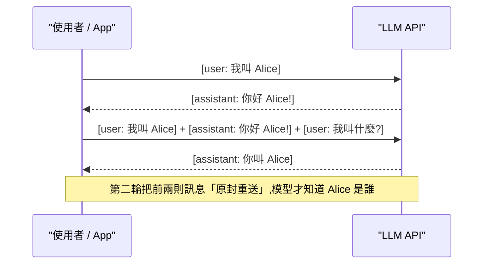
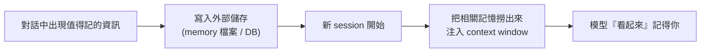

# LLM 的無狀態性與記憶策略

> 一句話版本：模型本身**沒有**記憶 —— 權重在訓練後凍結，API 也是無狀態的；你感受到的「它記得我」，其實是應用程式每次都把完整對話歷史重新塞進 context window，或是把重點寫進外部儲存再撈回來的工程手法。

## Step 1：先破除錯覺 —— API 是無狀態（stateless）的

呼叫 LLM API 時，模型不會「記得」上一次請求。多輪對話之所以成立，是因為**客戶端每一輪都重送完整歷史**：

模型每次都是「從頭讀一遍對話」再接著寫 —— 它不是想起來的，是重新看到的。

## Step 2：LLM 的四層「記憶」

用人類記憶類比，LLM 相關系統其實有四種不同性質的記憶，常被混為一談：

| 層 | 類比 | 載體 | 特性 |
|---|---|---|---|
| ① 參數化知識 | 長期知識（常識、語言能力） | 模型權重 | 訓練時寫入，之後**凍結**，有 knowledge cutoff |
| ② Context window | 工作記憶（短期） | 當次請求的輸入 | 對話結束即消失，有 token 上限 |
| ③ 外部記憶 | 筆記本 / 日記 | 檔案、資料庫、向量庫 | 工程手法：寫下來，之後再讀回 context |
| ④ 微調（fine-tuning） | 反覆練習形成的技能 | 權重增量（如 LoRA） | 改變模型本身，成本高、非即時 |

關鍵洞察：**模型「當下能用」的記憶只有 ①+②**。③ 必須透過某種機制把內容搬進 context window，模型才看得到。

## Step 3：那 ChatGPT / Claude 的「記憶功能」是什麼？

產品層的「memory」都是第 ③ 層的工程實作 —— 本質是「幫模型做筆記，下次開場自動夾帶」：

常見實作形態：

- **Memory tool / memory 檔案**：給模型讀寫檔案的工具，讓它自己記筆記（例如 Claude 的 memory tool 操作 `/memories` 目錄、Claude Code 的 `MEMORY.md`）。
- **RAG（檢索增強）**：把大量資料存進向量庫，依當前問題檢索相關片段塞進 context。
- **平台級 memory store**：雲端代管的跨 session 記憶（例如 Anthropic Managed Agents 的 memory stores，掛載成檔案系統目錄）。

## Step 4：各層記憶的更新方式比較

| 想讓模型「記住」新東西 | 對應手段 | 生效速度 | 持久性 |
|---|---|---|---|
| 這次對話內有效即可 | 直接寫進 prompt | 即時 | 對話結束消失 |
| 跨對話、個人化 | 外部記憶 + 注入 | 即時 | 持久（可刪改） |
| 領域知識大量更新 | RAG | 即時 | 持久、可隨時換資料 |
| 改變模型行為 / 風格 | fine-tuning | 需訓練 | 固化進權重 |
| 更新世界知識 | 重新預訓練 | 極慢 | 固化進權重 |

實務準則：**能用 context 解決就不要動權重** —— 注入記憶便宜、可控、可回滾；fine-tuning 貴且難以撤銷。

## 相關筆記

- [什麼是 context window?](#/llm/01-foundations/what-is-context-window.mdx) —— 模型唯一的工作記憶，以及塞不下時的壓縮策略
- [模型訓練和微調有什麼差異？LLM 如何回答得更好？](#/llm/02-training/pretraining-vs-finetuning.mdx) —— 第 ①、④ 層記憶的來源
- [LLM API Response 結構是什麼？](#/llm/04-applications/llm-api-response-structure.mdx) —— 無狀態 API 下多輪對話的訊息格式
