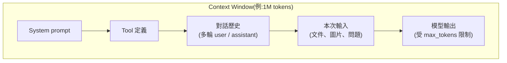

# Context Window 與模型記憶容量

> 一句話版本：context window 是模型單次請求中「看得到」的最大範圍（以 token 計），涵蓋輸入與輸出 —— 它是 LLM 的工作記憶（working memory），超出的內容模型完全不知道。

## Step 1：定義 —— 模型的「視野範圍」

LLM 每次推理時，能夠處理的 token 總量有一個上限，這個上限就是 **context window**（上下文視窗）。它涵蓋這次請求裡的所有東西：

重點：**輸入和輸出共享同一個 context window**。如果輸入佔掉 990K token，留給輸出的空間就只剩 10K。另外大多數 API 還有獨立的 `max_tokens`（單次輸出上限），它通常遠小於 context window。

## Step 2：為什麼會有上限？

Context window 不是人為刁難，而是架構與成本的物理限制：

1. **Attention 的計算複雜度**：Transformer 的 self-attention 要讓每個 token 和其他所有 token 兩兩計算關聯，複雜度是 $O(n^2)$ —— 序列長度 $n$ 翻倍，計算量變四倍。
2. **KV cache 的記憶體**：推理時每個 token 的 Key/Value 向量都要暫存在 GPU 記憶體，序列越長吃越多顯存。
3. **位置編碼（positional encoding）的外推能力**：模型在訓練時只見過某個長度以內的序列，超過訓練長度後對位置的理解會退化，需要 RoPE scaling 等技巧才能延伸。

所以「把 context window 做大」是模型架構、訓練方法、推理系統三方面共同優化的結果。

## Step 3：目前的實際大小（以 Claude 為例，2026）

| 模型 | Context window | 最大輸出 |
|---|---|---|
| Claude Fable 5 | 1M tokens | 128K |
| Claude Opus 4.8 / 4.7 / 4.6 | 1M tokens | 128K |
| Claude Sonnet 4.6 | 1M tokens | 64K |
| Claude Haiku 4.5 | 200K tokens | 64K |

直觀感受：1M token 約等於 75 萬個英文單字，大致是整套《哈利波特》全集再加幾本書的量，可以一次塞進一整個中型 codebase。

## Step 4：超過上限會怎樣？

- **請求階段**：輸入本身就超過上限 → API 直接回錯誤（request too large / validation error）。
- **生成階段**：對話累積到接近上限 → 模型停止生成，回傳類似 `model_context_window_exceeded` 的 stop reason。

實務上長對話有三種管理策略：

| 策略 | 做法 | 特性 |
|---|---|---|
| **Compaction（壓縮）** | 把較早的歷史「摘要」成一段濃縮內容 | 保留語意、丟失細節 |
| **Context editing（清理）** | 直接「刪掉」舊的 tool 結果、thinking 區塊 | 保留對話骨架、丟掉過期內容 |
| **外部記憶** | 把重要資訊寫到檔案 / 資料庫，需要時再撈回來 | 跨 session 持久化，見記憶篇 |

## Step 5：工程上的兩個重要含義

1. **成本**：API 依 token 計費，context window 用得越滿、每次請求越貴。長對話每一輪都要重送完整歷史（API 是無狀態的），所以 prompt caching 這類「前綴快取」技術非常重要。
2. **Lost in the middle**：研究顯示模型對 context 開頭與結尾的內容記得最牢，中段的資訊較容易被忽略 —— 所以重要指令放開頭（system prompt）、關鍵問題放結尾是常見的 prompt 編排原則。

## 相關筆記

- [LLM 有記憶功能嗎？](#/llm/01-foundations/do-llms-have-memory.mdx) —— context window 就是模型唯一的「短期記憶」
- [什麼是 token?API 通常如何計費？](#/llm/01-foundations/what-is-a-token-and-api-pricing.mdx)
- [什麼是 Transformer?](#/llm/01-foundations/what-is-transformer.mdx) —— attention 機制是 context window 上限的根源
