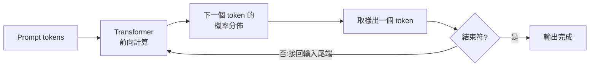

# Transformer 架構與注意力機制

> 一句話版本：Transformer 是一種完全以 **attention 機制**為核心的神經網路架構，取代了過去 RNN 的逐字循序處理方式，讓模型可以**平行處理整個序列**，並直接建模任意兩個 token 之間的關聯。它是目前所有主流 LLM（GPT、Claude、Llama…）的共同基礎。

## Step 1：先理解它要解決什麼問題

在 Transformer（2017 年論文 *Attention Is All You Need*）出現之前，處理文字序列的主流是 RNN / LSTM，有兩個致命限制：

1. **無法平行化**：第 t 個字的計算依賴第 t-1 個字的結果，序列越長訓練越慢。
2. **長距離依賴會衰減**：句子開頭的資訊要一路傳遞到結尾，途中不斷被壓縮、遺忘。

Transformer 的核心想法是：與其讓資訊「接力傳遞」，不如讓**每個 token 直接看到所有其他 token**，關聯強度由模型自己學出來——這就是 attention。

## Step 2：輸入怎麼變成模型能算的東西

1. **Tokenization**：把文字切成 token（常用 BPE 這類 subword 演算法），每個 token 對應一個整數 ID。
2. **Embedding**：每個 token ID 查表換成一個高維向量（例如 4096 維）。
3. **位置資訊**：attention 本身不在乎順序，所以要額外注入位置訊號——早期用固定的 positional encoding，現代 LLM 多用 RoPE（rotary position embedding）。

到這裡，一句話就變成了一個「token 數 × 維度」的矩陣。

## Step 3：Self-attention 的計算（核心中的核心）

對每個 token 的向量，乘上三個可學習的權重矩陣，得到三種角色：

| 角色 | 直覺意義 |
|------|----------|
| Query(Q) | 我在找什麼資訊？|
| Key(K) | 我能提供什麼資訊？|
| Value(V) | 我實際攜帶的內容 |

計算步驟：

1. 拿某個 token 的 Q，和**所有** token 的 K 做內積 → 得到相似度分數。
2. 除以 $\sqrt{d_k}$（縮放，避免數值過大）後過 softmax → 變成總和為 1 的注意力權重。
3. 用這些權重對所有 token 的 V 做加權平均 → 得到這個 token 的新表示。

$$
\mathrm{Attention}(Q, K, V) = \mathrm{softmax}\!\left(\frac{QK^{\top}}{\sqrt{d_k}}\right)V
$$

直覺：「it」這個代名詞的新向量，會自動大量混入它所指涉名詞的資訊，因為模型學會了給那個名詞高權重。

## Step 4：Multi-head 與 FFN

- **Multi-head attention**：上述計算平行做 h 份（例如 32 個 head），每個 head 用不同的投影矩陣，學到不同種類的關聯（語法、指代、語意…），最後拼接起來。
- **Feed-forward network(FFN)**:attention 之後，每個 token 各自通過一個兩層 MLP。一般理解是 attention 負責「token 之間搬運資訊」，FFN 負責「對每個 token 做知識加工」，模型大部分參數都在 FFN。
- 每個子層都配 **residual connection + normalization**，讓幾十層堆疊起來仍然可以穩定訓練。

一層「attention + FFN」就是一個 Transformer block，把它堆 N 層（GPT-3 是 96 層）就是完整模型。

## Step 5：LLM 實際怎麼用它生成文字

現代 LLM 幾乎都是 **decoder-only** 架構：

1. Attention 加上 **causal mask**，讓每個 token 只能看到自己左邊的 token（不能偷看未來）。
2. 模型的訓練目標極其單純：**預測下一個 token**。
3. 推理時是自回歸迴圈：

（這個迴圈裡每一步都要重算歷史 token 的 K、V，所以實務上會用 KV cache 來避免重複計算——這是推理優化章節的主題。）

## 小結

| 元件 | 職責 |
|------|------|
| Tokenizer + Embedding | 文字 → 向量序列 |
| Self-attention | token 之間互相交換資訊，建模長距離依賴 |
| Multi-head | 平行學多種關聯模式 |
| FFN | 對每個 token 做非線性加工，儲存大部分「知識」 |
| Residual + Norm | 讓深層堆疊可訓練 |
| Causal mask + 下一字預測 | 讓 decoder-only 模型能自回歸生成 |

Transformer 的成功關鍵不只是效果好，而是它**極度適合 GPU 平行運算**，才讓「堆更多資料、更多參數」的 scaling 路線成為可能。

## 相關筆記

- [LLM 是如何運作的？](#/llm/01-foundations/how-do-llms-work.mdx) — 從輸入到生成的完整流程總覽
