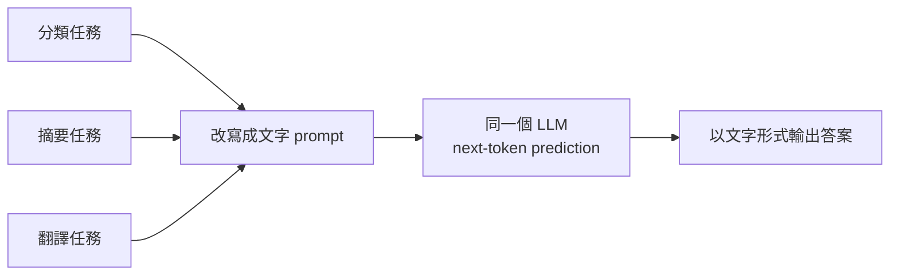

# 統一模型執行多項任務的能力

> 一句話版本：因為這些任務全部被統一成同一種形式 ——「給一段文字，預測下一個 token」。任務的差別不再寫死在模型結構裡，而是寫在輸入的文字（prompt）裡。

## Step 1：傳統 ML 的做法 —— 一個任務一個模型

在 LLM 之前，分類、摘要、翻譯是三個完全獨立的工程專案：

| 任務 | 典型模型 | 輸出形式 |
|------|----------|----------|
| 情感分類 | BERT + 分類頭（classification head） | 固定類別的機率分佈（如 3 類） |
| 摘要 | 專門訓練的 seq2seq 模型 | 一段文字 |
| 翻譯 | 每個語言對訓練一個模型 | 一段文字 |

關鍵限制在**輸出層是為任務量身打造的**：分類模型的最後一層就是 3 個神經元，它在數學上不可能輸出一段翻譯。任務被「烤進」了模型架構，換任務就要換架構、重新訓練。

## Step 2：LLM 的統一介面 —— 一切都是「預測下一個 token」

LLM 只有一種能力：給定前文，輸出「下一個 token 是什麼」的機率分佈。神奇之處在於，幾乎所有文字任務都能**改寫成這個形式**：

```text
分類:  「這則評論是正面還是負面?評論:『出貨超快,包裝完整』答案:」 → 正面
摘要:  「請用一句話摘要以下文章:……摘要:」                         → (一句話)
翻譯:  「把這句話翻成英文:『今天天氣很好』英文:」                   → The weather is ...
```

三個任務對模型來說**沒有任何差別**—— 都是讀入一串 token、接著吐出最可能的下一串 token。任務的定義從「模型結構」搬到了「輸入文字」，這就是所謂的 **text-to-text** 統一介面（T5 論文明確提出，GPT 系列用 decoder-only 架構把它推到極致）。



## Step 3：能力從哪裡來？—— 預訓練語料裡「什麼都有」

介面統一只解釋了「為什麼可以這樣問」，還要解釋「為什麼答得出來」。

預訓練目標是在海量網路文本上最小化 next-token 的預測損失：

$$
\mathcal{L} = -\sum_{t} \log P(x_t \mid x_{1}, \ldots, x_{t-1})
$$

要把這個損失壓低，模型被迫學會語料中隱含的各種規律，而網路語料本身就藏著大量「任務範例」：

- 影評網站上「評論 + 星等」的配對 → 隱含了**分類**
- 新聞的「內文 + 標題 / 導語」 → 隱含了**摘要**
- 維基百科、字幕、多語對照網頁 → 隱含了**翻譯**

換句話說，模型不是被「教」了三個任務，而是為了做好一個通用目標（預測下一個 token），**順便**把這些任務的模式都學進了同一組權重。GPT-2 的論文標題就叫 *Language Models are Unsupervised Multitask Learners*—— 語言模型天生就是多任務學習器。

## Step 4：讓它「聽得懂指令」——instruction tuning

純預訓練的 base model 雖然有這些能力，但你得用巧妙的接龍格式去「誘導」它。後續的 **instruction tuning(SFT)** 用大量「指令 → 理想回答」的配對做微調，讓模型學會一個 meta-skill：**把使用者的自然語言指令當成任務描述來執行**。

之後再配合 RLHF/DPO 對齊人類偏好，就成了你熟悉的 chat model—— 直接說「幫我摘要」「翻成英文」就能用，不需要特殊格式。

## Step 5：In-context learning——prompt 就是「執行期的任務設定」

用 OOP 的比喻：傳統 ML 像是為每個任務寫一個 class，行為在**編譯期**就固定了；LLM 更像一個超級通用的 interpreter,prompt 是**執行期**傳進來的程式。你甚至可以在 prompt 裡塞幾個範例（few-shot），模型就會現場「歸納」出你要的任務格式 —— 權重完全不變，任務卻換了。這個現象叫 **in-context learning**，是大模型規模到一定程度後才明顯浮現的能力（emergent ability）。

## 小結

| 問題 | 答案 |
|------|------|
| 為什麼「可以」？| 所有文字任務都能改寫成 next-token prediction，介面統一 |
| 能力哪來的？| 預訓練語料隱含大量任務範例，通用目標順便學會多任務 |
| 為什麼聽得懂人話？| instruction tuning + 對齊，把「照指令辦事」變成一種技能 |
| 換任務為何不用重訓？| in-context learning：任務定義活在 prompt 裡，不在權重裡 |

## 相關筆記

- [LLM 是如何運作的？](#/llm/01-foundations/how-do-llms-work.mdx)
- [LLM 和傳統 ML 模型有什麼差異？](#/llm/01-foundations/llm-vs-traditional-ml.mdx)
