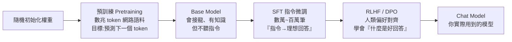

# 預訓練與微調：模型改進的完整路徑

> 一句話版本：預訓練（pretraining）是從隨機權重開始、用海量語料學會「語言與世界知識」；微調（fine-tuning）是在已訓練好的權重上，用少量精選資料調整「行為與風格」。而「回答得更好」是訓練期（SFT + RLHF）和推理期（prompt、RAG、reasoning）兩條路共同疊出來的。

## Step 1：先看全貌 —— 一個 LLM 的養成 pipeline

日常說的「訓練」通常指最左邊的 pretraining；「微調」指的是後面所有在既有權重上繼續調整的步驟（SFT、RLHF、或你自己針對領域任務的微調）。

## Step 2：預訓練 —— 從零打地基

- **起點**：權重完全隨機，模型什麼都不會。
- **資料**：數兆（trillions）token 的網路文本、書籍、程式碼，不需要人工標註 —— 下一個 token 本身就是標準答案（self-supervised）。
- **目標**：最小化 next-token 預測損失

  $$
  \mathcal{L} = -\sum_{t} \log P(x_t \mid x_{1}, \ldots, x_{t-1})
  $$

- **學到什麼**：文法、事實知識、推理模式、程式語法 —— 所有「智力」幾乎都來自這一步。
- **成本**：數千張 GPU 跑數週到數月，燒掉數百萬到上億美元。只有少數公司做得起。

產物是 **base model**：給它「台灣最高的山是」它會接「玉山」，但你問它問題，它可能只是繼續幫你「補完問題」而不是回答 —— 因為它學的是接龍，不是對話。

## Step 3：微調 —— 在地基上裝潢

微調的共同特徵：**從預訓練好的權重出發**，用小得多的資料、小得多的算力，改變模型的行為。常見幾種：

| 類型 | 資料 | 目的 |
|------|------|------|
| SFT (instruction tuning) | 數萬～百萬筆「指令 → 理想回答」 | 讓 base model 聽得懂指令、會對話 |
| RLHF / DPO | 人類對回答的偏好排序 | 對齊人類偏好：有幫助、誠實、無害 |
| 領域微調（domain FT） | 你自己的領域資料（法律、醫療、客服） | 注入領域用語與格式習慣 |
| Continued pretraining | 大量領域語料，仍用 next-token 目標 | 補充領域知識（介於兩者之間） |

工程上還有 **PEFT（如 LoRA）**：凍結原始權重，只訓練一小組低秩附加參數，讓微調在一張消費級 GPU 上就能做 —— 這也是「微調便宜、預訓練昂貴」差距的來源之一。

### 兩者差異總表

| 維度 | 預訓練 | 微調 |
|------|--------|------|
| 起點 | 隨機權重 | 已預訓練的權重 |
| 資料量 | 數兆 token | 數千～百萬筆 |
| 資料型態 | 未標註原始文本 | 精選、通常人工標註 |
| 學到的東西 | 知識與能力（是什麼） | 行為與風格（怎麼表現） |
| 成本 | 百萬～億級美元 | 幾十～幾萬美元 |
| 誰在做 | 模型廠商 | 廠商 + 一般團隊都可 |

一個常見誤解：**微調不適合用來「灌新知識」**。少量微調資料很難可靠地寫入事實（還可能加劇幻覺），它擅長的是改變格式、語氣、任務行為；要讓模型「知道」你的內部資料，RAG 通常是更對的工具。

## Step 4：LLM 要如何回答得更好？—— 兩條路

### 路線 A：訓練期（改變權重）

1. **SFT** 教會模型「照指令辦事」的形式。
2. **RLHF / DPO** 讓模型從人類偏好中學到「什麼樣的回答算好」—— 先訓練一個 reward model 給回答打分，再用 RL 讓模型往高分方向調整（DPO 則跳過 reward model 直接從偏好對學習）。這一步是 ChatGPT 時刻的關鍵：同樣的知識，回答品質天差地遠。
3. **Reasoning 訓練**：新一代模型（o1、R1 類）用 RL 獎勵「先想再答」，讓模型生成長思考鏈之後再給答案，大幅提升數學、程式等難題的正確率。

### 路線 B：推理期（不動權重）

| 手段 | 原理 |
|------|------|
| Prompt engineering | 把任務說清楚：角色、格式、範例（few-shot） |
| Chain-of-thought | 要求先推理再作答，用更多 token 換更高正確率 |
| RAG | 先檢索相關文件塞進 context，回答有依據、減少幻覺 |
| Tool use / Agent | 讓模型呼叫計算機、搜尋、程式執行，補足權重做不到的事 |

經驗法則：**先把路線 B 用盡，再考慮微調**。Prompt 和 RAG 迭代成本低、可隨時改；微調要準備資料、訓練、部署，而且知識更新還是得靠 RAG。

## 相關筆記

- [LLM 是如何運作的？](#/llm/01-foundations/how-do-llms-work.mdx)
- [為什麼同一個模型可以做分類、摘要、翻譯？](#/llm/01-foundations/why-one-model-many-tasks.mdx)
