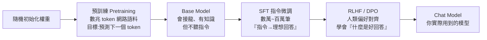
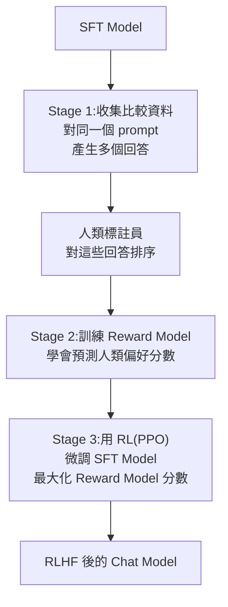

# 預訓練與微調：模型改進的完整路徑

> 一句話版本：預訓練（pretraining）是從隨機權重開始、用海量語料學會「語言與世界知識」；微調（fine-tuning）是在已訓練好的權重上，用少量精選資料調整「行為與風格」。而「回答得更好」是訓練期（SFT + RLHF）和推理期（prompt、RAG、reasoning）兩條路共同疊出來的。

## Step 1：先看全貌 —— 一個 LLM 的養成 pipeline

```mermaid
flowchart LR
    A["隨機初始化權重"] --> B["預訓練 Pretraining<br/>數兆 token 網路語料<br/>目標:預測下一個 token"]
    B --> C["Base Model<br/>會接龍、有知識<br/>但不聽指令"]
    C --> D["SFT 指令微調<br/>數萬~百萬筆<br/>『指令→理想回答』"]
    D --> E["RLHF / DPO<br/>人類偏好對齊<br/>學會『什麼是好回答』"]
    E --> F["Chat Model<br/>你實際用到的模型"]
```

日常說的「訓練」通常指最左邊的 pretraining；「微調」指的是後面所有在既有權重上繼續調整的步驟（SFT、RLHF、或你自己針對領域任務的微調）。

## Step 2：預訓練 —— 從零打地基

- **起點**：權重完全隨機，模型什麼都不會。
- **資料**：數兆（trillions）token 的網路文本、書籍、程式碼，不需要人工標註 —— 下一個 token 本身就是標準答案（self-supervised）。
- **目標**：最小化 next-token 預測損失

  $$
  \mathcal{L} = -\sum_{t} \log P(x_t \mid x_{1}, \ldots, x_{t-1})
  $$

- **學到什麼**：文法、事實知識、推理模式、程式語法 —— 所有「智力」幾乎都來自這一步。
- **成本**：數千張 GPU 跑數週到數月，燒掉數百萬到上億美元。只有少數公司做得起。

產物是 **base model**：給它「台灣最高的山是」它會接「玉山」，但你問它問題，它可能只是繼續幫你「補完問題」而不是回答 —— 因為它學的是接龍，不是對話。

## Step 3：微調 —— 在地基上裝潢

微調的共同特徵：**從預訓練好的權重出發**，用小得多的資料、小得多的算力，改變模型的行為。常見幾種：

| 類型 | 資料 | 目的 |
|------|------|------|
| SFT (instruction tuning) | 數萬～百萬筆「指令 → 理想回答」 | 讓 base model 聽得懂指令、會對話 |
| RLHF / DPO | 人類對回答的偏好排序 | 對齊人類偏好：有幫助、誠實、無害 |
| 領域微調（domain FT） | 你自己的領域資料（法律、醫療、客服） | 注入領域用語與格式習慣 |
| Continued pretraining | 大量領域語料，仍用 next-token 目標 | 補充領域知識（介於兩者之間） |

工程上還有 **PEFT（如 LoRA）**：凍結原始權重，只訓練一小組低秩附加參數，讓微調在一張消費級 GPU 上就能做 —— 這也是「微調便宜、預訓練昂貴」差距的來源之一。

### 兩者差異總表

| 維度 | 預訓練 | 微調 |
|------|--------|------|
| 起點 | 隨機權重 | 已預訓練的權重 |
| 資料量 | 數兆 token | 數千～百萬筆 |
| 資料型態 | 未標註原始文本 | 精選、通常人工標註 |
| 學到的東西 | 知識與能力（是什麼） | 行為與風格（怎麼表現） |
| 成本 | 百萬～億級美元 | 幾十～幾萬美元 |
| 誰在做 | 模型廠商 | 廠商 + 一般團隊都可 |

一個常見誤解：**微調不適合用來「灌新知識」**。少量微調資料很難可靠地寫入事實（還可能加劇幻覺），它擅長的是改變格式、語氣、任務行為；要讓模型「知道」你的內部資料，RAG 通常是更對的工具。

## Step 4：SFT 與 RLHF 各自怎麼訓練

這兩步合起來就是 base model 變成你實際在用的 chat model 的關鍵,原理不一樣,值得拆開看。

### SFT（Supervised Fine-Tuning，監督式微調）

做法跟預訓練幾乎一樣 —— 一樣是 next-token 預測、一樣是 cross-entropy loss —— 差別只在資料型態與 loss 計算範圍：

- **資料**：人工（或用強模型輔助）寫成的「指令 → 理想回答」配對,例如 `(「幫我摘要這段文字」, 一段示範摘要)`。
- **Loss**：只對「回答」的 token 算損失,「指令」部分只當作 context、不算 loss：

  $$
  \mathcal{L}_{\text{SFT}} = -\sum_{t \in \text{response}} \log P(x_t \mid x_{<t})
  $$

- **學到什麼**：模型從「接龍任何文字」收斂成「看到指令就照著指令的格式回答」——這一步決定了模型「聽不聽得懂人話」，但不保證回答「品質好不好」。

### RLHF（Reinforcement Learning from Human Feedback）

SFT 只教會模型「回答的形式」，RLHF 教的是「回答的好壞」，標準流程分三階段：

```mermaid
flowchart TD
    A["SFT Model"] --> B["Stage 1:收集比較資料<br/>對同一個 prompt<br/>產生多個回答"]
    B --> C["人類標註員<br/>對這些回答排序"]
    C --> D["Stage 2:訓練 Reward Model<br/>學會預測人類偏好分數"]
    D --> E["Stage 3:用 RL(PPO)<br/>微調 SFT Model<br/>最大化 Reward Model 分數"]
    E --> F["RLHF 後的 Chat Model"]
```

1. **收集偏好資料**：同一個 prompt 讓模型產生多個候選回答，人類標註員排序（哪個比較好、比較無害、比較有幫助）。
2. **訓練 reward model（RM）**：用 Bradley-Terry pairwise loss，讓 RM 學會對「較好的回答」給更高分：

   $$
   \mathcal{L}(\phi) = -\mathbb{E}_{(x, y_w, y_l)}\left[\log \sigma\big(r_\phi(x, y_w) - r_\phi(x, y_l)\big)\right]
   $$

   其中 $y_w$ 是人類偏好的回答、$y_l$ 是較差的回答。
3. **用 RL 優化 policy（也就是 LLM 本身）**：把 RM 的分數當作 reward，用 PPO 這類演算法更新模型參數，同時加一個 KL 散度懲罰項，限制模型不要離 SFT model 太遠（避免為了拿高分而產生語意崩壞、鑽 reward model 漏洞的「reward hacking」）：

   $$
   \max_{\theta}\ \mathbb{E}_{x \sim D,\, y \sim \pi_\theta(y \mid x)}\big[r_\phi(x, y)\big] - \beta\, D_{KL}\big[\pi_\theta(y \mid x) \,\|\, \pi_{\text{ref}}(y \mid x)\big]
   $$

RLHF 流程複雜（要練 RM、要跑 RL、訓練不穩定），所以後來出現 **DPO（Direct Preference Optimization）**：跳過訓練獨立的 reward model 與 RL 迴圈，直接從「偏好對」($y_w$ 比 $y_l$ 好)推導出一個閉式的分類損失來更新模型，數學上等價於同一個目標，但工程上簡單、穩定得多，也是目前很多開源模型採用的做法。

一句話總結兩者分工：**SFT 教模型「怎麼講」（格式、聽指令），RLHF/DPO 教模型「講得好不好」（品質、對齊人類偏好）**——兩者缺一，模型要嘛聽不懂指令，要嘛雖然聽得懂但回答空洞、不符合人類期待。

## Step 5：LLM 要如何回答得更好？—— 兩條路

### 路線 A：訓練期（改變權重）

1. **SFT** 教會模型「照指令辦事」的形式。
2. **RLHF / DPO** 讓模型從人類偏好中學到「什麼樣的回答算好」—— 先訓練一個 reward model 給回答打分，再用 RL 讓模型往高分方向調整（DPO 則跳過 reward model 直接從偏好對學習）。這一步是 ChatGPT 時刻的關鍵：同樣的知識，回答品質天差地遠。
3. **Reasoning 訓練**：新一代模型（o1、R1 類）用 RL 獎勵「先想再答」，讓模型生成長思考鏈之後再給答案，大幅提升數學、程式等難題的正確率。

### 路線 B：推理期（不動權重）

| 手段 | 原理 |
|------|------|
| Prompt engineering | 把任務說清楚：角色、格式、範例（few-shot） |
| Chain-of-thought | 要求先推理再作答，用更多 token 換更高正確率 |
| RAG | 先檢索相關文件塞進 context，回答有依據、減少幻覺 |
| Tool use / Agent | 讓模型呼叫計算機、搜尋、程式執行，補足權重做不到的事 |

經驗法則：**先把路線 B 用盡，再考慮微調**。Prompt 和 RAG 迭代成本低、可隨時改；微調要準備資料、訓練、部署，而且知識更新還是得靠 RAG。

## 相關筆記

- [LLM 是如何運作的？](#/llm/01-foundations/how-do-llms-work.mdx)
- [為什麼同一個模型可以做分類、摘要、翻譯？](#/llm/01-foundations/why-one-model-many-tasks.mdx)
