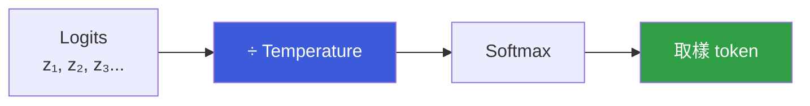

# Temperature 與 Top-p 的取樣策略

> 這兩個參數控制 LLM **取樣**時的隨機程度 —— 決定模型是「謹慎保守」還是「天馬行空」。

---

## 背景：LLM 輸出是一個機率分佈

每次輸出一個 token 時，模型會產生所有詞彙的機率分佈。問題是：要直接取最高機率的詞（確定性），還是從分佈中隨機取樣（創意性）？Temperature 和 Top-p 是調節這個取捨的旋鈕。

---

## Temperature

Temperature（$T$）縮放 logit（原始分數），改變機率的「尖銳程度」：

$$P_i = \frac{e^{z_i / T}}{\sum_j e^{z_j / T}}$$

| Temperature | 效果 | 適合場景 |
|-------------|------|---------|
| `T → 0` | 幾乎確定性地選最高機率 token（greedy） | 程式碼、事實問答 |
| `T = 1.0` | 原始分佈，不修改 | 預設值 |
| `T > 1.0` | 分佈更平坦，輸出更隨機 | 創意寫作、腦力激盪 |



---

## Top-p（Nucleus Sampling）

Top-p 不直接縮放機率，而是**動態縮減候選池**：把機率由高到低排序，累積到 `p` 為止，只從這個「核心（nucleus）」裡取樣。

```
token 機率排序: A(40%) B(35%) C(15%) D(7%) E(3%)
Top-p = 0.9 → 只保留 A+B+C（累積 90%），從這三個取樣
```

這樣當模型很有把握時（高機率集中在少數 token），候選池自動縮小；不確定時池子擴大。

---

## Top-k（補充）

另一個常見參數 Top-k：直接限制只從機率最高的 k 個 token 中取樣，無論其機率分佈形狀。Top-k 比較粗糙，Top-p 更能適應模型的確定性程度，所以 Top-p 更常用。

---

## 實務建議

| 場景 | 建議設定 |
|------|---------|
| 程式碼生成、事實問答 | temperature 0.1～0.3，top-p 0.9 |
| 通用問答 | temperature 0.7，top-p 0.9 |
| 創意寫作、故事生成 | temperature 0.9～1.0 |

通常只調 temperature 或 top-p 其中一個——兩個同時調容易互相干擾，效果難以預測。

---

## 相關筆記

- [LLM 是如何運作的？](#/llm/01-foundations/how-do-llms-work.mdx)
- [Reasoning model 和一般模型有什麼差異？](#/llm/06-frontiers/reasoning-models.mdx)
