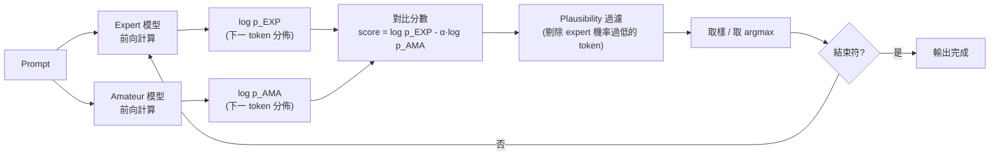

# Contrastive Decoding 的原理與應用

> 一句話版本：Contrastive decoding 讓一個「強模型（expert）」和一個「弱模型（amateur）」同時對下一個 token 打分，只挑出**強模型明顯比弱模型更有信心**的 token，藉此把兩個模型共有的通病（重複、空泛、常見套話）抵銷掉，讓輸出更精確、更少廢話。

## Step 1：先理解它想解決的問題

單一模型做 greedy / top-p 取樣時，常見兩種毛病：

1. **退化重複**：貪婪解碼容易卡在「這個很好」「總之」這類高頻但空洞的片語。
2. **常見但不精確**：模型會傾向輸出訓練資料中出現頻率高、但不一定最貼合當下語境的字詞。

這些毛病有個共同特徵：**它們在任何規模的模型上都容易發生**，包括小模型。Contrastive decoding（Li et al., 2023, *Contrastive Decoding: Open-ended Text Generation as Optimization*）的洞察是：如果一個 token 連小模型都覺得很有把握，那它很可能只是「常見套話」，不一定是大模型真正想表達的內容；反之，大模型才有信心、小模型沒把握的 token，往往才是模型真正的、有資訊量的選擇。

## Step 2：核心機制——expert 與 amateur 的對比

準備兩個模型：

| 角色 | 說明 |
|------|------|
| Expert（強模型） | 目標生成品質所依賴的主模型，例如 13B、70B |
| Amateur（弱模型） | 同系列但參數量小很多的模型，例如 125M、1B |

對同一個 prompt，兩個模型分別算出下一個 token 的 log 機率分佈 $\log p_{\text{EXP}}$、$\log p_{\text{AMA}}$，contrastive decoding 用兩者的**差**重新給每個候選 token 打分：

$$
\text{score}(x_t) = \log p_{\text{EXP}}(x_t \mid x_{<t}) - \alpha \cdot \log p_{\text{AMA}}(x_t \mid x_{<t})
$$

直覺：expert 覺得好、amateur 也覺得好 → 差分數普通（很可能是套話，被壓低）；expert 覺得好、amateur 覺得爛 → 差分數很高（expert 獨有的洞見，被放大）。

## Step 3：完整解碼流程

實務上還會加一個 **plausibility constraint**：只在 expert 認為「還算合理」的候選集合裡做對比（例如 expert 機率高於某個門檻的 token），避免對比分數把一個 expert 根本不看好、只是恰好 amateur 更討厭的怪異 token 硬拉上來。

## Step 4：和其他解碼策略的關係

| 策略 | 核心手法 | 解決的問題 |
|------|----------|------------|
| Temperature / Top-p | 調整單一模型的機率分佈形狀 | 控制隨機性與多樣性 |
| Contrastive decoding | 兩個不同規模模型的機率**相減** | 抑制兩者共有的空泛、重複輸出 |
| Speculative decoding | 小模型先草擬、大模型驗證 | 加速推理，不改變輸出分佈 |

值得注意：contrastive decoding 和 speculative decoding 雖然都用了「大模型 + 小模型」的組合，但目的完全不同——前者是為了**改善生成品質**（多一次前向計算，反而更貴），後者是為了**加速**（目標是不改變輸出分佈的前提下省算力）。不要把兩者搞混。

## Step 5：實務限制

- **需要額外一次前向計算**：amateur 模型雖小，但每個 token 都要多跑一次，會拉高延遲，不像溫度、top-p 幾乎零成本。
- **amateur 模型的選擇很關鍵**：通常選「同系列、同 tokenizer 的小模型」，否則兩個分佈不在同一個語意空間上，對比會失真。
- **$\alpha$ 需要調校**：$\alpha$ 太小起不了抑制效果，太大會把 expert 也不確定、但 amateur 更不確定的怪 token 錯誤放大。

## 相關筆記

- [Temperature 與 Top-p 的取樣策略](#/llm/03-inference/temperature-and-top-p.mdx) — 同屬解碼階段的機率分佈調整手法
- [Transformer 架構與注意力機制](#/llm/01-foundations/what-is-transformer.mdx) — expert / amateur 模型的前向計算基礎
