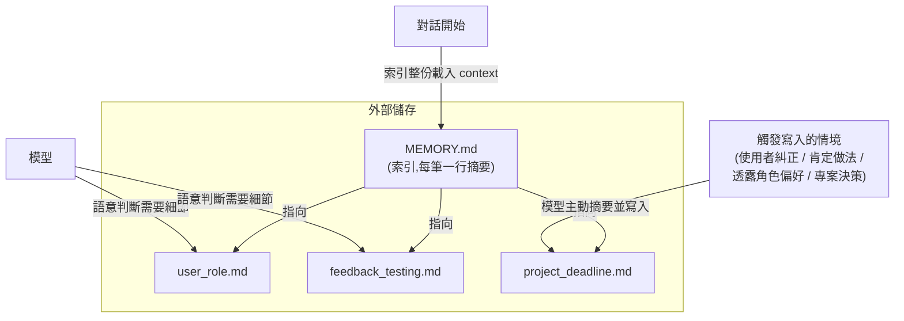
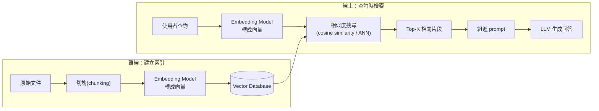
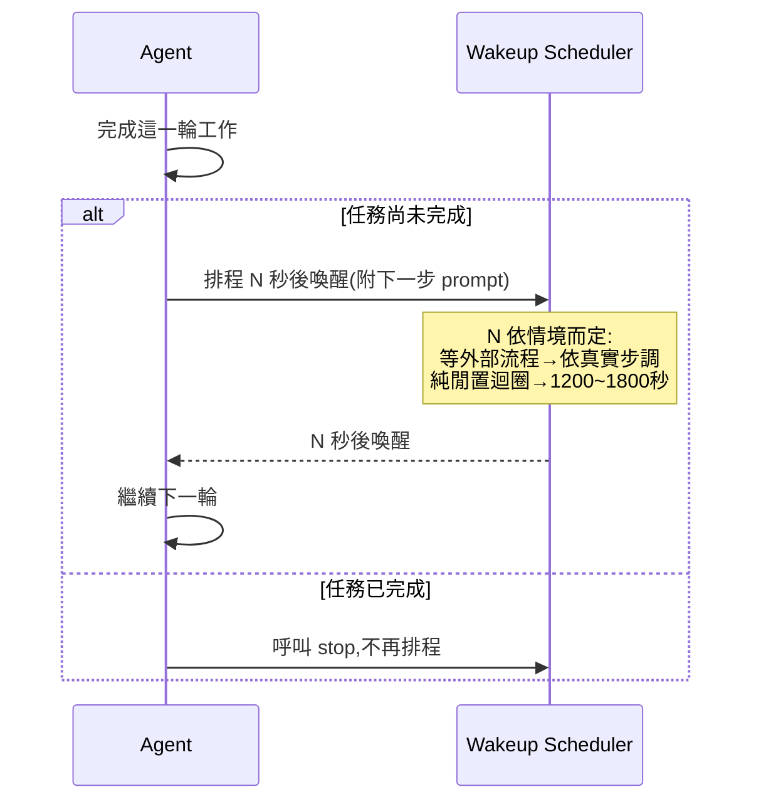

# Agent 檔案式記憶與 RAG 的異同

> 一句話：Agent 的檔案式記憶是「結構化筆記 + 索引表」，由模型自己判斷何時讀寫；RAG 是「向量化文件庫 + 語意檢索」，由相似度演算法在查詢當下自動抓取相關片段。兩者都在解決 LLM 的 context 限制，但檢索機制與適用規模完全不同。

## 背景：兩者都在解「同一個問題」

LLM 本身是無狀態的（見 [LLM 的無狀態性與記憶策略](#/llm/01-foundations/do-llms-have-memory.mdx)），單次對話的 context window 有限，跨對話、跨大量文件的資訊沒辦法全部塞進 prompt。因此需要一套「外部儲存 + 檢索」機制，讓模型在需要時把相關資訊帶回 context。

Agent 的檔案式記憶（例如 Claude Code 的 memory 系統）與 RAG 都是這類機制的實作，但設計目標不同：

- **檔案式記憶**：解決「這個 agent 跨多次對話該記得使用者是誰、偏好什麼、過去犯過什麼錯」。
- **RAG**：解決「怎麼從大量（可能上萬篇）文件中，找出跟這次查詢語意最相關的一小段」。

## Step 1：檔案式記憶的運作方式

以 Claude Code 為例，記憶系統的結構是：

特徵：

- **索引全量載入**：`MEMORY.md` 每次對話開頭就整份放進 context，不需要「查詢」這一步。
- **細節按需讀取**：只有索引裡的一行摘要顯示「這則記憶可能相關」時，模型才會主動去讀對應的完整檔案。
- **寫入靠語意判斷、非規則觸發**：模型自己判斷「使用者剛才糾正了我」「這是一個非顯而易見的肯定」等情境來決定要不要寫，而非固定規則（例如不是「每輪對話都存」）。
- **規模假設小**：索引超過一定行數會被截斷，代表這套機制假設記憶檔案數量是可控的（幾十到上百筆），不是為了索引百萬級文件設計的。

## Step 2：RAG 的運作方式

RAG（Retrieval-Augmented Generation）的流程分成離線建索引、線上檢索兩個階段：

特徵：

- **語意相似度檢索**：不是「整份載入」，而是每次查詢都即時算「哪幾段文字的向量離查詢向量最近」，只取 top-k。
- **離線 ingest、與對話無關**：文件進向量庫的流程通常是批次處理，跟「這輪對話model要不要記住什麼」無關，一次建好可以服務所有後續查詢。
- **規模設計目標是大量文件**：向量資料庫（如 Pinecone、pgvector、FAISS）本來就是為了在數千到數百萬筆文件中做次線性時間的近似最近鄰搜尋（ANN）。
- **檢索品質取決於 embedding model 與 chunking 策略**，詳見 [Embedding Model 的選型考量與評估方法](#/llm/04-applications/how-to-choose-embedding-model.mdx)。

## Step 3：對照表

| 面向 | 檔案式記憶（Agent Memory） | RAG |
|---|---|---|
| 儲存形式 | 純文字檔案（Markdown + frontmatter） | 文件切塊後的向量（embedding） |
| 檢索方式 | 索引全量載入 + 模型語意判斷要不要細讀 | Embedding 相似度搜尋（ANN），動態抓 top-k |
| 觸發寫入 | 模型依對話語意判斷（糾正、肯定、角色資訊、專案決策） | 通常是離線批次 ingest，與線上對話無關 |
| 適用規模 | 小（索引截斷代表假設量可控） | 大（設計目標就是海量文件） |
| 可解釋性 | 高：檔案就是自然語言，人類可直接讀懂、編輯 | 較低：向量距離不直接對應語意，需信任 embedding model |
| 更新時效 | 對話中即時寫入、即時生效 | 通常要等下一輪 ingest / 重新索引 |

## Step 4：什麼時候該用哪一種

兩者不是互斥的替代方案，而是分工：

- 需要記住**使用者是誰、偏好什麼、過去踩過什麼坑**這類低量、高複用價值的「個人化上下文」→ 檔案式記憶更合適，因為可解釋、可直接編輯、寫入時機由語意判斷而非固定規則。
- 需要從**大量外部知識（文件庫、程式碼庫、客服記錄）**中即時找出跟當前問題相關的內容 → RAG 更合適，因為它是為大規模語意檢索設計的。
- 實務上很多 agent 系統會**兩者並用**：用檔案式記憶存少量高價值的長期上下文，用 RAG 檢索大量參考資料，兩者都在回答生成前把內容組進 prompt。

## Step 5：記憶之外，agent 還需要「節奏控制」——Heartbeat 與 Cron

記憶機制解決的是「agent 記得什麼」，但 agent 要能長時間、跨時間持續運作，還需要另一層機制：什麼時候該再動一次。這跟記憶是互補而非替代的關係，Claude Code 裡有兩種對應的排程機制。

### Heartbeat（session 內的迴圈心跳）

在持續執行的迴圈情境（例如 `/loop`）中，agent 做到一個段落但任務還沒結束時，會主動排程「N 秒後把自己叫醒、帶著下一步的 prompt 繼續」，而不是靠外部輪詢：

關鍵原則：**心跳不是用來輪詢「背景任務完成了沒」**——如果等的是系統本身會主動通知的背景任務，任務結束時就會自動被喚醒，不需要額外心跳。心跳只用在「沒有其他訊號會通知我，但這個迴圈要靠自己維持節奏」的情境，例如定時檢查外部系統狀態，或沒有具體訊號的閒置迴圈（此時間隔預設拉長，避免無意義的頻繁喚醒）。心跳的生命週期跟著 session 走，session 結束心跳也隨之消失。

### Cron（跨 session 的排程 agent）

Cron 是另一層、獨立於任何單次對話的機制：建立一個依 cron 表達式（例如「每天 09:00」）定期觸發的雲端 agent（routine），不依賴目前的終端機或對話還存在。

| 面向 | Heartbeat（ScheduleWakeup） | Cron |
|---|---|---|
| 生命週期 | 綁定當前 session,session 結束即消失 | 獨立於任何 session,長期存在直到主動刪除 |
| 觸發方式 | 相對延遲(N 秒後) | Cron 表達式(絕對時間排程) |
| 用途 | 讓同一個任務的迴圈持續推進 | 週期性、跟單次對話無關的重複任務 |
| 典型情境 | `/loop` 動態模式下自我續跑 | 「每天幫我檢查一次 X」「每週產出報告」 |

### 三者的分工

- **Memory**：記得什麼（使用者是誰、偏好、過去的決策與教訓）。
- **Heartbeat**：同一個任務內，什麼時候該再往前推進一步。
- **Cron**：跟當前任務無關、獨立長期存在的週期性觸發。

三者疊在一起，才構成一個能跨時間、跨對話持續運作的 agent 系統。

## Step 6：MEMORY.md 與 CLAUDE.md 的差異

Claude Code 裡還有一份看似類似、但性質完全不同的檔案——`CLAUDE.md`。兩者常被混淆，但維護者、內容性質、優先權都不一樣。

| 面向 | MEMORY.md | CLAUDE.md |
|---|---|---|
| 誰維護 | Agent 自動寫入，使用者不需手動編輯 | 使用者手動維護，通常隨 repo commit 版控 |
| 內容性質 | 對話中學到的動態事實（使用者偏好、過去糾正過的做法、專案進度） | 固定的專案規則與規範（架構說明、指令、注意事項） |
| 作用範圍 | 跨對話的個人化記憶，每個專案一份，存在 agent 端的使用者目錄下（不在 repo 裡） | 專案內建規則，放在 repo 根目錄，對所有使用這個 repo 的人／agent 生效 |
| 更新時機 | Agent 判斷有值得記的語意訊號（糾正、肯定、角色資訊、專案決策）時主動寫 | 使用者覺得規則、流程變了時手動改 |
| 內容穩定性 | 會隨時間演進、修正、甚至刪除 | 相對穩定，是「這個專案該怎麼運作」的權威來源 |
| 優先權 | 提供上下文參考，不是強制規則 | Agent 要完全遵照執行的指令，會覆蓋預設行為 |

一句話區分：CLAUDE.md 是「這個專案的說明書」，寫給任何跟這個 repo 互動的人／agent 看；MEMORY.md 是「agent 對使用者的觀察筆記」，只跟這個使用者、這個 agent 有關，且是 agent 自己累積、不是使用者要求維護的文件。

兩者可以同時存在且互補：CLAUDE.md 定義「這個專案該怎麼做事」的固定規則，MEMORY.md 補上「這個使用者偏好怎麼被協作」的動態脈絡——前者是專案級的靜態契約，後者是使用者級的動態記憶。

## 相關筆記

- [LLM 的無狀態性與記憶策略](#/llm/01-foundations/do-llms-have-memory.mdx)
- [Embedding Model 的選型考量與評估方法](#/llm/04-applications/how-to-choose-embedding-model.mdx)
