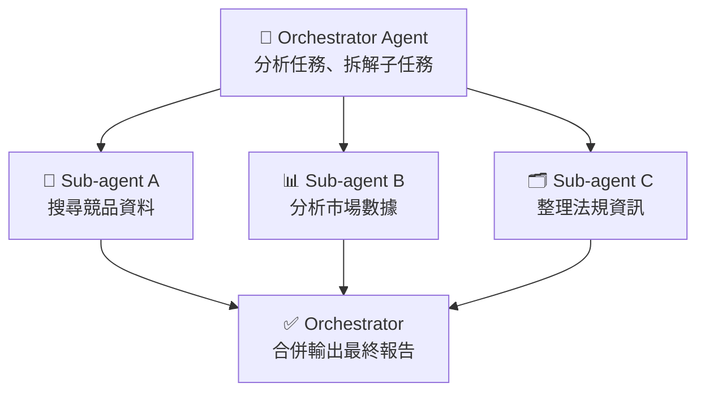
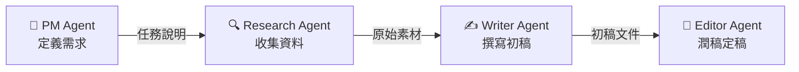
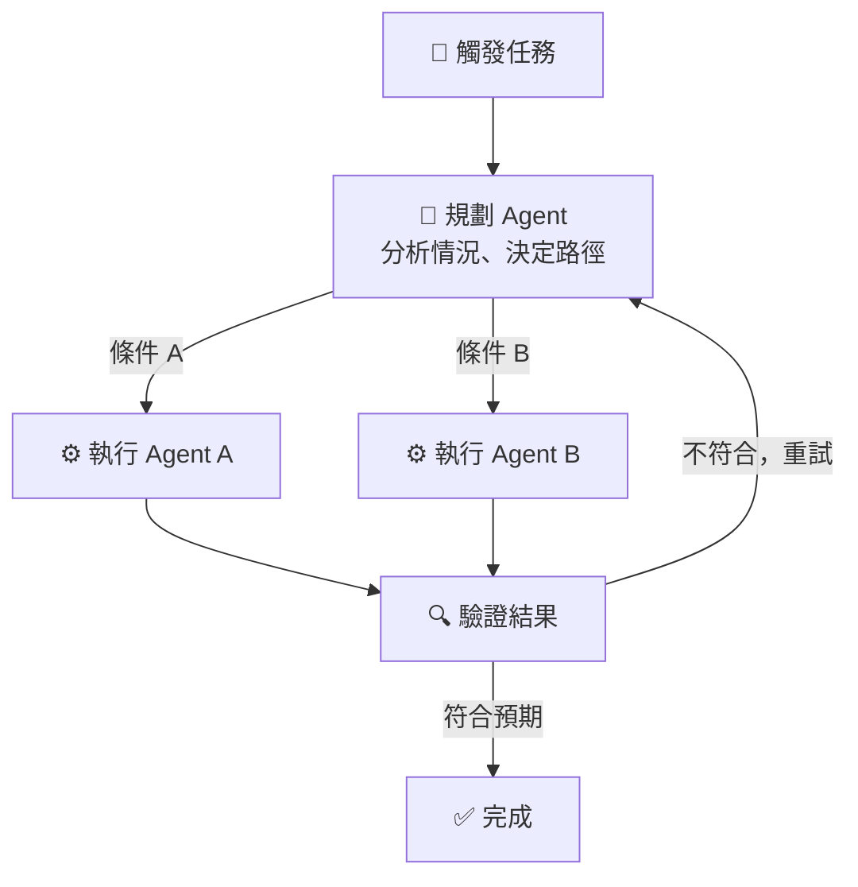

# AI Agent 三種分工模式

> 同一個任務，根據結構選對模式：Subagent 平行加速、Agent Teams 流水線分工、Dynamic Workflows 動態決策。

## 為什麼需要多 Agent 協作？

單一 Agent 面對複雜任務有兩個瓶頸：**Context 容量**（塞不下所有資訊）和**執行效率**（只能循序思考）。多 Agent 協作把任務分解給多個 Agent 同時或接力處理，突破這兩個限制。

但「多 Agent」不是一種固定架構，而是三種根本不同的組織方式，選錯會讓系統比單 Agent 更複雜、更慢。

---

## 模式一：Subagent（平行展開）

**核心概念**：一個 Orchestrator Agent 把任務切成獨立的子任務，同時丟給多個 Sub-agent 執行，最後收齊結果整合輸出。

**關鍵特性**：各 Sub-agent 之間**沒有依賴關係**，可以真正平行執行。

**最適合用在**：需要從多個來源平行蒐集資料的任務。

- 產品競調報告：競品分析、市場規模、法規環境三條線同時跑，速度是循序執行的三倍
- 多語言翻譯：同一份文件同時交給不同語言的 Agent 處理

**不適合用在**：有強依賴的任務。例如「先分析資料，再根據分析結論決定下一步」——Sub-agent B 需要 A 的結果才能開始，強行用 Subagent 反而增加協調複雜度。

---

## 模式二：Agent Teams（流水線接力）

**核心概念**：任務像工廠流水線，依照固定順序交棒給不同**專責 Agent**，每個 Agent 只負責自己的那一段，完成後把產出傳給下一棒。

**關鍵特性**：流程**事先固定**，每個 Agent 角色職責單純，可以獨立優化、重複使用。

**最適合用在**：步驟固定、有明確上下游關係的任務。

- 內容生產流水線：PM 定題目 → Research 找資料 → Writer 寫初稿 → Editor 潤稿，流程永遠一樣，容易維護
- 程式碼 Review 流水線：靜態分析 → 安全掃描 → 人工審核

**不適合用在**：中途需要分岔決策的任務。例如「如果分析發現資料品質有問題，走清洗流程；沒問題直接建模」——固定流水線無法動態跳轉，強行套用會讓流程卡死或跳過關鍵步驟。

---

## 模式三：Dynamic Workflows（動態決策）

**核心概念**：任務路徑不是事先決定的。Agent **邊執行邊根據結果**決定下一步要做什麼、走哪條路、要不要重試，具備自我修正的能力。

**關鍵特性**：控制流由**執行結果**決定，而非預先寫死的腳本。這讓系統具備處理不確定性的能力。

**最適合用在**：路徑無法預先規劃、需要反饋迴圈的任務。

- **自動修 Bug 的 Coding Agent**：跑測試 → 分析錯誤 → 選擇修法 → 再跑測試驗證 → 直到全過為止。整個路徑完全由測試結果決定，正是 Dynamic Workflow 的強項
- **自動化資料 Pipeline**：讀取資料 → 驗證格式 → 若有異常則選擇對應的清洗策略 → 重新驗證

**不適合用在**：步驟固定、不需要判斷的例行任務。例如「每天早上抓報表、寄信」，流程永遠一樣，用 Dynamic Workflow 是殺雞用牛刀，反而增加不必要的複雜度與 token 消耗。

---

## 三種模式比較

| 維度 | Subagent | Agent Teams | Dynamic Workflows |
|------|----------|-------------|-------------------|
| 執行結構 | 平行展開 | 循序接力 | 動態分支 + 迴圈 |
| 路徑 | 固定 | 固定 | 由執行結果決定 |
| 子任務依賴 | 無依賴 | 強依賴（上下游） | 視情況 |
| 強項 | 速度（平行化） | 分工清晰、可維護 | 自我修正、處理不確定性 |
| 複雜度 | 低 | 低～中 | 高 |
| token 消耗 | 中 | 中 | 高（可能重試多輪） |

## 選型原則

1. **子任務彼此獨立** → Subagent（平行跑，最快）
2. **步驟固定、有明確上下游** → Agent Teams（流水線，最好維護）
3. **路徑取決於執行結果、需要重試或分岔** → Dynamic Workflows（最靈活，但成本最高）

實際系統可以**組合**這三種模式：例如用 Agent Teams 定義整體流水線，其中某個環節用 Subagent 平行蒐集資料，另一個環節用 Dynamic Workflow 自動修正輸出品質。

## 相關筆記

- [In-Context Learning 與 Prompt Engineering](#/llm/04-applications/icl-and-prompt-engineering.mdx)
- [Structured Output 的必要性](#/llm/04-applications/why-structured-output.mdx)
