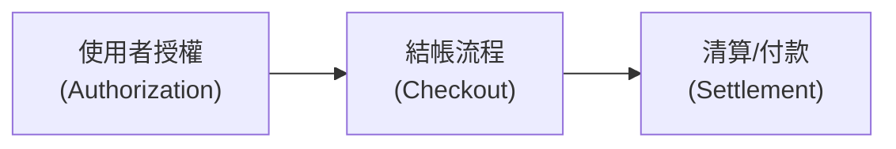

# AP2、ACP 與 x402：三個 Agent 支付協定的比較

> AP2（Google）處理「agent 有沒有得到授權」，ACP（OpenAI + Stripe）處理「agent 怎麼在商家端結帳」，x402（Coinbase）處理「錢怎麼在機器之間即時清算」——三者站在支付棧的不同層次，可以疊加使用而非互斥。

## 為什麼會出現這三個協定

當 AI agent 開始代替使用者做交易決策（買東西、呼叫付費 API、租用算力），傳統支付流程假設「操作者是人、當場輸入密碼或刷卡」的前提就不成立了。三個協定分別針對這個新問題的不同環節提出標準：

- **AP2** 對應第一層：agent 有沒有得到使用者授權？授權範圍是什麼？
- **ACP** 對應第二層：agent 跟商家之間，商品資訊、下單、結帳流程怎麼標準化？
- **x402** 對應第三層：錢怎麼真正轉過去？特別是 API/資料/算力這類「每次呼叫付一點錢」的場景。

三者不是競爭關係，而是可以疊在一起用：agent 用 AP2 取得授權 → 用 ACP 跟電商完成結帳 → 用 x402 做機器對機器（M2M）的實際扣款清算。

## AP2（Agent Payments Protocol）—— 授權與信任層

Google 於 2025 年 9 月發布，超過 60 家支付與科技夥伴（PayPal、Mastercard、American Express、Adyen、Coinbase 等）參與。核心概念是把每筆交易拆成三個**簽名過的 Mandate**（以 W3C Verifiable Credentials 格式承載）：

| Mandate | 由誰簽署 | 內容 |
|---|---|---|
| Intent Mandate | 使用者（在 AP2 相容的 client 端） | 使用者的意圖與限制，例如「買一雙跑鞋，US 10 號，$150 以內，白或灰，送到我常用地址」 |
| Cart Mandate | 商家或商家端 agent | 把 Intent 綁定到具體 SKU、價格、稅、運費、總額 |
| Payment Mandate | agent / 支付網路 | 最終授權金額、付款工具（卡片 token、錢包地址、銀行 token）、以及對 Intent + Cart 的雜湊值 |

這個鏈狀簽名機制解決的是「事後究責」問題：如果 agent 買錯東西，商家、支付方、使用者三方都能驗證「agent 當時確實有被授權做這件事」，避免各執一詞。AP2 對支付方式保持中立，卡片、銀行轉帳、stablecoin 都是一等公民。

## ACP（Agentic Commerce Protocol）—— 結帳流程層

OpenAI 與 Stripe 共同制定，聚焦在「agent-ready checkout」：商品 feed 格式、下單流程、付款委派（payment delegation）、訂單生命週期整合。可以理解成「讓 agent 能像人一樣在電商網站上加入購物車、結帳」的標準化 API，不特別關心底層資金怎麼清算——那部分可以交給信用卡網路、或搭配 AP2 / x402。

## x402 —— 清算層，復活 HTTP 402 狀態碼

Coinbase 提出，核心創意是把 HTTP 標準裡長期未被實作的 `402 Payment Required` 狀態碼變成真正可用的機制：API/服務端回應 402，agent 附上一筆 stablecoin 微支付憑證後重試請求即可拿到資源。

適用場景是「per-request 付費」：呼叫一次付費 API、下載一份付費資料、租用一次算力——這類高頻、小額、機器對機器的場景，比信用卡授權流程輕量很多。x402 目前生產落地進度最快：V2 於 2025 年 12 月上線，Stripe 於 2026 年 2 月在 Base 上整合 x402，Cloudflare 也支援 x402 交易。

## 三者對照

| 維度 | AP2 | ACP | x402 |
|---|---|---|---|
| 主導方 | Google | OpenAI + Stripe | Coinbase |
| 解決層次 | 授權與信任 | 結帳流程 | 清算 / 支付 |
| 核心機制 | 三段簽名 Mandate（Verifiable Credentials） | 商品 feed + checkout API | HTTP 402 + stablecoin 微支付 |
| 典型場景 | agent 代買、需要事後究責的高價值交易 | agent 在電商平台下單購物 | API / 資料 / 算力的逐次付費、M2M |
| 資金型態 | 卡片、銀行轉帳、stablecoin 皆可 | 依商家現有支付方式 | 以 stablecoin 為主 |

一句話總結：**AP2 證明「agent 有沒有得到授權」、ACP 定義「agent 怎麼在商家端結帳」、x402 解決「錢怎麼在機器之間即時清算」**——實務上一個完整的 agentic commerce 系統，往往是三者疊加使用，而非三選一。

## 相關筆記

- [建立 Agent 並設計 Tool 呼叫的權限管理：以 Gemini API 示範](#/llm/04-applications/building-agent-tool-permissions-gemini.mdx)
- [評估 LLM Agent 任務執行是否過度（Over-Execution）的方法](#/llm/04-applications/evaluating-agent-over-execution.mdx)
