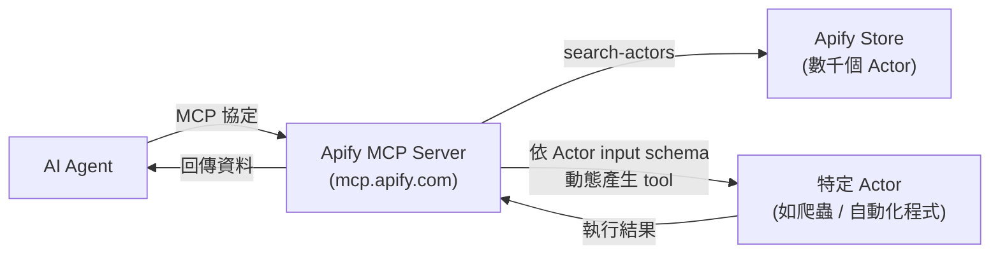

# Apify MCP：把網頁爬蟲平台變成 Agent 可呼叫的工具

> Apify MCP 用 MCP（Model Context Protocol）把 Apify Store 上數千個現成的爬蟲／自動化程式（Actor）包裝成 AI agent 可動態發現、動態呼叫的工具，核心機制是 dynamic tool discovery。

## 解決什麼問題

沒有 MCP 之前，若要讓 LLM agent「去抓某個網站的資料」，得自己寫 scraper、手動包成 function calling 的 tool schema、餵給 agent。Apify Store 上已經有數千個社群維護的現成 Actor（各種網站的爬蟲、自動化腳本），Apify MCP 的價值是把整個 Store 變成 agent 可以動態發現、呼叫的工具庫，不需要為每個 Actor 手動寫一個 tool schema。

## 核心機制：Dynamic Tool Discovery

一般 MCP server 是靜態註冊一組固定 tool，但 Apify Store 太大、成長太快，不可能把每個 Actor 都預先包成 tool。因此 Apify MCP 預設只帶幾個 helper tool：

| Tool | 作用 |
|---|---|
| `search-actors` | 在 Apify Store 裡搜尋符合需求的 Actor |
| `fetch-actor-details` | 拉出某個 Actor 的 input schema 與文件 |
| `search-apify-docs` / `fetch-apify-docs` | 搜尋、讀取 Apify 官方文件 |

Agent 的典型流程：先用 `search-actors` 找到合適的爬蟲 → 用 `fetch-actor-details` 拿到它的 input schema → MCP server 動態把這個 schema 轉成一個 MCP tool → agent 依此知道該傳什麼參數、預期收到什麼格式的回應，再實際呼叫執行。

## 預設配置與可存取的資源

Apify MCP 預設會掛載一個 Actor：`apify/rag-web-browser`（做一般網頁抓取＋內容整理，適合 RAG 場景直接用）。整體上支援四類操作：

1. **Actors**——搜尋、查看細節、當作 tool 執行
2. **Apify 文件**——搜尋與讀取官方文件
3. **Actor runs**——列出執行紀錄、查看細節、拉 log（方便除錯）
4. **Apify storage**——讀取 dataset、key-value store 裡的資料（Actor 執行後的結果通常存在這裡）

## 跟一般單一功能 MCP server 的差異

多數 MCP server（例如 GitHub MCP、Slack MCP）是「一個服務 = 一組固定 tool」。Apify MCP 更像是「工具市集的 MCP 入口」：本身不做爬蟲邏輯，而是把「發現＋動態綁定」標準化。這與長 context 場景下「按需拉取而非一次塞進 context」的思路一致——agent 不需要一次載入幾千個 Actor 的 schema，只在需要時才動態載入相關的那一個。

## 小結

Apify MCP 把 Apify Store 的爬蟲生態系接上 MCP 協定，用 dynamic tool discovery（先搜尋、再拉 schema、再動態產生 tool）讓 agent 不需要預先知道所有工具，就能按需呼叫合適的網頁資料擷取工具。

## 相關筆記

- [Recursive Language Models（遞迴語言模型）的核心概念與運作原理](#/llm/06-frontiers/what-are-recursive-language-models.mdx)
- [建立 Agent 並設計 Tool 呼叫的權限管理：以 Gemini API 示範](#/llm/04-applications/building-agent-tool-permissions-gemini.mdx)
