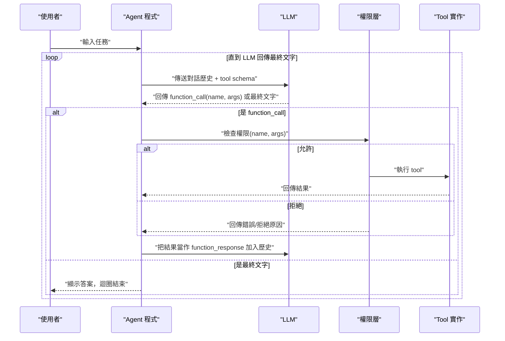
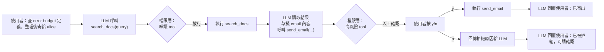

# 建立 Agent 並設計 Tool 呼叫的權限管理：以 Gemini API 示範

> Agent 的核心是一個「LLM 決定要呼叫什麼 → 你的程式決定能不能呼叫、然後執行 → 結果回餵給 LLM」的迴圈。LLM 本身不具備任何執行能力，權限完全掌控在呼叫端（你的程式）手上，這一點跨 provider（Gemini / OpenAI / Claude）皆相同。

## Step 1：Agent 迴圈的基本架構

一個 Agent 不是什麼特殊的模型，而是一段「讓 LLM 多輪呼叫 tool 直到完成任務」的程式邏輯：



**關鍵認知**：LLM 只會產生「我想呼叫 `delete_file(path="/tmp/x")`」這樣的**結構化意圖**，不會真的刪檔案。是否要真的執行，完全是你的程式碼決定——這就是為什麼「權限管理」是應用層的責任，不是模型層的責任。

## Step 2：Tool Schema 定義（讓 LLM 知道能力邊界）

每個 tool 要向 LLM 宣告名稱、用途描述、參數的 JSON Schema。描述寫得越精確，模型越不會誤判該不該呼叫、該傳什麼參數。

```python
# tools_schema.py
GET_WEATHER = {
    "name": "get_weather",
    "description": "查詢指定城市目前的天氣狀況（唯讀，無副作用）",
    "parameters": {
        "type": "object",
        "properties": {
            "city": {"type": "string", "description": "城市名稱，例如 Taipei"},
        },
        "required": ["city"],
    },
}

SEARCH_DOCS = {
    "name": "search_docs",
    "description": "在內部知識庫做全文搜尋，回傳相關文件片段（唯讀）",
    "parameters": {
        "type": "object",
        "properties": {
            "query": {"type": "string"},
            "top_k": {"type": "integer", "description": "回傳筆數，預設 5"},
        },
        "required": ["query"],
    },
}

SEND_EMAIL = {
    "name": "send_email",
    "description": "寄送 email 給指定收件人（會產生外部可見的副作用，高風險）",
    "parameters": {
        "type": "object",
        "properties": {
            "to": {"type": "string"},
            "subject": {"type": "string"},
            "body": {"type": "string"},
        },
        "required": ["to", "subject", "body"],
    },
}

DELETE_FILE = {
    "name": "delete_file",
    "description": "刪除指定路徑的檔案（不可逆操作，高風險）",
    "parameters": {
        "type": "object",
        "properties": {"path": {"type": "string"}},
        "required": ["path"],
    },
}
```

留意每個 description 裡刻意標注了「唯讀」「高風險」「不可逆」——這不只是給人看的註解，也是給模型的訊號：好的 LLM 在猶豫要不要呼叫某個 tool 時會參考描述的風險語氣，但**這只是輔助，不能取代下面的權限層**。模型仍然可能因為理解錯誤或被 prompt injection 誘導而呼叫危險 tool。

## Step 3：Tool 實作與 schema 解耦

Schema 是「介面」，實作是「行為」。分開的好處：可以獨立替換實作（例如測試時 mock）、可以對同一份 schema 套用不同的權限規則、也方便之後把同一組 tool 接到不同 LLM provider。

```python
# tools_impl.py
import os

def get_weather(city: str) -> dict:
    return {"city": city, "temp_c": 31, "condition": "sunny"}  # 示範用假資料

def search_docs(query: str, top_k: int = 5) -> dict:
    return {"query": query, "results": [f"doc-{i}: ...相關內容..." for i in range(top_k)]}

def send_email(to: str, subject: str, body: str) -> dict:
    print(f"[MOCK SEND] to={to} subject={subject}")
    return {"status": "sent", "to": to}

def delete_file(path: str) -> dict:
    os.remove(path)
    return {"deleted": path}

TOOL_IMPL = {
    "get_weather": get_weather,
    "search_docs": search_docs,
    "send_email": send_email,
    "delete_file": delete_file,
}
```

## Step 4：權限層設計——Agent 安全的核心

權限層要回答四個問題：**這個 tool 這次對話准不准用？這個呼叫的參數合理嗎？這個動作風險多高，要不要人工確認？呼叫頻率/範圍有沒有超出合理界線？**

### 4.1 風險分級（Risk Tiering）

把 tool 依副作用大小分級，是設計權限層的起點：

| 風險等級 | 特性 | 範例 | 預設策略 |
|---|---|---|---|
| 唯讀（read-only） | 不改變任何外部狀態 | `get_weather`、`search_docs` | 自動放行 |
| 可逆寫入（reversible write） | 有副作用但可復原/撤回 | 建立草稿、加入購物車 | 記錄 + 自動放行，事後可稽核 |
| 不可逆/外部可見（irreversible / external-facing） | 無法復原，或會被第三方看到 | `send_email`、下訂單、發布貼文 | 需要人工確認 |
| 破壞性（destructive） | 刪除資料、花錢、改權限 | `delete_file`、轉帳、修改 IAM | 預設拒絕，白名單逐案開放 |

這張分級表就是[[evaluating-agent-over-execution]]中討論「blast radius」概念的具體落地：風險等級本質上就是這個 tool 一旦誤呼叫，影響半徑有多大。

### 4.2 白名單 / 黑名單

```python
# permissions.py
class PermissionDenied(Exception):
    pass

# 這次 session 允許「自動放行」的唯讀 tool
AUTO_ALLOWED = {"get_weather", "search_docs"}

# 高風險 tool：允許呼叫，但每次都要人工確認
REQUIRES_CONFIRMATION = {"send_email"}

# 破壞性 tool：預設整個 session 都不開放（除非明確加入 AUTO_ALLOWED 或 REQUIRES_CONFIRMATION）
DENYLIST = {"delete_file"}
```

### 4.3 參數層級的驗證

只做 tool 級別的黑白名單還不夠，同一個 tool 的不同參數可能有天差地遠的風險。例如 `search_docs` 唯讀沒問題，但如果 tool 是 `run_sql(query)`，就必須連參數內容一起檢查：

```python
import re

def validate_args(tool_name: str, args: dict) -> None:
    if tool_name == "delete_file":
        path = args.get("path", "")
        if not path.startswith("/tmp/agent_workspace/"):
            raise PermissionDenied(f"delete_file 只能操作 /tmp/agent_workspace/ 底下的檔案，拒絕: {path}")

    if tool_name == "send_email":
        to = args.get("to", "")
        if not re.match(r"^[^@]+@company\.com$", to):
            raise PermissionDenied(f"send_email 只能寄給 @company.com 網域，拒絕: {to}")
```

### 4.4 人工確認（Human-in-the-loop）

對於 `REQUIRES_CONFIRMATION` 的 tool，權限層要中斷自動迴圈、把決定權交還給人：

```python
def check_permission(tool_name: str, args: dict) -> None:
    if tool_name in DENYLIST:
        raise PermissionDenied(f"'{tool_name}' 在此 session 中被完全禁止")

    validate_args(tool_name, args)

    if tool_name in AUTO_ALLOWED:
        return  # 自動放行

    if tool_name in REQUIRES_CONFIRMATION:
        answer = input(f"⚠️ Agent 想呼叫 {tool_name}({args})，是否允許？(y/n) ")
        if answer.strip().lower() != "y":
            raise PermissionDenied(f"使用者拒絕執行 {tool_name}")
        return

    # 沒被分類到任何清單 → 預設拒絕（fail-closed，比 fail-open 安全）
    raise PermissionDenied(f"tool '{tool_name}' 未被分類，預設拒絕")
```

注意最後一段的**預設拒絕（fail-closed）**：任何沒被明確分類的 tool 一律擋下，而不是「沒寫規則就放行」。這是安全設計的基本原則——新增 tool 時如果忘記幫它分級，寧可它被擋住而失敗顯眼，也不要它悄悄被自動執行。

### 4.5 呼叫範圍與頻率限制

除了單次呼叫的權限，還要防止 Agent 在一個任務裡「合法但過量」地呼叫 tool（例如迴圈裡不斷重試 `send_email` 造成垃圾信）：

```python
from collections import defaultdict

call_counts = defaultdict(int)
MAX_CALLS_PER_TOOL = {"send_email": 3, "delete_file": 0}

def check_rate_limit(tool_name: str) -> None:
    call_counts[tool_name] += 1
    limit = MAX_CALLS_PER_TOOL.get(tool_name, 20)  # 預設每個 tool 最多 20 次/任務
    if call_counts[tool_name] > limit:
        raise PermissionDenied(f"'{tool_name}' 已超過本次任務的呼叫上限({limit})")
```

## Step 5：完整可執行的 Gemini Function Calling 範例

用 `google-genai` SDK，把 schema、實作、權限層串起來。關鍵是關閉 SDK 的 **automatic function calling**，讓每次 tool 呼叫都先經過我們自己的權限 gate，而不是讓 SDK 直接幫你執行。

```python
# agent.py
import os
from google import genai
from google.genai import types
from tools_schema import GET_WEATHER, SEARCH_DOCS, SEND_EMAIL, DELETE_FILE
from tools_impl import TOOL_IMPL
from permissions import check_permission, check_rate_limit, PermissionDenied

client = genai.Client(api_key=os.environ["GEMINI_API_KEY"])

tool_declarations = types.Tool(
    function_declarations=[GET_WEATHER, SEARCH_DOCS, SEND_EMAIL, DELETE_FILE]
)

config = types.GenerateContentConfig(
    tools=[tool_declarations],
    # 關掉自動執行：強制模型只回傳 function_call，實際執行交給我們的權限層
    automatic_function_calling=types.AutomaticFunctionCallingConfig(disable=True),
)

def run_agent(user_input: str, max_steps: int = 8):
    contents = [types.Content(role="user", parts=[types.Part(text=user_input)])]

    for step in range(max_steps):
        resp = client.models.generate_content(
            model="gemini-2.5-flash",
            contents=contents,
            config=config,
        )
        part = resp.candidates[0].content.parts[0]

        if part.text:
            print("Agent:", part.text)
            return

        fc = part.function_call
        print(f"[Step {step}] LLM 想呼叫 {fc.name}({dict(fc.args)})")
        contents.append(resp.candidates[0].content)

        try:
            check_permission(fc.name, dict(fc.args))
            check_rate_limit(fc.name)
            result = TOOL_IMPL[fc.name](**fc.args)
        except PermissionDenied as e:
            result = {"error": str(e)}
        except Exception as e:
            result = {"error": f"執行失敗: {e}"}

        contents.append(
            types.Content(
                role="user",
                parts=[types.Part(function_response=types.FunctionResponse(
                    name=fc.name, response=result
                ))],
            )
        )

    print("Agent: 已達最大步數，中止避免無限迴圈")

if __name__ == "__main__":
    run_agent("台北現在天氣怎樣？順便幫我在知識庫搜尋一下 error budget 的定義")
```

`max_steps` 這個上限本身也是一種權限設計：防止 Agent 因為模型誤判或 tool 結果格式不如預期，陷入無限重試迴圈——這正對應[[evaluating-agent-over-execution]]所討論的「執行是否過度」問題，權限層要同時管「能不能做」與「做多久/做多少次」。

## Step 6：多步驟 Tool Chaining 情境

真實任務常常需要模型串連多個 tool，一步的輸出是下一步的輸入。例如「查詢知識庫，把結果整理後寄信給某人」：



這個情境暴露出權限層很重要的一點：**上游 tool 的輸出會影響下游 tool 的參數**，因此不能只在「第一次看到 send_email 呼叫」時驗證，必須每一次呼叫都重新跑完整的 `check_permission`——不能假設前面已經通過確認的信任可以延續到後面不同的呼叫（例如模型可能因為前一步查到的內容，把收件人偷換成另一個信箱）。

## 與 OpenAI / Claude 的權限設計比較

三家 provider 的 function calling schema 都是 JSON Schema，格式細節略有差異，但**「LLM 只產生呼叫意圖、實際執行與授權在應用層」這個模型完全一致**：

| 面向 | Gemini | OpenAI | Claude |
|---|---|---|---|
| Tool 宣告格式 | `FunctionDeclaration`（JSON Schema） | `tools=[{"type":"function","function":{...}}]`（JSON Schema） | `tools=[{"name","input_schema"}]`（JSON Schema） |
| 是否有內建「自動執行」模式 | 有（`automatic_function_calling`），預設會自動呼叫本地 Python function | 無，一律回傳 `tool_calls` 由你執行 | 無，一律回傳 `tool_use` block 由你執行 |
| 多步驟串接方式 | 把 `function_response` 塞回 `contents` | 把結果塞回 `messages` role=`tool` | 把結果塞回 `messages` 的 `tool_result` block |
| 平行呼叫多個 tool | 支援（`parallel_function_calling`） | 支援（一次回傳多個 `tool_calls`） | 支援（一次回傳多個 `tool_use` block） |
| 官方內建權限機制 | 無，需自建 | 無，需自建 | Claude Code/Agent SDK 有內建 permission prompt 機制可參考設計 |

**共通結論**：不管換哪一家 API，權限層都要自己寫，而且應該設計成與 provider 無關的一層（如本文的 `permissions.py`），這樣切換 LLM provider 時只需要改「呼叫 API 與解析回應」的部分，風險分級、白名單、人工確認、參數驗證這些規則可以整份沿用。

## 相關筆記

- [Structured Output 的必要性](#/llm/04-applications/why-structured-output.mdx)——function calling 本質上是 structured output 的一種應用
- [評估 LLM Agent 任務執行是否過度（Over-Execution）的方法](#/llm/04-applications/evaluating-agent-over-execution.mdx)——risk tiering 與 blast radius 的評估角度
- [Prompt Injection 攻擊](#/llm/05-evals-safety/prompt-injection.mdx)——權限層是防禦 prompt injection 誘導 Agent 執行危險 tool 的最後一道關卡
