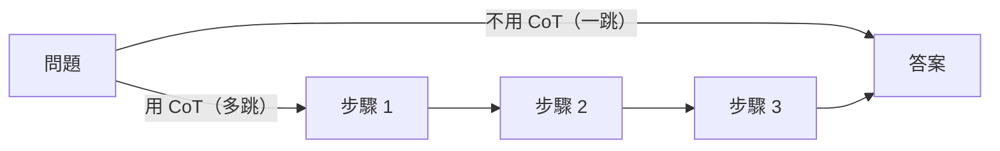

# Chain-of-Thought 與多步推理

> 一句話版本：Chain-of-Thought 是讓模型在給出最終答案之前**先逐步輸出推理過程**的技術——本質上是用輸出 token 換計算量，讓模型把一個難問題拆成多個簡單步驟來解。

## Step 1：什麼是 CoT？

標準 prompting 要求模型一步跳到答案；CoT 讓模型先「想出來」：

```text
❌ 標準 prompting：
問：Roger 有 5 顆球，買了 2 罐各 3 顆的球，共幾顆？
答：11               ← 直接輸出，容易算錯

✅ CoT prompting：
問：Roger 有 5 顆球，買了 2 罐各 3 顆的球，共幾顆？先一步步思考，再給答案。
答：2 罐 × 3 顆 = 6 顆。5 + 6 = 11 顆。答案是 11。   ← 逐步推理，正確率大幅提升
```

## Step 2：三種使用方式

| 方式 | 做法 | 說明 |
|------|------|------|
| Zero-shot CoT | prompt 加「Let's think step by step」或「先一步步思考」 | 最簡單，無需範例 |
| Few-shot CoT | 範例裡包含完整推理過程 | 效果更穩，但要人工寫推理步驟 |
| Extended thinking | 模型用專用 thinking token 自行推理（不輸出給使用者） | 現代 reasoning model 的做法（o1、Claude 3.7+ 等） |

**Zero-shot CoT 範例**（最常用的起手式）：

```text
問：一間工廠每天生產 1200 個零件，故障率 2%，問一週的瑕疵品數量。
請先一步步思考，再給出答案。
```

**Few-shot CoT 範例**（格式控制更強）：

```text
問：小明有 12 顆糖，給了小華 1/3，又買了 5 顆，共幾顆？
推理：12 × (1/3) = 4 顆給出。12 - 4 = 8 顆剩下。8 + 5 = 13 顆。
答案：13

問：一間工廠每天生產 1200 個零件，故障率 2%，問一週的瑕疵品數量。
推理：
```

## Step 3：為什麼有效？（機制解析）

### 核心原因：用 token 換計算量

Transformer 的每個 token 生成都是一次 forward pass，計算量固定。問題越難，「一步跨越」越困難：



CoT 把一個大推理鏈分解成多個小步驟，每步只做一件容易的事。這不是「更努力想」，而是**把難問題重新結構化成多個簡單問題**。

### 輔助效果 1：Scratchpad（草稿紙）

中間步驟寫在 context 裡，後面生成的 token 可以 attend 到這些步驟——等於模型有了草稿紙，不需要「用腦記中間結果」。

### 輔助效果 2：Self-verification

推理步驟是可見的。模型在生成後面步驟時有機會「看到前面哪裡不對」，自我修正的機率比直接輸出答案高。

### 輔助效果 3：Emergent at scale

CoT 在小模型上幾乎無效，大模型（~70B+）才顯著，屬於典型 emergent ability。這也解釋了為什麼 GPT-3 論文時代 CoT 還沒被廣泛使用——當時的模型還不夠大。

## Step 4：何時用，何時不用

| 適合使用 CoT | 不適合或效益低 |
|------------|--------------|
| 數學計算、邏輯推理 | 單純分類、抽取任務 |
| 多步驟決策 | 格式轉換（如 JSON 重排） |
| 需要解釋過程的任務 | latency 極敏感的場景（CoT 輸出 token 多、延遲高） |
| Debugging / 診斷類 | 答案本來就是直觀的 |

**實務建議**：先試 zero-shot CoT（加一句「先一步步思考」），測量效果。如果輸出格式需要精確控制，改用 few-shot CoT 並在範例裡直接示範推理格式。

## 相關筆記

- [Zero-shot、Few-shot、Instruction Prompting 有什麼差別？](#/llm/04-applications/prompting-styles.mdx)
- [Reasoning Model 和一般模型有什麼差異？](#/llm/06-frontiers/reasoning-models.mdx)
