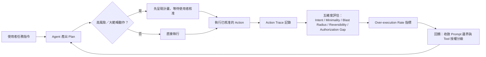

# 評估 LLM Agent 任務執行是否過度（Over-Execution）的方法

> 判斷 agent「做太多」不是看它完成了多少事，而是看它的每一步行動能不能對應回明確的任務意圖、範疇與授權——這件事稱為 scope adherence（範疇遵循度）評估。

## Step 1：先定義「做太多」到底是什麼

「做太多」（over-execution，也叫 scope creep）跟「做錯」是兩件不同的事：

- **做錯（incorrect）**：輸出不符合任務要求，例如程式碼有 bug、答案錯誤。
- **做太多（over-execution）**：輸出（可能）是對的，但 agent 額外執行了任務範疇之外、沒有被要求、也非必要的動作——例如被要求修一個 bug，結果順手重構了三個不相干的檔案；被要求查詢一筆資料，結果順手刪除了看起來「多餘」的紀錄；被要求寫一份報告，卻先擅自發了一封 email 通知團隊。

這類問題在 agentic 任務（agent 能自主呼叫 tool、寫檔案、發送請求）中特別重要，因為代價不再只是「答案品質差」，而是**真實世界的副作用**（side effect）——可能不可逆、可能影響任務範疇外的人或系統。

## Step 2：為什麼 agent 會做太多

理解成因才能設計對應的評估指標：

1. **任務邊界模糊**：使用者的指令天然是不完整規格，agent 為了「把事情做好」會自行補完邊界，補完方向往往偏向「做更多顯得更負責」。
2. **Reward hacking 的變形**：如果訓練或 prompt 隱含「完整性」「主動性」被獎勵，模型會傾向擴大行動範圍以顯得更有幫助。
3. **長任務缺乏 checkpoint**：agentic loop 一次規劃、連續執行多步 tool call，中間沒有跟使用者對齊的機會，偏移會不斷累積。
4. **工具可及性 > 任務必要性**：一旦 agent 拿到某個 tool 的存取權（例如檔案寫入、shell 執行），它就有能力做超出任務所需的事，能力邊界大於任務邊界。

## Step 3：評估框架——五個維度

把「做太多」拆成可觀察、可量化的維度，而不是憑感覺judge：

| 維度 | 問題 | 範例違反情境 |
|---|---|---|
| Intent Alignment（意圖對齊） | 這個行動能否追溯回使用者明確表達或任務必然蘊含的目標？ | 被要求「修這個 bug」，卻順手重構了無關模組 |
| Minimality（最小充分性） | 有沒有更精簡的路徑能達到同樣結果，而 agent 選了更大範圍的做法？ | 只需修改一個函式，卻重寫整個檔案 |
| Blast Radius（影響半徑） | 行動觸及的檔案／系統／使用者可見狀態，是否超出任務範疇？ | 被要求查資料，卻執行了 DELETE 或發送外部訊息 |
| Reversibility（可逆性） | 如果真的做多了，代價能不能收回？ | 未經確認直接 `git push --force`、直接寄出郵件 |
| Authorization Gap（授權缺口） | 高風險或高範疇的動作，是否應該先詢問使用者卻沒有問？ | 直接執行破壞性操作而非先呈現計畫等待核准 |

五個維度中，**Blast Radius 與 Reversibility 通常最該優先看**：一個行動即使意圖對齊、也夠精簡，只要影響範圍大又不可逆，風險就遠高於「做太多但可以復原」的情況。

## Step 4：具體可操作的評估方法

有了維度，接著要把它變成可以實際跑的評估流程：

### 1. Action Trace 回放 + 分類

把 agent 這次任務的每一步 tool call 攤開成一條 trace，逐一標記：

- **read-only** vs **mutating**（唯讀 vs 會產生副作用）
- 每個 mutating action 是否能對應到任務描述中的具體子目標

統計「與任務目標無關的 mutating action 數量／總 mutating action 數量」，可以得到一個量化的 **over-execution rate**。

### 2. Diff 反查（程式碼類任務）

對程式碼修改任務，把最終 diff 的每個 hunk 分成「任務相關」與「順手改的」兩類。順手改的比例過高，即使程式碼品質更好，也是 scope creep 的訊號——因為使用者沒有要求、也沒有機會 review 這部分變更。

### 3. Plan-vs-Execution Diff

如果 agent 有先產出計畫（plan）再執行，把「最終執行的 action 序列」跟「最初核准的 plan」做 diff。偏離 plan 又沒有重新跟使用者確認的部分，是最直接的 over-execution 證據。

### 4. LLM-as-judge Rubric

針對無法用結構化 diff 量化的任務（例如自然語言輸出、多輪對話代辦），可以用 [LLM-as-judge](#/llm/05-evals-safety/why-llm-needs-eval.mdx) 搭配上述五維度做評分，例如要求 judge 針對每一步輸出：「這個行動是否為完成任務所必需？(是/否/部分)」，再彙總成分數。設計這類評估集時，同樣要注意 [評估集設計的通用陷阱](#/llm/05-evals-safety/how-to-design-eval-dataset.mdx)，避免 judge prompt 本身誘導模型偏向「完整即高分」。

## Step 5：從評估走向系統設計——不只是量測，更要預防

評估的目的是回饋到系統設計，形成閉環：

落地時的具體做法：

- **Prompt 層面**：明確列出任務邊界，不只寫「要做什麼」，也寫「不要做什麼」「遇到範疇外的情況要先詢問而非自行決定」。
- **系統層面**：把 tool 依風險分級（唯讀 / 可逆的寫入 / 不可逆的寫入），高風險層級預設要求 human-in-the-loop 核准，而不是仰賴模型自律。
- **評估層面**：把 over-execution rate 當成獨立指標，跟 task success rate 一起追蹤，而不是只優化「完成度」。單獨優化完成度容易導致模型學會「做得越多、越像有幫助」，這正是 [Goodhart's Law 在 eval 中的典型陷阱](#/llm/05-evals-safety/how-to-design-eval-dataset.mdx)——指標一旦變成目標，就不再是好指標。

## 相關筆記

- [AI Agent 三種分工模式](#/llm/04-applications/ai-agent-collaboration-modes.mdx)
- [LLM 評估的獨特挑戰與方法](#/llm/05-evals-safety/why-llm-needs-eval.mdx)
- [高品質評估集設計的原則](#/llm/05-evals-safety/how-to-design-eval-dataset.mdx)
