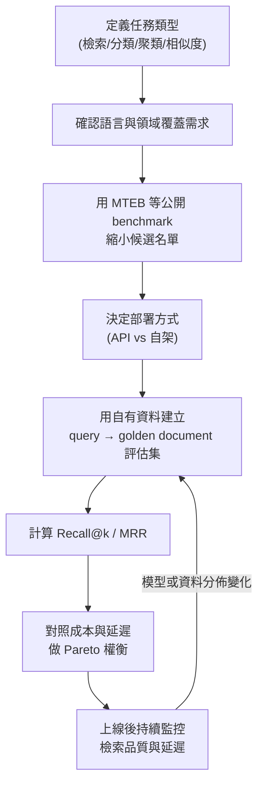

# Embedding Model 的選型考量與評估方法

> 選 embedding model 不是挑 leaderboard 分數最高的那個，而是先釐清任務類型（檢索／分類／聚類）、資料的語言與領域，再用自己的資料跑評估，兼顧品質、成本與延遲三者的權衡。

## Step 1：先搞清楚 embedding model 是拿來做什麼

Embedding model 把一段文字（或圖片、程式碼）映射成一個固定維度的向量，讓語意相近的內容在向量空間中距離也相近。常見應用場景：

- **檢索（retrieval）**：RAG pipeline 裡把 query 與文件都轉成向量，用 cosine similarity 或內積找出最相關的段落，詳見 [LLM 的無狀態性與記憶策略](#/llm/01-foundations/do-llms-have-memory.mdx) 中提到的 RAG 記憶模式。
- **分類（classification）**：把 embedding 當作特徵餵給下游分類器，而不是直接微調整個 LLM。
- **聚類與去重（clustering / dedup）**：例如把大量客服工單依語意分群、找出重複問題。
- **語意相似度（semantic similarity / reranking）**：判斷兩段文字是否語意相近，或對檢索結果做粗排。

這四種任務對 embedding model 的要求並不相同——**專為檢索優化的模型，不一定是分類或聚類任務的最佳選擇**，這是選型時最容易忽略的一點。

## Step 2：選型的核心考量維度

### 1. 任務對齊（task alignment）

多數現代 embedding model（如 OpenAI `text-embedding-3`、Cohere `embed-v3`、開源的 BGE / E5 系列）都是用對比學習（contrastive learning）在「query-document pair」上訓練的，天生偏向檢索任務。如果你的場景是聚類或分類，訓練資料的分佈是否涵蓋你的任務型態，會直接影響效果。

### 2. 語言與領域覆蓋

- **語言**：多語模型（multilingual）通常會犧牲一部分單語言（例如純英文）的效果去換取跨語言能力。如果你的文件全是中文，先確認候選模型的中文訓練資料量與 tokenizer 是否對中文友善。
- **領域**：法律、醫療、程式碼等專業領域的用詞分佈跟通用網路文本差異很大，通用 embedding model 在這類領域的檢索效果可能明顯下降，需要考慮領域微調或專門模型（如程式碼用 `code-embedding` 系列）。

### 3. 向量維度與儲存成本

維度越高，理論上能保留的語意資訊越多，但也直接影響：

- 向量資料庫的儲存空間（維度 $d$、文件數 $N$，儲存量約為 $O(N \times d)$）
- 向量檢索的計算成本（ANN 索引建置與查詢延遲通常隨維度上升而增加）

許多新一代模型（例如支援 Matryoshka Representation Learning 的模型）允許在推理時截斷向量維度（例如從 1536 維截到 256 維），用小幅品質換取大幅的儲存與延遲節省，這在成本敏感的場景很值得評估。

### 4. Context length（輸入長度上限）

Embedding model 通常有輸入長度上限（例如 512 tokens），超過會被截斷。如果文件本身較長，需要考慮：

- **Chunking 策略**：如何切分文件以配合 model 的輸入上限（這是獨立的工程課題，不只是選 model 的問題）。
- 部分模型專門針對長輸入優化（如 8K tokens 以上），適合長文件較多的場景。

### 5. 部署方式：API vs 自架

| 面向 | API（如 OpenAI、Cohere、Vertex AI） | 自架開源模型（如 BGE、E5、GTE） |
|---|---|---|
| 上線速度 | 快，呼叫 API 即可 | 需要自建 serving（如 TEI、vLLM embedding 模式） |
| 單次成本 | 依 token 計費，量大時成本累積明顯 | 主要是硬體與維運成本，邊際成本趨近於零 |
| 資料隱私 | 資料會離開內部環境 | 可完全在內部環境運行 |
| 客製化 | 無法微調底層模型 | 可針對自有資料做 fine-tuning 或 contrastive 微調 |
| 版本穩定性 | 供應商可能靜默更新模型，向量分佈可能漂移 | 版本掌握在自己手上，可控管升級時機 |

### 6. 效能：延遲與吞吐量

線上 RAG 場景中，query embedding 的延遲會直接疊加在使用者體感的 end-to-end latency 上（可對照 [P50/P95/P99 延遲監控](#/sre/02-observability/latency-percentiles.mdx) 的觀念，embedding 呼叫本身也該納入 SLO 的一環）。批次的文件 embedding（建索引階段）對延遲不敏感，但對吞吐量與成本敏感，兩種情境的選型權衡不同。

## Step 3：怎麼用 benchmark 初篩，再用自己的資料驗證

### 用 MTEB 之類的公開 benchmark 做初篩

[MTEB](https://huggingface.co/spaces/mteb/leaderboard)（Massive Text Embedding Benchmark）涵蓋檢索、分類、聚類、相似度等多個任務類別的分數，是目前最廣泛使用的 embedding model 評估集合。使用時要注意：

- **看跟自己任務最相關的子分數**，不要只看綜合平均分——這跟 [如何有系統地比較不同 LLM 模型的差異](#/llm/05-evals-safety/comparing-different-llms.mdx) 中「綜合分數掩蓋任務差異」的陷阱是同一個道理。
- MTEB 的資料集以英文與部分多語資料為主，中文場景的代表性有限，建議搭配中文子榜（如 C-MTEB）一起看。
- Benchmark 分數只適合縮小候選名單到 3～5 個，**不能直接當作最終選型依據**。

### 用自己的資料跑檢索品質評估

1. 準備一份「query → 應該命中的正確文件（golden document）」的評估集，數量不需要很大，但要貼近真實查詢分佈。
2. 對每個候選模型，把 query 與文件都轉成向量，計算 top-k 檢索結果。
3. 用檢索領域的標準指標評分：

$$
\text{Recall@k} = \frac{\text{golden document 出現在 top-k 結果中的 query 數}}{\text{總 query 數}}
$$

$$
\text{MRR} = \frac{1}{|Q|} \sum_{i=1}^{|Q|} \frac{1}{\text{rank}_i}
$$

其中 $\text{rank}_i$ 是第 $i$ 個 query 的 golden document 在檢索結果中的排名。Recall@k 反映「有沒有找到」，MRR 進一步反映「排得多前面」，兩者搭配比單一指標更完整。

4. 把品質分數跟成本、延遲一起比較（同樣是 quality vs cost 的權衡框架），而不是選「Recall@k 最高」的那個就結束。

## Step 4：整體選型流程

## Step 5：常見陷阱

- **只看 MTEB 綜合分數就下決定**：務必檢查跟自己任務最相關的子項分數，並用自己的資料再驗證一次。
- **忽略向量維度帶來的長期儲存成本**：向量資料庫的成本會隨文件量線性成長，維度選擇要及早評估。
- **換模型後沒有重建索引**：不同 embedding model（甚至同模型不同版本）產生的向量空間不相容，換模型必須對所有文件重新做 embedding、重建索引，不能只換 query 端。
- **忽略 chunking 策略的影響**：同一個 embedding model，配合不同的文件切分方式，檢索效果可能差異很大，評估時應固定 chunking 策略再比較模型，避免把兩個變因混在一起。

## 相關筆記

- [LLM 的無狀態性與記憶策略](#/llm/01-foundations/do-llms-have-memory.mdx)
- [如何有系統地比較不同 LLM 模型的差異](#/llm/05-evals-safety/comparing-different-llms.mdx)
- [常見 LLM 評估指標與適用場景](#/llm/05-evals-safety/eval-metrics-overview.mdx)
- [P50 / P95 / P99 百分位延遲的意義與監控應用](#/sre/02-observability/latency-percentiles.mdx)
