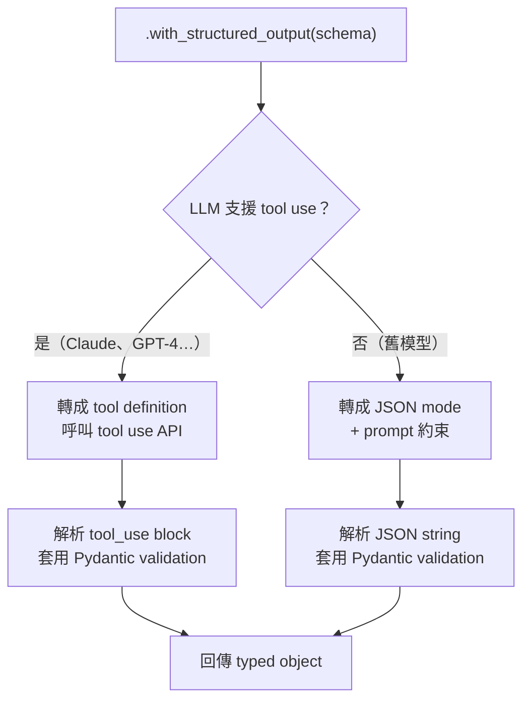

# LangChain 的結構化輸出機制

> LangChain 用 `.with_structured_output()` 統一介面，底層自動選 tool use 或 JSON mode，並整合 Pydantic 驗證。

## 核心 API：`.with_structured_output()`

LangChain 0.2+ 提供統一的 structured output API，直接接受 Pydantic model 或 JSON Schema：

```python
from langchain_anthropic import ChatAnthropic
from pydantic import BaseModel

class User(BaseModel):
    name: str
    age: int
    email: str

llm = ChatAnthropic(model="claude-sonnet-4-6")
structured_llm = llm.with_structured_output(User)

result = structured_llm.invoke("擷取：Alice，30 歲，alice@example.com")
# result 是 User 物件，不是 string
print(result.name)   # "Alice"
print(result.age)    # 30（是 int，不是 "30"）
```

## 底層機制

LangChain 根據 LLM 能力自動選擇實作方式：



對 Claude 來說，LangChain 的 `.with_structured_output()` 實際上是把 schema 轉成 tool definition，然後呼叫 Anthropic tool use API。

## 三種 Schema 輸入格式

```python
from typing import TypedDict
from pydantic import BaseModel

# 方式 1：Pydantic model（推薦，型別最嚴格）
class User(BaseModel):
    name: str
    age: int

# 方式 2：TypedDict（輕量，不需要 pydantic）
class UserDict(TypedDict):
    name: str
    age: int

# 方式 3：JSON Schema dict（最底層，最靈活）
user_schema = {
    "type": "object",
    "properties": {
        "name": {"type": "string"},
        "age":  {"type": "integer"}
    },
    "required": ["name", "age"]
}

structured_llm_1 = llm.with_structured_output(User)      # 回傳 User object
structured_llm_2 = llm.with_structured_output(UserDict)  # 回傳 dict
structured_llm_3 = llm.with_structured_output(user_schema) # 回傳 dict
```

## `include_raw=True`：同時取得原始輸出

有時需要看模型的原始 reasoning 或 debug 用：

```python
structured_llm = llm.with_structured_output(User, include_raw=True)
result = structured_llm.invoke("...")

# result 是 dict
result["raw"]     # AIMessage（原始模型輸出）
result["parsed"]  # User object（解析後）
result["parsing_error"]  # 解析失敗時的錯誤訊息
```

## 錯誤處理

LangChain 預設在解析失敗時直接 raise exception。生產環境建議加重試：

```python
from langchain_core.output_parsers import JsonOutputParser
from langchain_core.runnables import RunnableWithFallbacks

structured_llm = llm.with_structured_output(User)

# 方法 1：用 .with_retry()
chain = structured_llm.with_retry(stop_after_attempt=3)

# 方法 2：用 include_raw + 自己處理
structured_llm = llm.with_structured_output(User, include_raw=True)

def safe_parse(result):
    if result["parsing_error"]:
        # 重試或回傳預設值
        return None
    return result["parsed"]
```

## 和直接用 Tool Use API 的比較

| 維度 | LangChain `.with_structured_output()` | 直接用 Anthropic SDK tool use |
|------|--------------------------------------|------------------------------|
| 程式碼量 | 少（自動轉換 schema） | 多（手動寫 tool definition） |
| 框架耦合 | 依賴 LangChain | 無耦合 |
| 型別支援 | 直接整合 Pydantic | 需自行接 Pydantic |
| 除錯難度 | 較難（多一層抽象） | 較易（清楚看到 API 呼叫） |
| 換模型 | 幾乎不改 code | 可能需調整 tool format |

**建議**：小型專案 / 原型 → 直接用 SDK；需要跨模型切換或複雜 chain → LangChain 抽象層值得代價。

## 相關筆記

- [為什麼需要 Structured Output？](#/llm/04-applications/why-structured-output.mdx)
- [LLM API Response 結構是什麼？](#/llm/04-applications/llm-api-response-structure.mdx)
