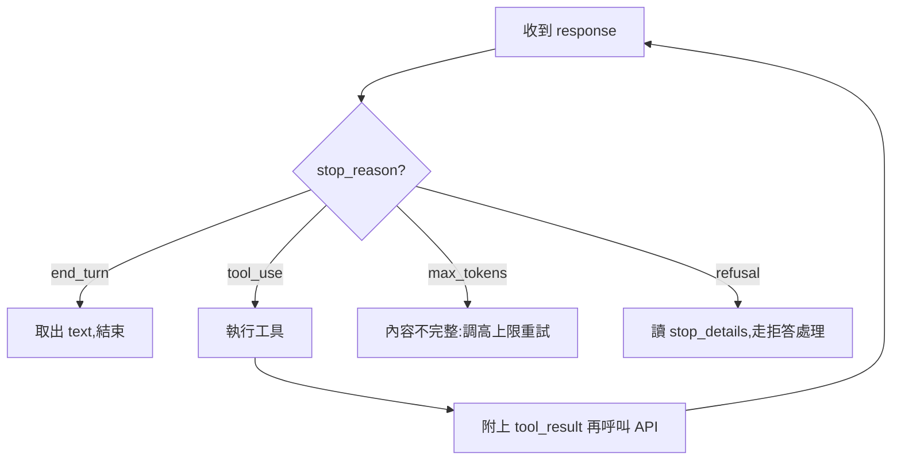

# LLM API 回應的結構與語義

> 一句話版本：主流 LLM API 的回應是一個 JSON 物件，核心三塊是 **content（模型產出的內容區塊）**、**stop_reason（為什麼停下來）**、**usage（token 用量/計費依據）**；寫整合程式時，先看 stop_reason、再解析 content、最後記錄 usage，是最穩健的處理順序。

## Step 1：一個真實的回應長什麼樣（以 Claude Messages API 為例）

請求 `POST /v1/messages` 後，拿到的回應大致如下：

```json
{
  "id": "msg_01XFDUDYJgAACzvnptvVoYEL",
  "type": "message",
  "role": "assistant",
  "model": "claude-opus-4-8",
  "content": [
    { "type": "text", "text": "法國的首都是巴黎。" }
  ],
  "stop_reason": "end_turn",
  "stop_sequence": null,
  "usage": {
    "input_tokens": 12,
    "output_tokens": 18,
    "cache_creation_input_tokens": 0,
    "cache_read_input_tokens": 0
  }
}
```

各家 API（OpenAI、Gemini…）欄位命名不同，但結構同構：都有「識別資訊 + 內容 + 停止原因 + 用量」四大塊。OpenAI 的對應是 `choices[0].message.content` 與 `finish_reason`;Claude 則把內容設計成 `content` **區塊陣列**，原因見下一步。

## Step 2：content —— 為什麼是「陣列」而不是一個字串？

因為模型的單次輸出可能混合多種型態的內容，每種是一個 block，用 `type` 區分：

| block type | 內容 | 什麼時候出現 |
|---|---|---|
| `text` | 一般文字回答 | 最常見 |
| `thinking` | 推理過程（摘要） | 開啟 thinking 時，出現在 text 之前 |
| `tool_use` | 模型想呼叫工具：`id` + `name` + `input` 參數 | 有給 tools 且模型決定使用時 |
| `web_search_tool_result` 等 | 伺服器端工具的執行結果 | 使用 server-side tools 時 |

所以解析時**永遠不要假設 `content[0]` 是文字**，要用 type 過濾：

```python
for block in response.content:
    if block.type == "text":
        print(block.text)
    elif block.type == "tool_use":
        result = run_tool(block.name, block.input)  # 執行後把結果回傳給模型
```

## Step 3：stop_reason —— 模型為什麼停下來？

這是整合程式的**控制流核心**，不同值對應完全不同的後續動作：

| stop_reason | 意義 | 你該做什麼 |
|---|---|---|
| `end_turn` | 自然講完了 | 正常結束 |
| `max_tokens` | 撞到輸出上限，**內容被截斷** | 提高 `max_tokens` 或改用 streaming |
| `stop_sequence` | 命中你自訂的停止字串 | 依應用邏輯處理 |
| `tool_use` | 模型要呼叫工具 | 執行工具 → 把 `tool_result` 回傳 → 再呼叫一次 API(agent loop) |
| `pause_turn` | 伺服器端工具長任務暫停 | 原樣重送，讓它繼續 |
| `refusal` | 安全機制拒答 | 檢查 `stop_details`，不要原 prompt 重試 |



## Step 4：usage —— 計費與快取觀測

| 欄位 | 意義 |
|---|---|
| `input_tokens` | 未命中快取、全價計費的輸入 token |
| `output_tokens` | 輸出 token（單價通常是輸入的數倍） |
| `cache_creation_input_tokens` | 這次寫入 prompt cache 的量（約 1.25 倍價） |
| `cache_read_input_tokens` | 從快取讀到的量（約 0.1 倍價，便宜 90%） |

注意：總輸入量 = 三個 input 欄位**相加**。長對話中若 `cache_read_input_tokens` 一直是 0，代表快取沒生效，值得排查。

## Step 5：streaming 模式 —— 結構變成「事件流」

聊天 UI 要逐字顯示，會改用 streaming（SSE）。同一份回應被拆成一串事件，依序是：

```
message_start          → 回應的骨架(id、model…)
content_block_start    → 某個 content block 開始(index 0)
content_block_delta    → 增量內容(text_delta 一小段一小段來)
content_block_stop     → 該 block 結束
message_delta          → 尾端 metadata(stop_reason、usage)
message_stop           → 整則結束
```

把所有 `content_block_delta` 依 index 拼起來，就還原出非 streaming 版的 `content` 陣列 —— 兩種模式的最終結構是一致的，SDK 通常提供 `get_final_message()` 幫你組好。

## Step 6：錯誤回應的結構

非 2xx 時，body 是另一種固定格式：

```json
{
  "type": "error",
  "error": { "type": "rate_limit_error", "message": "..." },
  "request_id": "req_011CSHoEeqs5C35K2UUqR7Fy"
}
```

依 `error.type`（或 HTTP status）分流：429/5xx 可退避重試，400/404 是請求本身有問題不該重試。`request_id` 回報問題時要附上。

## 相關筆記

- [什麼是 token?API 通常如何計費？](#/llm/01-foundations/what-is-a-token-and-api-pricing.mdx) —— usage 欄位的計費邏輯
- [什麼是 context window?](#/llm/01-foundations/what-is-context-window.mdx) —— input + output 的總量上限
- [LLM 有記憶功能嗎？](#/llm/01-foundations/do-llms-have-memory.mdx) —— 為什麼每輪請求都要重送完整 messages
