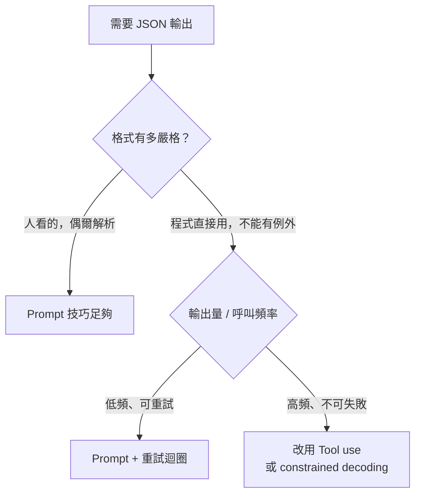

# Prompt 驅動的 JSON 輸出技巧

> Prompt 無法 100% 保證格式，但有幾個技巧可以大幅提高命中率 —— 搭配後處理驗證才算完整。

## 前置認知：Prompt 是 Soft Constraint

Prompt 只能影響機率分布，不能硬性封鎖非法輸出。這節技巧的目標是**把合法 JSON 的機率推到夠高**，而不是達到 100%（那需要 tool use 或 constrained decoding）。

## 技巧 1：System Prompt 清楚宣告格式

越早、越明確越好。模糊指令 vs. 精確指令：

```
# 模糊（效果差）
"請用 JSON 格式回答"

# 精確（效果好）
"你是資料擷取 API。只輸出一個合法 JSON 物件，不包含任何說明文字、
markdown code fence 或換行前綴。必須符合以下 schema：
{ \"name\": string, \"age\": number, \"email\": string }"
```

關鍵要素：
- 明說「不包含 markdown code fence」
- 明說「不包含說明文字」
- 直接列出 schema 或欄位

## 技巧 2：Few-shot 範例示範格式

給 1-3 個示範，模型會模仿格式：

```python
messages = [
    {"role": "system", "content": "只輸出 JSON，格式如範例所示。"},
    {"role": "user",   "content": "擷取：Alice，30 歲，alice@example.com"},
    {"role": "assistant", "content": '{"name": "Alice", "age": 30, "email": "alice@example.com"}'},
    {"role": "user",   "content": "擷取：Bob，25 歲，bob@corp.io"},
]
```

注意：assistant 範例的內容就是純 JSON，沒有多餘文字 —— 模型會學這個模式。

## 技巧 3：Output Template（最有效的 prompt 技巧）

在 assistant 的回覆開頭預填 `{`，強迫模型「接著寫」而不是「重新決定格式」：

```python
messages = [
    {"role": "user", "content": "擷取以下文字的姓名和年齡：Alice，30 歲"},
    {"role": "assistant", "content": "{"},  # 預填開頭
]
```

這個技巧在 Anthropic API 稱為「prefill」，在 OpenAI 中可用 `prefix：true`（部分模型支援）。模型看到已有 `{`，幾乎必然繼續完成合法 JSON。

## 技巧 4：明確禁止常見偏移

```
禁止項目（請在系統提示中列出）：
- 不要在 JSON 前加任何說明
- 不要使用 markdown code fence（``` 或 ```json）
- 不要在 JSON 後加任何解釋
- 不要輸出多個 JSON 物件
```

## 技巧 5：後處理驗證 + 重試迴圈

即使做了上述所有事，仍應加一層後處理：

```python
import json, re

def extract_json(raw：str) -> dict:
    # 嘗試直接解析
    try:
        return json.loads(raw)
    except json.JSONDecodeError:
        pass

    # 嘗試從 code fence 中擷取
    match = re.search(r'```(?:JSON)?\s*(\{.*?\})\s*```', raw, re.DOTALL)
    if match:
        return json.loads(match.group(1))

    # 嘗試找第一個 { ... }
    match = re.search(r'\{.*\}', raw, re.DOTALL)
    if match:
        return json.loads(match.group(0))

    raise ValueError(f"無法從輸出中擷取 JSON: {raw[:200]}")

def call_with_retry(prompt, max_retries=3):
    for attempt in range(max_retries):
        raw = call_llm(prompt)
        try:
            return extract_json(raw)
        except (ValueError, json.JSONDecodeError):
            if attempt == max_retries - 1:
                raise
            prompt += f"\n\n上次輸出格式有誤：{raw[:100]}\n請只輸出合法 JSON。"
```

## 效果比較

| 技巧組合 | 約略命中率 |
|---------|----------|
| 無任何約束 | 60-70% |
| 清楚 system prompt | 80-90% |
| + few-shot 範例 | 90-95% |
| + output template（prefill） | 95-99% |
| + 後處理重試 | ~99.5% |
| Tool use / constrained decoding | 100% |

## 何時應該放棄 Prompt，改用 Tool Use？



## 相關筆記

- [為什麼需要 Structured Output？](#/llm/04-applications/why-structured-output.mdx)
- [LLM 為什麼容易輸出不穩定格式？](#/llm/04-applications/why-llm-outputs-unstable-format.mdx)
- [如何設計 Constraint 讓模型輸出更穩定？](#/llm/04-applications/constraint-design.mdx)
