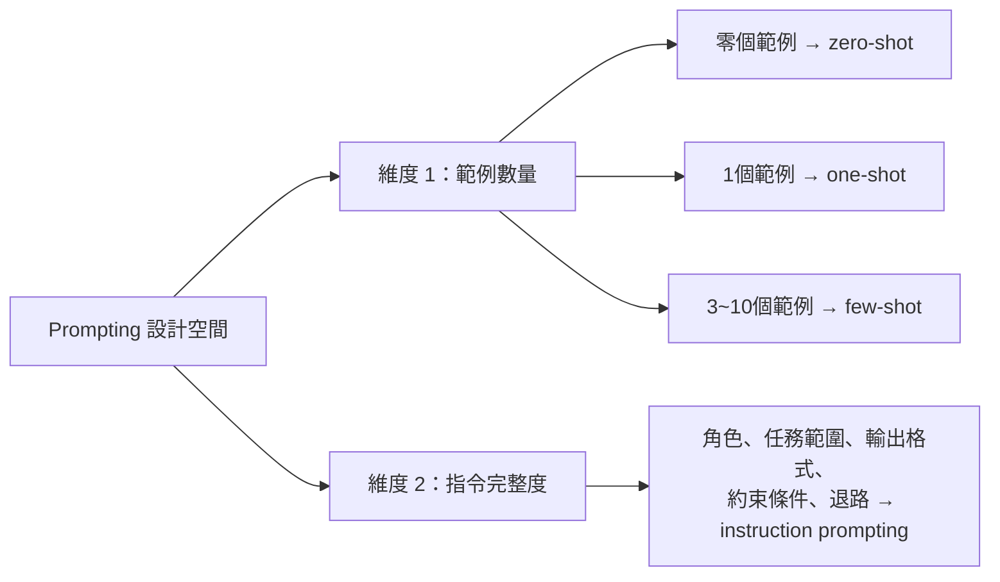
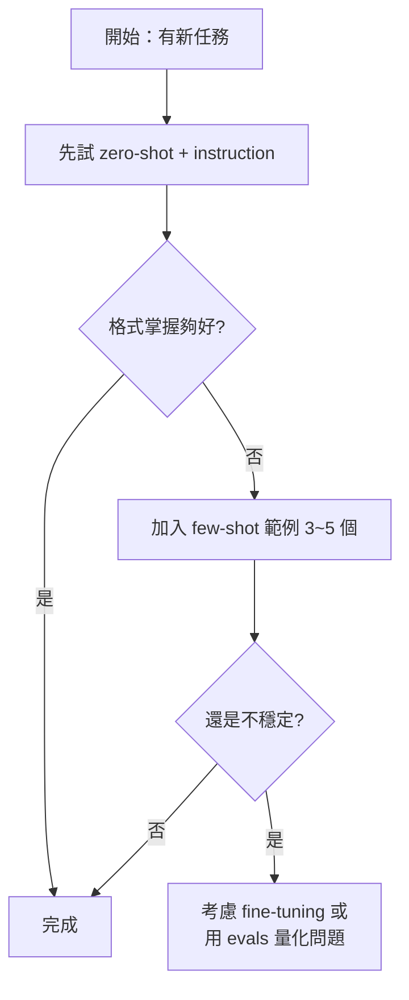

# 零樣本、少樣本與指令提示的區別

> 一句話版本：Zero-shot 與 Few-shot 是**範例數量**的維度；Instruction prompting 是**指令完整度**的維度。兩者正交、可自由組合——搞清楚這個區別，才能有系統地排查 prompt 問題。

## Step 1：兩個不同維度

這三個詞常被混用，但它們其實描述的是設計 prompt 的兩個獨立軸：



## Step 2：維度 1——範例數量（zero-shot / few-shot）

| 模式 | 範例數 | 模型依賴什麼 |
|------|--------|------------|
| Zero-shot | 0 | 預訓練知識 + 理解自然語言指令的能力 |
| One-shot | 1 | 一個示範 + 預訓練知識 |
| Few-shot | 3~10 | 範例中歸納出的格式／模式（ICL） |

Few-shot 的核心價值是觸發 **In-context Learning（ICL）**：模型不靠文字描述理解格式，而是直接從你給的輸入→輸出配對「看懂」。

```text
Few-shot 範例（情感分類）：

輸入：這部電影太好看了！
標籤：正面

輸入：劇情拖沓，浪費時間。
標籤：負面

輸入：普普通通，沒什麼特色。
標籤：
```

模型從這三個配對歸納出格式，直接輸出標籤，不需要你解釋「幫我做情感分類」。

**Few-shot 的代價**：佔用 context window、需要人工準備範例、範例品質不一致會教壞模型。格式越標準（如 JSON 輸出），zero-shot 通常就夠用；格式越奇特，few-shot 的優勢越明顯。

## Step 3：維度 2——Instruction Prompting（指令完整度）

Instruction prompting 不是「給幾個範例」，而是一種**寫法風格**：把任務描述寫得完整、結構化。

五個核心要素：

| 要素 | 說明 | 範例 |
|------|------|------|
| 角色 | 設定模型要模仿的專業身份 | 「你是資深 Python reviewer」 |
| 任務範圍 | 明確要做什麼、按什麼順序 | 「依序檢查：邊界條件、例外處理、命名」 |
| 輸出格式 | 具體的結構要求 | 「每個問題一行：severity \| 行號 \| 說明 \| 建議修法」 |
| 約束條件 | 排除不要做的事 | 「只看函式本身，不要猜測呼叫端行為」 |
| 退路 | 資料不足時的處理方式 | 「沒有問題時輸出 LGTM」 |

現代 **instruction-tuned 模型**（Claude、GPT-4、Llama-3 Instruct）對這種風格特別有效，因為 SFT/RLHF 訓練就是用「指令 → 理想回應」的配對資料微調的——模型本來就被訓練成「乖乖遵照清楚指令」。

## Step 4：組合方式與實務建議

兩個維度可以自由組合：

| 組合 | 適用場景 | 說明 |
|------|---------|------|
| Zero-shot + Instruction | 最常用的現代做法 | 指令夠清楚時，不需要範例 |
| Few-shot（無詳細指令） | 格式複雜但難以文字描述 | 讓範例自己說話 |
| Few-shot + Instruction | 最強；格式複雜又需精確控制 | 耗 context，但輸出最穩定 |
| Zero-shot（無指令） | 只適合超簡單問題 | 讓模型猜，品質不可控 |



**迭代原則**：先用 zero-shot + instruction，格式不對再加 few-shot 範例，最後才考慮 fine-tuning。從最便宜的做法開始。

## 相關筆記

- [In-context learning 與 Prompt engineering 是什麼？](#/llm/04-applications/icl-and-prompt-engineering.mdx)
- [模型訓練和微調有什麼差異？](#/llm/02-training/pretraining-vs-finetuning.mdx)
