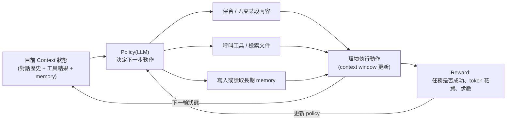

# Context Engineering 中的 Reinforcement Learning

> 一句話：Context Engineering 決定「這一輪要餵給模型什麼」，而 Reinforcement Learning（RL）讓這個決定本身變成一個可以被訓練、被優化的 policy，而不是靠人工寫死的規則。

## Step 1：先釐清 Context Engineering 在做什麼

Context Engineering 是 Prompt Engineering 的延伸，處理的問題從「這句話怎麼寫」擴大到「這個 context window 裡該放哪些東西」，包含：

- 該保留哪些歷史對話 / 工具呼叫紀錄
- 該從 RAG 檢索哪些文件片段
- 該何時做 compaction（壓縮舊 context 騰出空間）
- 該何時把資訊寫進長期記憶（memory）、何時讀回來
- 該呼叫哪個工具、要不要呼叫

這些都是**動作（action）**，而不是單純的文字生成。傳統做法是工程師手寫規則（例如「超過 80% context window 就觸發 compaction」），這類規則詳見 [Context Window 與模型記憶容量](#/llm/01-foundations/what-is-context-window.mdx)。

## Step 2：規則式 Context Engineering 的天花板

手寫規則有兩個問題：

1. **無法針對任務目標優化**：規則只能保證「不爆 context window」，無法保證「保留的內容真的有助於完成任務」。
2. **規則之間會互相打架**：要不要保留某段歷史，取決於後面十步是否會用到它——這是一個長期依賴的決策問題，人工很難窮舉所有情境寫規則。

這正是 RL 的強項：把一連串「要不要保留 / 要不要檢索 / 要不要壓縮」的決策視為一個 **sequential decision-making 問題**，用最終任務成敗（reward）反過來訓練這些決策。

## Step 3：把 Context 管理建模成 RL 問題

用標準 RL 詞彙對應：

| RL 概念 | 對應到 Context Engineering |
|---|---|
| State（狀態） | 目前的 context window 內容 + 任務進度 |
| Action（動作） | 保留 / 丟棄某段內容、呼叫某個工具、寫入或讀取 memory、觸發 compaction |
| Policy（策略） | 通常就是 LLM 本身（或一個附加的 controller） |
| Reward（獎勵） | 任務是否成功、花了多少 token / 多少步、有沒有因為關鍵資訊被丟掉而失敗 |
| Episode（回合） | 一次完整的多輪 agent 任務（例如一次 debug 任務從頭到結束） |

這與只做單輪輸出的 RLHF（詳見 [預訓練與微調：模型改進的完整路徑](#/llm/02-training/pretraining-vs-finetuning.mdx)）不同：RLHF 的 reward 通常評估「這一次回答好不好」，而 context engineering 的 RL 評估的是「一連串跨多輪的 context 操作，最終有沒有讓任務成功」，屬於 **multi-turn / long-horizon RL**。

## Step 4：具體的訓練方式

實務上常見兩種切法：

1. **把 context 管理動作變成 agent 的 tool call**：例如把「compaction」「寫入 memory」「檢索」都包裝成工具（tool），讓 agent 在 agentic loop 中自主決定何時呼叫。訓練時用 PPO / GRPO 之類的演算法，對整個 multi-step trajectory 算 reward，反向更新模型權重，讓模型學會「什麼時候該呼叫哪個 context 管理工具」。
2. **把 context 管理獨立成一個 controller policy**：LLM 本身只負責生成任務內容，另外訓練一個較小的 policy（甚至用 RL 訓練的分類器）專門決定 context 的取捨，兩者解耦、各自優化。

不論哪種切法，reward 設計都是關鍵，常見組成：

$$
R = R_{\text{task success}} - \lambda_1 \cdot R_{\text{token cost}} - \lambda_2 \cdot R_{\text{latency / steps}}
$$

也就是「任務有沒有成功」為主要訊號，同時用 token 花費、步數當作懲罰項，逼 policy 學會用最精簡的 context 完成任務，而不是無腦保留所有歷史。

## Step 5：這套做法面臨的挑戰

- **Reward 稀疏且延遲（sparse & delayed reward）**：一個 context 管理決策（例如第 3 步就把某段資訊丟掉）可能要到第 30 步才會因為缺資訊而任務失敗，credit assignment 很困難。
- **Reward hacking**：如果只獎勵「token 花費少」，policy 可能學會過度丟棄內容、犧牲正確性換取分數（reward hacking 的一般性討論見 [LLM 中的訓練、驗證、測試劃分](#/llm/05-evals-safety/train-val-test-in-llm.mdx)）。
- **訓練成本高**：multi-turn RL 需要跑完整的 agent episode 才能拿到 reward，比單輪 RLHF 貴很多，通常需要模擬環境或可重複執行的任務環境來大量取樣。
- **評估困難**：context 管理策略好不好，很難用單一 benchmark 衡量，往往要看一整批多樣化任務的成功率與效率。

## 小結

Context Engineering 的 RL 化，本質是把「context 該放什麼」從一個靠人工規則維護的工程問題，變成一個可以用任務結果反饋、持續優化的學習問題。這也是目前 agent 相關研究（context compaction、memory 管理、tool selection）的主流方向之一：與其寫死規則，不如讓模型在大量任務中學會「怎麼管理自己的 context 最划算」。

## 相關筆記

- [Context Window 與模型記憶容量](#/llm/01-foundations/what-is-context-window.mdx)
- [LLM 的無狀態性與記憶策略](#/llm/01-foundations/do-llms-have-memory.mdx)
- [In-Context Learning 與 Prompt Engineering](#/llm/04-applications/icl-and-prompt-engineering.mdx)
- [Agent 檔案式記憶與 RAG 的異同](#/llm/04-applications/agent-memory-vs-rag.mdx)
- [預訓練與微調：模型改進的完整路徑](#/llm/02-training/pretraining-vs-finetuning.mdx)
