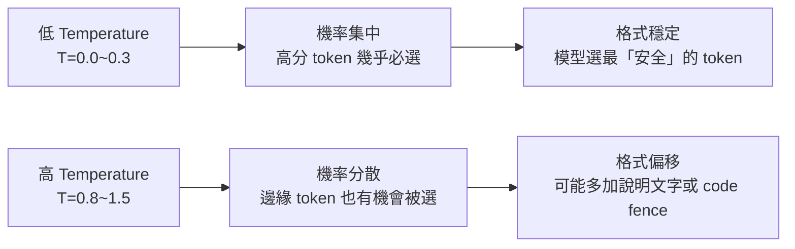
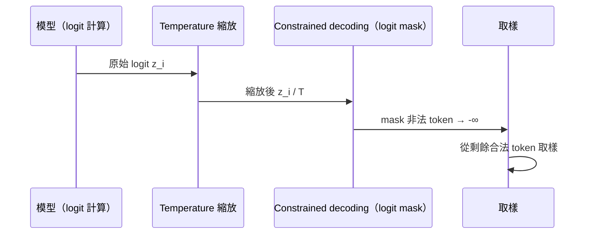

# Temperature 與結構化輸出的相互作用

> Temperature 控制的是取樣隨機性——格式穩定性和創意輸出是相反方向的需求，structured output 場景幾乎永遠應該用低 temperature。

## 回顧：Temperature 是什麼

Temperature $T$ 縮放 logit（token 的原始分數）再轉成機率：

$$
P(x_i) = \frac{\exp(z_i / T)}{\sum_j \exp(z_j / T)}
$$

- $T \to 0$：機率集中在最高分 token（幾乎確定性輸出）
- $T = 1$：原始分布
- $T > 1$：機率分布更平坦，低分 token 機率上升

## 為什麼 Temperature 影響格式穩定性



**具體例子**：
- 在 `{"name": "` 之後，正確 token 是姓名字串
- 但「`Here is the JSON:`」這種 token 在高 temperature 下也有一定機率
- 低 temperature → 模型直接繼續 JSON；高 temperature → 可能插入這種偏移 token

## 不同路線受 Temperature 影響的程度

| 方式 | Temperature 影響 | 說明 |
|------|----------------|------|
| Prompt 約束 | **高** | 完全依賴機率，temperature 直接影響偏移率 |
| JSON mode | **中** | API 層會 retry 直到合法 JSON，但仍可能影響欄位內容 |
| Tool use | **低** | 參數 schema 有驗證，但欄位值的品質仍受影響 |
| Constrained decoding | **無** | logit masking 在 temperature 縮放之後再套用，格式 100% 正確 |

## 實務建議

### Structured output 場景：用低 temperature

```python
response = client.messages.create(
    model="claude-sonnet-4-6",
    temperature=0,      # 或 0.1 至多 0.2
    tools=[schema],
    messages=[...]
)
```

`temperature=0` 表示 greedy decoding（永遠取最高機率 token），格式偏移率最低。

### 什麼時候才需要提高 temperature？

| 場景 | 建議 temperature |
|------|----------------|
| 資料擷取、分類、摘要（答案有唯一最優解） | 0 ~ 0.2 |
| 問答、說明文字（需要流暢但不需要創意） | 0.3 ~ 0.7 |
| 創意寫作、腦力激盪 | 0.7 ~ 1.0 |
| 多樣性取樣（同一問題要多個不同答案） | 0.8 ~ 1.2 |

### 特殊考量：temperature=0 不等於「永遠相同輸出」

即使 $T=0$，以下因素仍可能造成輸出變化：
- 同分 token（tie-breaking 行為依實作而定）
- 服務端的 batch padding（影響 attention）
- 模型版本更新

所以：**structured output 的可靠性應由 schema validation 保證，而不是依賴輸出的確定性**。

## 與 Constrained Decoding 的關係



Constrained decoding 在 temperature 縮放**之後**才 mask——這意味著即使 temperature 很高，非法 token 的機率仍然是 0。溫度影響的只是合法 token 之間的選擇（欄位值的多樣性），不影響格式正確性。

## 相關筆記

- [Temperature 與 Top-p 是什麼？](#/llm/03-inference/temperature-and-top-p.mdx)
- [為什麼需要 Structured Output？](#/llm/04-applications/why-structured-output.mdx)
- [LLM 為什麼容易輸出不穩定格式？](#/llm/04-applications/why-llm-outputs-unstable-format.mdx)
