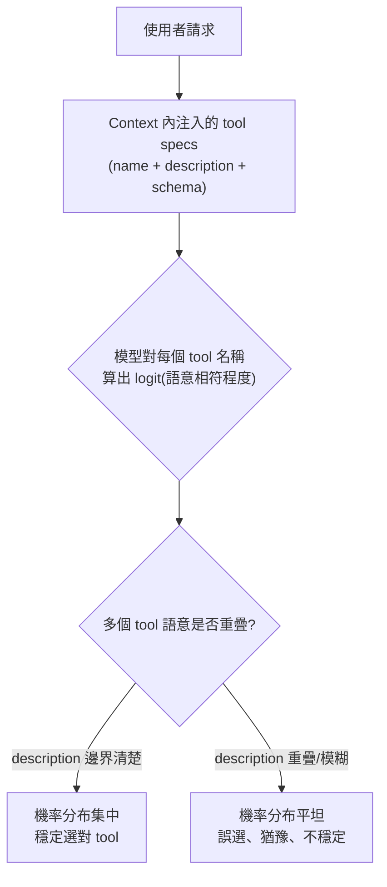
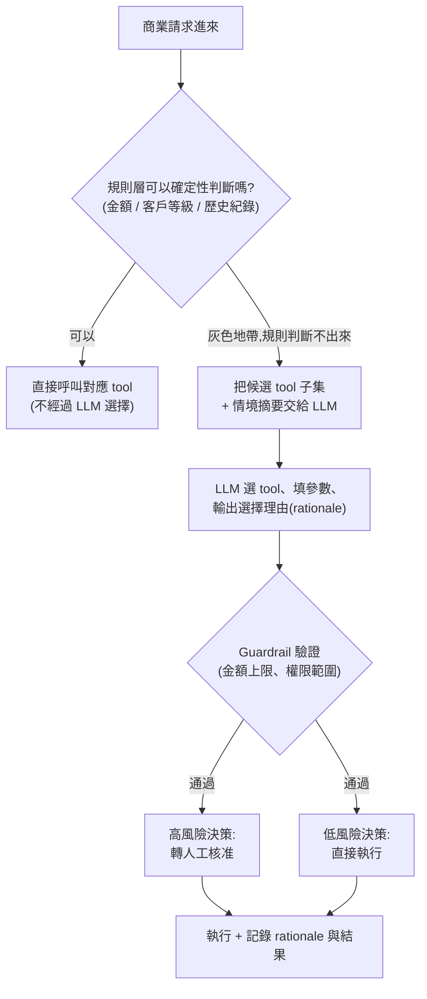
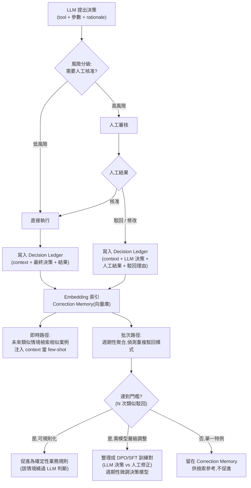
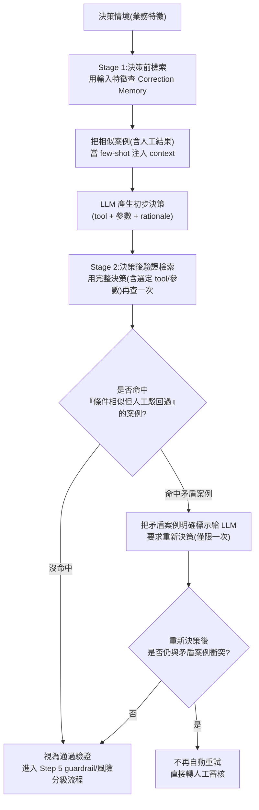

# LLM 面對多個同性質 Tool 時的決策機制

> Tool 選擇不是獨立的規則引擎,而是模型在做一次以 tool 的 name、description、parameter schema 為條件的 next-token 生成;當多個 tool 語意重疊時,這個機率分布會變平、變模糊,導致誤選或猶豫。理解這個本質,才知道為什麼「寫清楚的 description」比任何後製邏輯都更有效。

## Step 1:Tool 呼叫的本質是條件式生成,不是查表

Function calling / tool use 的訓練方式,是把每個可用 tool 的定義(名稱、description、JSON Schema 參數)序列化成一段結構化文字,注入到 context 裡(通常是 system 層級),再讓模型透過 SFT 與 RLHF 學會:看到使用者請求時,從這段 context 裡挑出對應的 tool 名稱與參數,以特定格式(如 JSON)輸出。

也就是說,模型並不是先「查一張 tool 對照表」再決定,而是把整個 tool 清單當作 context 的一部分,用跟生成一般文字完全相同的機制 —— attention 加 softmax —— 算出下一個 token(這裡是 tool 名稱)的機率分布:

$$
P(\text{tool}_i \mid \text{context}) = \frac{\exp(z_i)}{\sum_j \exp(z_j)}
$$

其中 $z_i$ 是模型對 tool $i$ 名稱這個 token(或 token 序列)算出的 logit,取決於使用者意圖與這個 tool 的 name/description 在語意空間中的相符程度。這跟模型選一個一般字詞是同一套機制,只是「詞彙表」換成了「目前 context 裡的 tool 名單」。

## Step 2:模型實際依賴的訊號有哪些

| 訊號 | 作用 | 重要性 |
|------|------|--------|
| Tool description | 主要依據,決定該 tool 適用情境的自然語言說明 | 最高 |
| Tool name | 名稱本身的語意線索(如 `search_web` vs `search_code`) | 高 |
| Parameter schema | 目前對話中是否已具備能填入該 tool 參數的資訊 | 中高 |
| 對話歷史 / 先前 tool 呼叫結果 | 延續性:剛用過某類 tool,傾向再次選擇同類 | 中 |
| System prompt 中的顯式規則 | 直接寫「遇到 X 情境用 tool A,不要用 tool B」 | 高(若有寫的話) |
| Few-shot 範例 | In-context 示範某情境對應哪個 tool | 中高 |
| 清單中的順序 | 位置偏誤(primacy/recency),tool 太多時尤其明顯 | 低但存在 |

其中 description 是決定性因素,因為它是模型唯一能用來做語意匹配的「權威文字」——這也是為什麼業界公認「tool 設計的品質,決定了 tool 呼叫的準確率」。

## Step 3:為什麼「同性質」的 tool 特別容易選錯

當兩個 tool 的 description 語意重疊(例如都寫「用來查詢資料」),模型算出的 logit $z_i$、$z_j$ 會很接近,softmax 後的機率分布變得平坦、不集中。這時模型的輸出對 context 裡的微小線索(措辭、順序、上一輪對話)非常敏感,呼叫結果變得不穩定 —— 同一個問題問兩次,可能選到不同 tool。

這個現象在業界常被稱為 tool overload / tool confusion:當同時暴露給模型的 tool 數量太多(經驗上超過 20 到 40 個)、或多個 tool 功能高度相似時,選擇準確率會明顯下降。

## Step 4:業界降低誤選的實務做法

1. **description 互斥且具體**:明確寫出「何時用 / 何時不要用」,把邊界寫進文字裡,不要指望模型自己推理出隱含的分工。
2. **減少同時暴露的 tool 數量**:超過幾十個 tool 會讓決策變不穩定,能合併就合併。
3. **用一個 tool 加 enum 參數,取代多個相似 tool**:例如一個 `search` tool 搭配 `scope` 參數(`web` / `docs` / `code`),比三個獨立但語意相近的 tool 更容易讓模型正確分流,因為選擇被收斂成單一 tool 名稱 + 顯式列舉值,而不是在多個相似名稱間比較。
4. **Deferred tool loading / tool retrieval**:tool 數量很多時(例如多個 MCP server 掛載),不要一次把所有 tool 定義都塞進 context,而是先用關鍵字或 embedding 檢索出候選子集,只把最相關的幾個 tool 定義注入,縮小模型要比較的候選範圍。這也是這個系統本身採用的機制:大部分工具預設不載入,需要時才依關鍵字查出對應 schema 再使用。
5. **Namespace 前綴**:多來源工具用 `mcp__<server>__<tool>` 這類前綴,避免不同來源但功能相近的 tool 名稱互相干擾。
6. **In-context few-shot 範例**:針對容易混淆的情境,直接示範「這種請求要選這個 tool」,比純靠 description 更能收斂機率分布。
7. **讓模型先用自然語言推理再輸出 tool_call**:reasoning model 的 extended thinking 讓模型在正式輸出呼叫前,先用文字比較候選 tool 的適用性,等同人為拉開了語意接近的 logit 差距,對重疊 tool 的分辨力有明顯幫助。
8. **Server 端二次確認**:對信心不足或同時觸發多個候選的情況,加一層 router/verifier 做後處理,而不是完全依賴單次生成的結果。

## Step 5:特化場景 —— 把「每一種商業決策」都包成一個 tool

這是同性質 tool 誤選問題的一個高風險特例:商業決策(核准折扣、退款、信用額度調整、合約條款…)彼此的語意邊界通常比技術類 tool 更模糊(都可以描述成「處理客戶的某個請求」),而選錯 tool 的代價不是回錯資料,而是真的做出錯誤的商業行動。這裡在 Step 4 的通用做法之外,還有幾個針對「決策類 tool」的特化建議。

### 先問:這些決策該包成多個 tool,還是一個 tool 加 enum

決策空間如果彼此互斥、輸入欄位又高度重疊(例如「核准 5% 折扣」「核准 10% 折扣」「核准 15% 折扣」),幾乎必然應該收斂成 **一個 `make_decision` tool + `decision_type` enum + 對應參數**,而不是拆成多個相似 tool——原因跟 Step 4 提到的一致:多個語意相近的 tool 會讓模型的選擇機率分布變平,但同一個 tool 內選 enum 值,等同把「選 tool」這個高風險的模糊決策,轉成「填參數」這個模型相對穩定的任務。

只有當不同決策類型需要的輸入欄位、下游 side effect 差異很大時(例如「退款」跟「調整合約條款」),才值得拆成獨立 tool——這時 parameter schema 本身就是清楚的區分訊號。

### 用「規則層」先做確定性分流,LLM 只在灰色地帶做選擇

商業決策通常有一部分情境是可以用明確規則直接判斷的(金額、客戶等級、歷史紀錄都在系統裡查得到)。把這部分邏輯留給 LLM,等於把本來可以確定性處理的問題,变成一個機率性、可能不穩定的問題。實務上更穩妥的架構,是先用規則/查表做確定性分流,只有規則判斷不出來的灰色地帶才交給 LLM 選 tool:

### 強制模型先講理由,再選 tool

在 tool 呼叫的 schema 裡加一個必填的 `rationale` 欄位,要求模型在選 tool 之前,先用自然語言講清楚「為什麼是這個決策類型、依據是什麼」。這等同 Step 4 提到的「先推理再輸出 tool_call」,但在商業決策場景額外有兩個好處:一是可審計(auditability)——事後能回答稽核「這筆折扣為什麼核准」;二是能把 rationale 拿去做離線評估,找出模型系統性選錯的決策類別,回頭修 description 或補 few-shot 範例。

### 依風險分級,而不是統一規則

不同商業決策的 blast radius 差異很大(核准 5% 折扣 vs 核准全額退款 vs 修改合約),應該比照 [建立 Agent 並設計 Tool 呼叫的權限管理](#/llm/04-applications/building-agent-tool-permissions-gemini.mdx) 的做法,依風險分級決定:低風險決策 LLM 選完直接執行;高風險決策無論 LLM 多有信心,都強制經過人工核准。這一層是 Step 4 的「router/verifier 二次確認」在商業場景的具體化,也是防止「LLM 選錯 tool」直接變成「公司真的做錯決策」的最後一道防線。

## Step 6:人工駁回 LLM 決策後,如何設計「記得」的資料流程

Step 5 提到高風險決策要轉人工核准,但核准流程不能是一次性的——人工駁回或修改的結果,必須回饋進系統,否則同樣的錯誤會一直重演。這裡的關鍵前提是:**LLM 本身無狀態**(見 [LLM 的無狀態性與記憶策略](#/llm/01-foundations/do-llms-have-memory.mdx)),「記得」從來不是模型的能力,而是外部資料流程要不要把過去的決策結果,重新餵回下一次的 context。設計上要區分三個不同層次的「記得」:

| 層次 | 做法 | 特性 |
|------|------|------|
| 同一 session 內 | 直接把駁回結果寫進當前對話 context | 立即生效,但 session 結束就消失 |
| 跨 session、不改權重 | 外部 Correction Memory + 檢索注入(RAG for cases) | 部署快、可即時生效,是下面的主要做法 |
| 系統性長期改變 | 促進為確定性業務規則,或整理成訓練資料微調決策模型 | 生效慢,但一次性解決一整類重複錯誤 |

### 資料流程設計

**Decision Ledger** 是整個流程的 source of truth,每筆記錄至少要有:`decision_id`、時間戳、`context_snapshot`(做決策當下的輸入特徵)、`llm_decision`(選的 tool、參數、rationale)、風險分級、`human_action`(核准/駁回/修改)、`human_reason`(駁回理由,盡量結構化而非純自由文字)、最終結果。這張表不是聊天記錄,是可查詢、可審計的資料庫,是後續兩條路徑(即時檢索、批次促進)的唯一資料來源。

### 即時路徑:Correction Memory 檢索注入

這是跟 Step 4「few-shot 範例」同一套機制,只是範例來源從人工預先寫好,換成系統自動累積的真實駁回案例:對 `context_snapshot` 做 embedding,存進向量庫;下次遇到類似情境,檢索出最相似的過去案例(尤其是被駁回過的),連同人工的駁回理由一起注入 context,讓模型在做決策前先看到「類似情況之前被駁回過,理由是……」。這條路徑不需要重新訓練,部署後幾乎立即生效,是回饋循環裡最先該補上的一段。

**檢索用的 embedding 表示法很關鍵**:要以決策相關的業務特徵(客戶等級、金額區間、決策類型)為主去 embed,而不是原始對話文字——否則語意相近但業務條件不同的案例會被誤判成「類似」,反而注入錯誤的參考。

### 批次路徑:模式偵測與促進

不是每次駁回都該立刻變成規則或訓練資料——要先分辨這是**單一特例**(業務人員一次性的判斷,跟決策邏輯本身無關),還是**系統性模式**(同一類情境被連續駁回多次,代表 tool 的 description、參數規則,或原本設計的決策邊界有問題)。實務上用一個門檻(例如同類情境在滾動視窗內累積 N 次駁回)來決定要不要促進:

- **可規則化**(駁回理由是明確的業務條件,如「金額超過 X 一律要人工」):直接寫成確定性規則,讓這類情境未來繞過 LLM 判斷,從源頭消除誤選風險。
- **需模型層級調整**(駁回理由是模型系統性判斷偏差,不是單一硬規則能表達):把「LLM 原本的決策」跟「人工修正後的正確決策」整理成 DPO 訓練對(用人工修正當 $y_w$、LLM 原決策當 $y_l$),週期性微調決策模型或其 router。

### 容易忽略的設計細節

- **駁回理由要結構化**:純自由文字很難拿去做模式偵測與訓練資料,建議至少搭配一組 reason code(如「工具選錯」「參數超出權限」「政策判斷,不涉及工具邏輯」),否則無法判斷這筆駁回該進即時路徑、批次路徑,還是根本不該促進。
- **人工判斷本身也要可回溯、可版本化**:人工核准/駁回不是絕對正確答案,事後可能被推翻(政策改變、判斷失誤),Correction Memory 與已促進的規則都要能標記失效、重新檢視,不然錯誤的人工判斷會被系統當成「正確範例」持續放大。
- **避免用單一離群案例污染 Correction Memory**:門檻機制(N 次以上才促進)同時也保護即時檢索路徑——如果任何一次駁回都無差別注入未來 context,一次不具代表性的人工誤判也會被當成範例反覆引用。

## Step 7:「先決策、後查 RAG、再決定是否重新決策」可行嗎

這是 Step 6 即時路徑的一個變形:不是在 LLM 做決策**之前**就把相似案例注入 context,而是讓 LLM **先產生一個初步決策**,再拿這個決策去查 Correction Memory,依查到的結果決定要不要推翻重來。這個做法機制上完全可行——本質上就是經典的 case-based reasoning(檢索相似案例輔助決策)加上一層自我驗證(reflection/self-verification)——但有幾個容易踩雷的地方,值得先想清楚。

### 為什麼「先決策再檢查」不是最穩妥的順序

自迴歸生成有個已知現象:模型一旦先輸出了一個決策,後續文字會**條件在自己已經講過的話上**——這讓「已生成的決策」帶有慣性,模型在看到查到的反例時,傾向於為自己的初步決策辯護、合理化,而不是真正推翻重來。這跟 Step 4 提到的「先推理再輸出」是同一個原理的另一面:順序會系統性地影響最終結果。研究上也觀察到類似模式:LLM 的 unprompted self-correction(自己想一想有沒有錯)普遍不可靠;但當「該不該修正」的判斷依據是**外部、有根據的訊號**(這裡是查到的人工駁回紀錄,不是模型自己空想)時,修正的可靠度明顯提高。

也就是說,你的設計裡「先決策再查 RAG」這個順序本身有風險,但「拿外部檢索結果當修正依據」這個核心想法是對的方向——問題出在檢索時機,不是檢索本身。

### 檢索用的 query 也可能被自己的決策污染

如果查詢 Correction Memory 的 query 是用「LLM 剛剛做出的決策」組出來的(例如把決策內容也編碼進 embedding),檢索結果容易偏向「支持這個決策」的案例,而不是真正相似但結論相反的案例——因為 query 本身已經帶有這次決策的訊息,retrieval 傾向找到語意相近、而不是「條件相同、結論不同」的反例。

### 建議的修正:兩段式檢索,而不是二選一

比較穩妥的做法不是在「決策前查」跟「決策後查」中選一個,而是兩段都做,各司其職:

- **Stage 1(決策前)**:用輸入特徵(客戶等級、金額區間、決策類型)查詢,目的是讓模型一開始就看過類似案例,形成合理的初步判斷——這對應 Step 6 的即時路徑。
- **Stage 2(決策後)**:用「完整決策」(含模型選的 tool 與參數)再查一次,目的不是重找 few-shot,而是**驗證**——特別去檢查有沒有「條件很像、但人工結果跟現在這個決策衝突」的案例。這一步查詢用的是決策後才確定的細節(例如具體核准金額),往往比決策前的查詢更精準,能抓到 Stage 1 因為資訊還不完整而漏掉的衝突案例。
- **重新決策要有界限**:允許重來,但只允許一次,且必須把「查到的矛盾案例」明確、具體地標示給模型看(而不是要模型自己反省),重新決策後如果依然衝突,直接轉人工,不要陷入自動反覆重試的迴圈。

### 這跟 Step 6 的分工

Step 6 的即時路徑(決策前檢索)解決的是「讓模型一開始就少犯已知的錯」;這裡的決策後驗證檢索解決的是「模型還是犯了已知的錯,能不能在執行前攔下來」——兩者是互補、不是取代關係。批次路徑(規則促進、DPO 微調)則負責處理「同一種矛盾一直發生」的系統性問題,三層合起來才是完整的回饋迴路。

## 相關筆記

- [建立 Agent 並設計 Tool 呼叫的權限管理:以 Gemini API 示範](#/llm/04-applications/building-agent-tool-permissions-gemini.mdx)
- [評估 LLM Agent 任務執行是否過度(Over-Execution)的方法](#/llm/04-applications/evaluating-agent-over-execution.mdx)
- [LLM 的無狀態性與記憶策略](#/llm/01-foundations/do-llms-have-memory.mdx)
- [Agent 檔案式記憶與 RAG 的異同](#/llm/04-applications/agent-memory-vs-rag.mdx)
- [Apify MCP:把網頁爬蟲平台變成 Agent 可呼叫的工具](#/llm/04-applications/apify-mcp-overview.mdx)
- [Structured Output 的必要性](#/llm/04-applications/why-structured-output.mdx)
- [AI Agent 三種分工模式](#/llm/04-applications/ai-agent-collaboration-modes.mdx)
