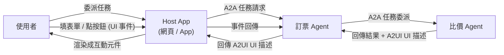

# A2UI（Agent2UI）協定的核心概念與運作原理

> A2UI 是 Google 提出、與 A2A 配套的協定，讓 AI agent 能動態輸出與框架無關的結構化 UI 描述，交由 host 應用渲染成人類可互動的畫面，而不只是回傳純文字。

## Step 1：要解決的問題

在 agent 應用普及之前，LLM 的輸出介面基本上只有兩種：

1. **純文字 / Markdown**：agent 說「請輸入你的信用卡卡號」，使用者自己在對話框打字回覆，沒有輸入驗證、沒有結構化互動。
2. **前端工程師手刻的 UI**：開發者針對每一種可能的互動（訂票表單、確認卡片、日期選擇器）預先寫好對應畫面，agent 只能從固定的幾種畫面裡選一種觸發，擴充性差，而且 agent 的能力和前端開發脱鉤、綁死在特定 client 上。

A2UI 想讓 **UI 的產生權下放給 agent 本身**：agent 在執行任務過程中動態決定「這裡該讓使用者填表單」「這裡該顯示比價卡片」，用一種與平台無關的方式描述這個 UI，交給 host（網頁、手機 App、聊天視窗）去渲染。這跟 MCP 讓 agent 動態發現「有哪些 tool 可以呼叫」是同一種思路，只是換成「有哪些 UI 可以呈現」。

## Step 2：核心概念——UI 是資料，不是程式碼

A2UI 的關鍵設計是：agent 傳出的不是某個框架的元件程式碼（不是 React JSX、不是 Flutter widget tree），而是一份**與框架無關的宣告式 UI 描述**（可理解成標準化的 JSON schema，描述元件類型、layout、資料綁定、使用者可觸發的事件）。

這樣設計帶來幾個效果：

- **同一份 agent 輸出可在不同 client 上渲染成不同長相**：網頁版用 React 元件渲染，App 版用原生元件渲染，只要 host 端實作了對應的 renderer。
- **UI 與商業邏輯分離**：agent 只負責「要顯示什麼」與「使用者互動後會回傳什麼資料」，具體怎麼畫出來是 host 的責任，agent 開發者不需要懂前端框架。
- **雙向資料流**：使用者在 A2UI 渲染出來的表單裡填資料、按按鈕，這些互動事件依照協定格式送回 agent，讓 agent 接續處理。

## Step 3：跟 A2A 的關係

A2UI 誕生的背景是 A2A（Agent2Agent Protocol）——A2A 定義了 agent 之間如何互相發現能力、委派任務、回報進度與結果。但 A2A 的訊息本質是給另一個 agent（機器）看的，不是拿來畫給人看的。

當一條任務鏈的最終消費者是**人類使用者**（例如：使用者委派一個訂票 agent，這個 agent 內部又呼叫了另一個比價 agent），需要有辦法讓深層 agent 產生的結果，一路「浮現」成使用者看得懂、能互動的介面，而不是被扁平化成一段文字塞進聊天框。A2UI 補上這一段：它讓 A2A 訊息流裡可以夾帶「這是一段 UI」的結構化 payload，host 應用收到後知道要用渲染器把它畫出來，而不是當成純文字顯示。

## Step 4：跟 MCP 的定位差異

三個協定容易搞混，用「各自解決什麼問題」來區分最清楚：

| 協定 | 解決什麼問題 | 通訊的兩端 |
|------|-------------|-----------|
| **MCP**（Model Context Protocol） | agent 如何動態發現與呼叫外部 tool / 資料源 | Agent ↔ Tool/資料源 |
| **A2A**（Agent2Agent） | agent 之間如何互相委派任務、回報結果 | Agent ↔ Agent |
| **A2UI**（Agent2UI） | agent 產生的結果如何動態渲染成人類可互動的 UI | Agent ↔ Host App（面向使用者的那層） |

可以把整條鏈想成：使用者 ↔ **A2UI** ↔ Host App ↔ **A2A** ↔ 多個協作 agent ↔ **MCP** ↔ 各種外部工具與資料。三者互補，不是互相取代的關係。

## Step 5：對開發者的實際影響

- Agent 開發者不必為每個 client 平台各寫一套 UI，只需要輸出一份符合 A2UI schema 的描述。
- Host / client 開發者只需要實作一個通用的 A2UI renderer（把 schema 映射到自己框架的元件），就能承接任何遵循 A2UI 的 agent 輸出，不需要為每個新 agent 客製前端。
- 這種「protocol-first、renderer 解耦」的模式，本質上跟 [gRPC](#/swe/01-system-design/what-is-grpc.mdx) 用 IDL 解耦 client/server 實作、或 MCP 用標準化 schema 解耦 agent 與工具，是同一種工程思路的延伸：**用一份與實作無關的描述格式，換取雙邊各自演進的自由度**。

## 相關筆記

- [Apify MCP：把網頁爬蟲平台變成 Agent 可呼叫的工具](#/llm/04-applications/apify-mcp-overview.mdx)
- [AP2、ACP 與 x402：三個 Agent 支付協定的比較](#/llm/04-applications/ap2-vs-acp-vs-x402.mdx)
- [建立 Agent 並設計 Tool 呼叫的權限管理：以 Gemini API 示範](#/llm/04-applications/building-agent-tool-permissions-gemini.mdx)
