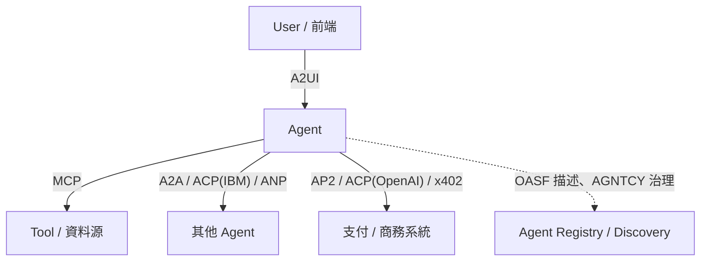

# 除了 A2UI、AP2 之外的 Agent 相關標準總覽

> 圍繞 agent 之間如何溝通、如何呼叫工具、如何被發現的一系列新興協定，可依「解決的問題層次」分成工具呼叫、agent 互聯、UI 驅動、支付、治理描述五層。

業界圍繞「agent 之間怎麼溝通、agent 怎麼呼叫工具、agent 怎麼被發現與治理」這幾個問題，冒出了一批協定/規範。可以按解決的問題層次分類理解。

## Agent 與 Tool/資料源之間——MCP（Model Context Protocol）

- **發起者**：Anthropic（2024 底發布，現由社群治理）。
- **解決的問題**：agent 要呼叫外部工具、讀取資料，過去每家框架（LangChain、LlamaIndex…）都有自己的 tool schema，導致 `M` 個 agent 對 `N` 個工具要寫 `M × N` 個整合。MCP 定義統一的 client-server 協定，工具/資料源只要實作一次 MCP server，任何支援 MCP 的 agent 都能呼叫。
- **架構**：MCP Host（如 Claude Desktop）內的 MCP Client 透過 JSON-RPC 連到 MCP Server，Server 暴露 `tools`、`resources`、`prompts` 三種原語。

## Agent 與 Agent 之間（水平溝通）

| 標準 | 發起者 | 解決的問題 |
|---|---|---|
| A2A（Agent2Agent Protocol） | Google（2025，現捐給 Linux Foundation） | 不同框架/廠商做出來的 agent 如何互相發現能力（Agent Card）、委派任務、串流回報進度，是「agent 對 agent」版的 MCP |
| ANP（Agent Network Protocol） | 開源社群主導 | 定位類似 A2A，強調去中心化身分（DID）與跨組織 agent 互聯，走 W3C DID 標準路線 |
| ACP（Agent Communication Protocol，IBM） | IBM（BeeAI 專案） | 也是 agent 間 RESTful 溝通協定，2025 中已宣布與 A2A 整合方向靠攏，兩者定位重疊，社群目前有整併趨勢 |

這一層的共通模式：每個 agent 用一份「能力名片」（Agent Card / manifest）宣告自己能做什麼，其他 agent 或 orchestrator 據此發現並委派任務，本質上是 agent 版的 service discovery + RPC。

## Agent 與 UI 之間——A2UI

Google 主導，讓 agent 能動態產生/驅動前端 UI，而不是只回傳文字，詳見 [A2UI（Agent2UI）協定的核心概念與運作原理](#/llm/04-applications/what-is-a2ui.mdx)。

## Agent 與商業/支付之間

| 標準 | 發起者 | 定位 |
|---|---|---|
| AP2（Agent Payments Protocol） | Google | 用 Mandate（授權憑證）讓 agent 代表使用者付款 |
| ACP（Agentic Commerce Protocol，OpenAI） | OpenAI + Stripe | 電商場景的 agent 下單協定，跟上面 IBM 的 ACP 同名不同義，注意區分 |
| x402 | Coinbase 主導 | 復活 HTTP 402 status code，讓 agent 用穩定幣做 API 微支付 |

三者的詳細比較見 [AP2、ACP 與 x402：三個 Agent 支付協定的比較](#/llm/04-applications/ap2-vs-acp-vs-x402.mdx)。

## Agent 治理/描述層（較新、還在早期）

- **AGNTCY（Internet of Agents）**：Cisco 發起的產業聯盟，目標是建立 agent 的身分、發現、可觀測性的跨廠商標準棧，目前把 A2A、MCP 都納入其參考架構。
- **OASF（Open Agentic Schema Framework）**：AGNTCY 底下用來描述 agent 能力/metadata 的 schema 標準，類似「agent 的 `package.json`」。

## 分層心智圖

目前最成熟、生態最大的是 MCP（工具呼叫）與 A2A（agent 互聯），其餘多數還在標準化早期，廠商陣營尚未完全收斂，未來很可能出現整併（例如 IBM ACP 併入 A2A 的趨勢）。

## 相關筆記

- [A2UI（Agent2UI）協定的核心概念與運作原理](#/llm/04-applications/what-is-a2ui.mdx)
- [AP2、ACP 與 x402：三個 Agent 支付協定的比較](#/llm/04-applications/ap2-vs-acp-vs-x402.mdx)
- [Apify MCP：把網頁爬蟲平台變成 Agent 可呼叫的工具](#/llm/04-applications/apify-mcp-overview.mdx)
