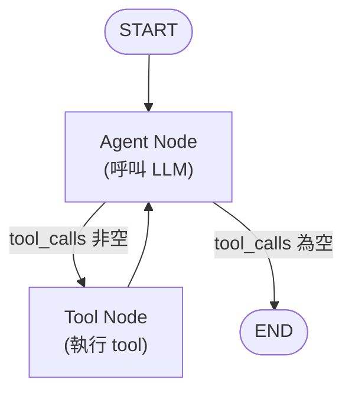
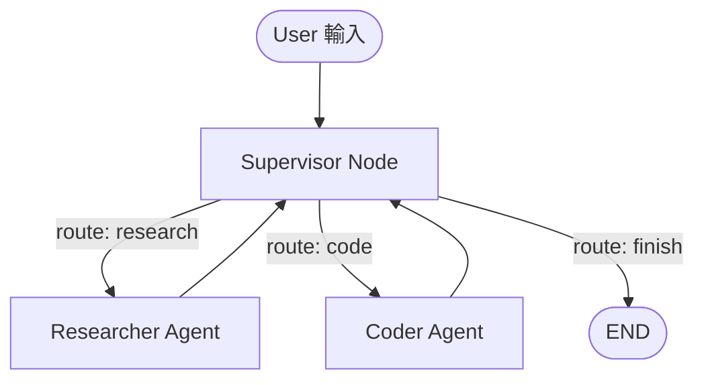

# LangGraph：以圖為核心的 LLM Agent 編排框架

> LangGraph 是 LangChain 生態下的底層 agent 編排框架，把 agent 的執行流程明確建模成一個「狀態機／有向圖」——節點（node）是計算單元、邊（edge）是控制流轉移、state 是在節點間流動並被逐步合併更新的共享資料結構。它用顯式的圖結構、內建的 checkpoint 持久化與可暫停機制，取代傳統 `AgentExecutor` 那種隱式黑盒式的迴圈。

## Step 1：為什麼需要 LangGraph

早期 LangChain 的 agent 是用 `AgentExecutor` 包出來的一個隱式迴圈：內部反覆呼叫 LLM、解析要不要呼叫 tool、執行 tool、把結果塞回 prompt，直到 LLM 不再要求呼叫 tool 為止。這種設計在複雜場景下有幾個明顯痛點：

- **迴圈邏輯是黑盒**：想要「呼叫兩次 tool 失敗就轉人工」「某個分支要跳過 LLM 直接規則判斷」這類客製化控制流，很難插進去。
- **沒有原生 persistence**：迴圈狀態只活在記憶體裡，一斷線、一重啟就沒了，無法做「跑到一半暫停、明天再繼續」。
- **難以支援 human-in-the-loop**：無法優雅地在某個危險操作（例如送出付款、刪除資料）前暫停，等人核准後再繼續執行。
- **多 agent 協作沒有標準模式**：多個 agent 互相呼叫、分工時，狀態怎麼傳遞、怎麼路由，都要自己土法煉鋼。

LangGraph 的解法是：不要把控制流藏在框架內部，而是讓開發者**顯式定義一張圖**，圖上每個節點做什麼、節點之間怎麼流轉，全部攤開來寫，框架只負責照著圖執行、管理 state、並在需要時把每一步存下來。

## Step 2：核心心智模型——State、Node、Edge

LangGraph 的核心抽象只有三個，理解這三個之後，複雜的 agent 行為都只是拿它們組合出來的圖。

### State：貫穿整張圖的共享資料

State 是一個型別化的資料結構（通常用 `TypedDict` 或 Pydantic model 定義），代表這次執行過程中所有節點共享的「上下文」。例如一個對話型 agent 的 state 可能長這樣：

```python
from typing import Annotated, TypedDict
from langgraph.graph.message import add_messages

class AgentState(TypedDict):
    messages: Annotated[list, add_messages]
    retry_count: int
```

關鍵在於每個欄位可以指定一個 **reducer**：節點回傳的欄位值不是直接覆蓋舊值，而是依 reducer 合併。上面的 `messages` 用 `add_messages` 這個 reducer，代表節點回傳的新訊息會被「append」到既有的訊息列表，而不是整個覆蓋掉——這正是「多輪對話歷史不能每次都被清空」這件事在 LangGraph 裡的實作方式。

### Node：一個接收 state、回傳 state 更新的函式

Node 就是一個普通函式（或 Runnable），輸入是目前的 state，輸出是要更新哪些欄位：

```python
def call_model(state: AgentState) -> dict:
    response = llm.invoke(state["messages"])
    return {"messages": [response]}
```

節點內部可以做任何事：呼叫 LLM、執行 tool、查資料庫、跑一段純 Python 邏輯——LangGraph 不關心節點內部做什麼，只關心它讀哪些 state 欄位、寫哪些 state 欄位。

### Edge：決定下一步去哪個節點

- **一般 edge**：固定從節點 A 走到節點 B，沒有分支邏輯。
- **conditional edge**：執行完一個節點後，呼叫一個 routing function，依目前 state 決定要走向哪個節點（甚至可以走向 `END` 結束整張圖）。

`START` 與 `END` 是兩個特殊的哨兵節點，分別代表圖的進入點與結束點。

## Step 3：執行模型——把圖組裝起來並編譯

```python
from langgraph.graph import StateGraph, START, END

def route_after_agent(state: AgentState) -> str:
    last = state["messages"][-1]
    return "tools" if last.tool_calls else END

graph = StateGraph(AgentState)
graph.add_node("agent", call_model)
graph.add_node("tools", tool_node)
graph.add_edge(START, "agent")
graph.add_conditional_edges("agent", route_after_agent, {"tools": "tools", END: END})
graph.add_edge("tools", "agent")

app = graph.compile()
result = app.invoke({"messages": [("user", "台北明天天氣如何？")]})
```

`compile()` 之後得到的 `app` 是一個標準的 Runnable，支援 `invoke` / `stream` / `ainvoke`。`stream` 模式下，每執行完一個節點就會產出一份 state 快照，方便前端逐步顯示 agent 的思考過程。

整張圖畫出來就是一個典型的 ReAct 風格 agent 迴圈：



這張圖的重點是：**迴圈是圖上一條看得見的邊**（`Tools --> Agent`），不是框架內部藏著的 `while` 迴圈。想改變迴圈行為（例如加上「連續失敗三次就轉人工」），只要在 `route_after_agent` 裡多判斷 `state["retry_count"]` 即可，完全是使用者程式碼可控的範圍。

## Step 4：Checkpointer——persistence 與 human-in-the-loop 的基礎

LangGraph 在 `compile()` 時可以掛上一個 **checkpointer**（`MemorySaver`、`SqliteSaver`、`PostgresSaver` 等），每執行完一個節點，當下的完整 state 就會被存下來，並綁定一個 `thread_id`：

```python
from langgraph.checkpoint.memory import MemorySaver

app = graph.compile(checkpointer=MemorySaver())
config = {"configurable": {"thread_id": "user-42"}}
app.invoke({"messages": [("user", "幫我訂明天的會議室")]}, config)
```

有了 checkpoint，幾件事變得自然：

- **多輪對話**：同一個 `thread_id` 再次呼叫時，會從上次存的 state 接續，不用自己維護對話歷史。
- **暫停與人工核准（human-in-the-loop）**：`compile(interrupt_before=["send_payment"])` 可以讓圖執行到 `send_payment` 節點前自動暫停，等人工檢視 state、決定要不要放行，再呼叫 `app.invoke(None, config)` 從暫停處恢復。
- **time travel／除錯**：可以取出某個歷史 checkpoint，修改其中的 state 後重新往下執行，方便重現與除錯特定分支。

這也是 LangGraph 與「自己手刻一個 while 迴圈呼叫 LLM」最本質的差異——後者只要程式一結束，執行狀態就沒了；LangGraph 把「執行到哪一步、當下 state 是什麼」變成可以持久化、可以查詢、可以回溯的一等公民。

## Step 5：Multi-agent 架構模式

當一個任務需要拆給多個各有專長的 agent 協作時，LangGraph 常見的模式是 **supervisor pattern**：一個 supervisor 節點負責讀 state、決定接下來該交給哪個子 agent，子 agent 執行完再把結果交回 supervisor 決定下一步或結束。



這其實跟 [AI Agent 三種分工模式](#/llm/04-applications/ai-agent-collaboration-modes.mdx) 裡談到的 orchestrator 模式是同一件事，只是 LangGraph 把它變成一個可以用 conditional edge 精確描述、可 checkpoint、可局部重跑的圖結構。更複雜的場景下，每個子 agent 本身也可以是一個獨立編譯好的 **subgraph**，被當成單一節點掛進更大的圖裡，達成可組合（composable）的分層架構。

## Step 6：與傳統 AgentExecutor 的比較

| 面向 | LangChain `AgentExecutor` | LangGraph |
|---|---|---|
| 控制流 | 內建固定迴圈，客製化空間小 | 開發者顯式定義圖，任意分支與迴圈都可控 |
| State 管理 | 迴圈內隱式維護，難以擴充自訂欄位 | `TypedDict` / Pydantic 定義，reducer 決定合併方式 |
| Persistence | 無原生支援 | Checkpointer 原生支援，綁定 `thread_id` |
| Human-in-the-loop | 需要自行拼湊 | `interrupt_before` / `interrupt_after` 原生支援 |
| 多 agent 協作 | 沒有標準模式 | Supervisor、subgraph 等模式化支援 |
| 除錯／可觀測性 | 迴圈內部是黑盒 | 每個節點執行都是一個可觀測、可重放的 state 轉移 |
| 適合場景 | 簡單、單一迴圈的 tool-calling agent | 複雜控制流、需要持久化或人工介入的生產級 agent 系統 |

## 小結

LangGraph 的本質是把「LLM agent 該怎麼跑」從一個隱藏在框架內部的迴圈，變成一張開發者親手畫、框架負責執行與持久化的顯式圖。State／Node／Edge 三個抽象足夠簡單，卻能組合出 ReAct 迴圈、human-in-the-loop 審核流程、multi-agent supervisor 等各種生產級 agent 架構，這也是為什麼它逐漸取代 `AgentExecutor` 成為 LangChain 生態下建構複雜 agent 系統的預設選擇。

## 相關筆記

- [AI Agent 三種分工模式](#/llm/04-applications/ai-agent-collaboration-modes.mdx)
- [LangChain 的結構化輸出機制](#/llm/04-applications/langchain-structured-output.mdx)
