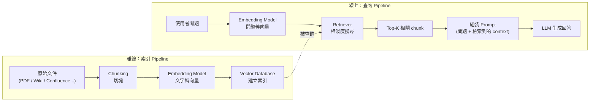
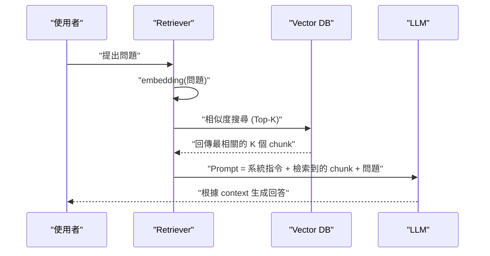

# RAG（Retrieval-Augmented Generation）的核心概念與運作原理

> 一句話版本：RAG 是在生成答案之前，先從外部知識庫檢索出相關內容、把它塞進 prompt 當作 context，讓 LLM「參考資料再回答」，藉此補足模型參數裡沒有、或已過時的知識。

## Step 1：為什麼需要 RAG

LLM 的知識來自 pretraining 階段看過的資料，這帶來三個結構性限制：

1. **知識截止（knowledge cutoff）**：訓練資料有時間點，之後發生的事模型不知道。
2. **私有資料**：公司內部文件、個人筆記這類資料本來就不在訓練集裡，模型無從得知。
3. **Hallucination**：當模型「不知道」卻仍被要求回答時，會用參數裡的統計規律「編」出看似合理但錯誤的內容（詳見 [LLM 的 Hallucination 問題](#/llm/05-evals-safety/what-is-hallucination.mdx)）。

RAG 的思路很直接：與其要求模型把所有知識都記在參數裡，不如在回答當下**現查現用**，讓模型的工作從「回憶」變成「閱讀理解＋摘要整合」——這通常比純粹的參數記憶更準確、更容易更新（改資料庫即可，不用重新訓練），也更容易追溯來源（可以附上引用的文件片段）。

這和另一種常見做法——把新知識透過 fine-tuning 寫進參數——是互補而非取代的關係，兩者的適用場景與成本結構不同，可參考 [Agent 檔案式記憶與 RAG 的異同](#/llm/04-applications/agent-memory-vs-rag.mdx) 裡對「參數記憶 vs. 外部記憶」的討論。

## Step 2：整體架構——兩條 pipeline

RAG 系統通常拆成兩條獨立的 pipeline：**離線的索引（indexing）**與**線上的查詢（query）**。

兩條 pipeline 用的是**同一個 embedding model**——文件在索引時怎麼被轉成向量，問題在查詢時就要用同一個模型轉成向量，否則向量空間不一致，相似度計算沒有意義。

## Step 3：索引 Pipeline 的關鍵決策

### Chunking：怎麼切文件

文件不能整篇塞進 embedding model（有 token 長度限制），也不該整篇塞進 LLM 的 context（貴、且稀釋掉真正相關的資訊）。常見切法：

| 策略 | 做法 | 適合場景 |
|---|---|---|
| Fixed-size | 固定 token 數切塊，chunk 之間留 overlap | 通用文字、快速上線 |
| 語意切分 | 按段落 / 標題 / 句子邊界切，保留語意完整性 | 結構清楚的文件（技術文件、法規） |
| 遞迴切分 | 先按大結構（章）切，太大再往下切（節、段） | 長文件、階層清楚的手冊 |

Chunk size 是一個 trade-off：切太小，單一 chunk 語意不完整，檢索到的片段可能斷章取義；切太大，一個 chunk 混雜多個主題，相似度計算被稀釋，且塞進 LLM context 的雜訊變多。實務上通常從幾百 token 開始，搭配 overlap（例如 chunk 之間重疊 10–20%）避免關鍵句子被硬生生切成兩半。

### Embedding Model：怎麼選

這部分屬於獨立的決策議題（模型選型、維度、MTEB 榜單、成本），已有專篇整理，這裡不重複，見 [Embedding Model 的選型考量與評估方法](#/llm/04-applications/how-to-choose-embedding-model.mdx)。

### Vector Database：怎麼存、怎麼查

向量庫負責兩件事：儲存 `(向量, 原文, metadata)`，以及對「查詢向量」做高效的**近似最近鄰（Approximate Nearest Neighbor, ANN）**搜尋——資料量大時逐一算相似度太慢，實務上用 HNSW、IVF 這類索引結構犧牲一點精確度換取速度。

相似度最常見的是 cosine similarity：

$$
\text{score}(q, d) = \frac{\vec{q} \cdot \vec{d}}{\|\vec{q}\| \, \|\vec{d}\|}
$$

其中 $\vec{q}$ 是查詢向量、$\vec{d}$ 是文件 chunk 向量。分數越接近 1，代表語意越相近。

## Step 4：查詢 Pipeline 的關鍵決策

- **Top-K 怎麼選**：K 太小容易漏掉關鍵資訊，K 太大則把不相關的雜訊也塞進 context，稀釋模型注意力、增加成本，也可能讓模型更容易被無關內容誤導。
- **Retrieval 品質評估**：檢索出來的 chunk 到底「準不準」，用 Recall@K、MRR 這類指標衡量，方法與 embedding model 評估共用，同樣在 [Embedding Model 的選型考量與評估方法](#/llm/04-applications/how-to-choose-embedding-model.mdx) 裡說明。

## Step 5：Naive RAG 的常見問題與進階做法

最基本的「embedding 查詢 → Top-K → 塞進 prompt」流程（上面 Step 4 畫的）稱為 **Naive RAG**，實務上常遇到幾個問題，也各自有對應的改良手法：

| 問題 | 現象 | 常見對策 |
|---|---|---|
| 查詢與文件用詞不一致 | 使用者問「怎麼退貨」，文件寫「退換貨政策」，純向量相似度可能抓不準 | **Hybrid search**：向量檢索（語意）+ 關鍵字檢索（BM25，抓字面）並用，再合併排序 |
| 語意相近但不夠精確 | Top-K 抓回來的 chunk 主題相關但不是最切題的那個 | **Reranking**：先用便宜的向量檢索抓較大的候選集（如 K=50），再用較貴但更準的 rerank 模型重新排序，取前幾名 |
| 問題本身模糊或多步驟 | 「這功能跟上一版比有什麼差別」需要查兩份文件再比較 | **Query rewriting / decomposition**：先用 LLM 把使用者問題改寫或拆解成更適合檢索的子問題，再分別檢索 |
| 檢索到的內容其實不相關，但模型還是硬答 | 模型把不相關的 context 也當真，答非所問或編造 | 在 prompt 裡明確指示「若 context 不足以回答則說不知道」，並可加一層 groundedness 檢查 |

這些技巧疊加起來，就是業界常說的 **Advanced RAG / Agentic RAG**——把「檢索」也變成 LLM 可以主動決策、反覆迭代的一個步驟（例如：先查一次、看看夠不夠、不夠再換個關鍵字查一次），而不是寫死的一次性 pipeline。這已經和 agent 的 tool-use 概念高度重疊，可參考 [In-Context Learning 與 Prompt Engineering](#/llm/04-applications/icl-and-prompt-engineering.mdx) 與 agent 相關筆記。

## Step 6：RAG 不是萬靈丹

RAG 解決的是「模型不知道某個事實」，但不解決：

- **推理能力不足**：檢索到正確資料，模型仍可能算錯或邏輯推導錯誤。
- **Prompt injection 風險**：如果檢索來源包含惡意內容（例如爬蟲抓回來的網頁），可能夾帶指令操控模型行為，這屬於 indirect prompt injection，詳見 [Prompt Injection 攻擊](#/llm/05-evals-safety/prompt-injection.mdx)。
- **檢索不到就等於沒有**：如果知識庫本身沒涵蓋某個主題，或 chunking／embedding 品質不佳導致檢索不到，RAG 也無從補救，模型仍可能 hallucinate。

## 相關筆記

- [Embedding Model 的選型考量與評估方法](#/llm/04-applications/how-to-choose-embedding-model.mdx)
- [Agent 檔案式記憶與 RAG 的異同](#/llm/04-applications/agent-memory-vs-rag.mdx)
- [LLM 的 Hallucination 問題](#/llm/05-evals-safety/what-is-hallucination.mdx)
- [Prompt Injection 攻擊](#/llm/05-evals-safety/prompt-injection.mdx)
