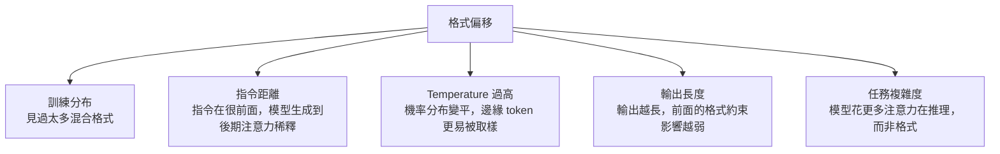

# LLM 格式不穩定的原因與對策

> LLM 本質是機率型文字預測器，不是狀態機——它沒有「格式模式」的概念，格式不穩定是訓練目標的副作用。

## Step 1：LLM 的底層機制

LLM 在每個 time step 做的事只有一件：**根據前面所有 token，預測下一個 token 的機率分布，然後取樣**。

```
P(token_n | token_1, token_2, ..., token_{n-1})
```

這個機制有一個關鍵特性：**模型沒有「我現在在輸出 JSON」的明確狀態**。它只是在預測下一個字元是什麼，依賴訓練資料的統計模式。

## Step 2：訓練資料的影響

預訓練資料是海量網際網路文字，其中包含大量不同的格式慣例：

| 情境 | 常見格式 |
|------|---------|
| GitHub README | ` ```json\n(json)\n``` ` |
| StackOverflow 回答 | 先說明、再貼 code |
| ChatGPT 對話 | 「以下是 JSON：\n（json）」 |
| 文件範例 | 純 JSON，無說明 |

模型見過所有這些格式，**沒有學到「只有一種正確輸出」**。當你說「用 JSON 回傳」，它激活的是整個相關模式的集合，不是單一格式。

## Step 3：指令遵從是機率性的

即使 system prompt 清楚寫著「只回傳 JSON，不要說明文字」，這個指令本身也是被 encode 進 context，和其他 token 一起影響機率分布——它不是一個 hard constraint，而是一個 **soft signal**。

影響模型偏離格式的因素：



## Step 4：為什麼 Markdown code fence 特別常見？

這是個典型的「訓練分布偏差」案例：

1. GitHub、技術文章大量使用 code fence 包 JSON
2. 指令微調（SFT）資料也常見這種格式（因為人類覺得這樣「比較清楚」）
3. 模型學到「展示 JSON 時加 fence = 好回答」
4. 結果：即使你說「直接回傳 JSON」，模型的預訓練慣性仍推向加 fence

這就是為什麼光靠 prompt 說「不要加 code fence」效果有限——要改變的是整個機率景觀，而不是一個 bit。

## Step 5：根本解法 vs. 緩解措施

| 方法 | 原理 | 穩定性 |
|------|------|-------|
| Prompt 約束 | Soft signal，仍是機率性 | 中（80-95%） |
| JSON mode | API 層強制合法 JSON | 高（保證 parseable） |
| Tool use | Schema 驗證 | 高（保證 schema） |
| Constrained decoding | 非法 token logit = `-∞` | 100% |

## 相關筆記

- [為什麼需要 Structured Output？](#/llm/04-applications/why-structured-output.mdx)
- [如何透過 prompt 強制輸出 JSON？](#/llm/04-applications/prompt-force-json-output.mdx)
- [Temperature 與 Top-p 是什麼？](#/llm/03-inference/temperature-and-top-p.mdx)
