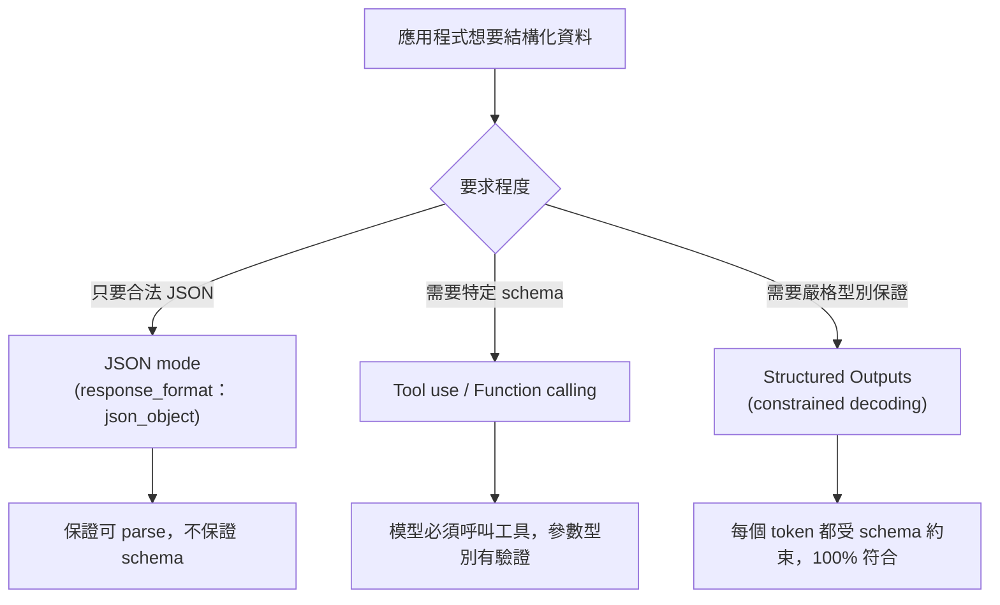
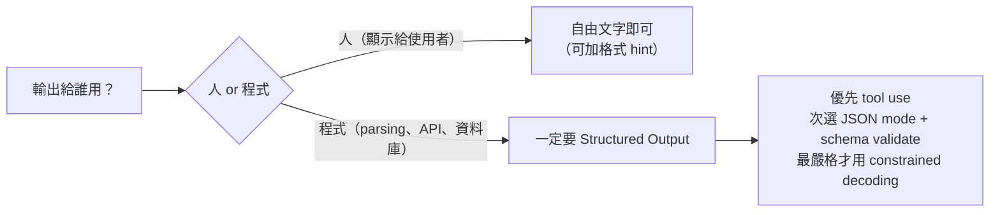

# Structured Output 的必要性

> LLM 輸出是自由文字，但程式需要可 parse 的資料 ——Structured Output 就是彌合這個落差的機制。

## Step 1：LLM 的輸出本質是「自由文字」

LLM 的訓練目標是預測下一個 token，輸出是自然語言。你問它「用 JSON 回傳使用者資料」，它可能：

- 正確回傳 `{"name": "Alice", "age": 30}`
- 在 JSON 外面包 markdown：` ```json\n(json)\n``` `
- 多說一句話：「以下是 JSON：\n（JSON）」
- 欄位名拼錯、型別不一致

這在 demo 無所謂，**但對程式來說是災難**—— 只要一次格式偏移就 crash。

## Step 2：為什麼「叫它回傳 JSON」不夠

用 prompt 約束輸出可以提高命中率，但有幾個根本限制：

| 問題 | 說明 |
|------|------|
| 機率性 | 模型在高 temperature 或長輸出時更容易偏移格式 |
| 無法保型別 | `"age": "30"` 和 `"age": 30` 都是「合法 JSON」但型別不同 |
| 無法保 schema | 欄位多了少了模型不會報錯 |
| 很難測試 | regex / 解析器需要應對各種邊緣狀況 |

## Step 3：Structured Output 的三種技術路線



### 路線 A：JSON mode

確保輸出是合法 JSON，但不保證欄位存在 —— 適合結構簡單、可接受 validate 在應用層做的情境。

### 路線 B：Tool use（最主流）

```python
tools = [{
    "name": "extract_user",
    "input_schema": {
        "type": "object",
        "properties": {
            "name": {"type": "string"},
            "age":  {"type": "integer"}
        },
        "required": ["name", "age"]
    }
}]
```

模型必須「呼叫這個工具」，回傳的是 `tool_use` block，`input` 已通過 schema 驗證。這是目前**最通用**的結構化輸出方式，Anthropic Claude、OpenAI 皆支援。

### 路線 C：Constrained Decoding（最嚴格）

在每個 token 生成步驟，把不符合當前 JSON 狀態的 token logit 設為負無限大，讓模型**物理上無法生成違反 schema 的輸出**。

```
schema：{ "name": string, "age": integer }
目前已生成：{"name": "Ali
→ 這個位置合法的 token 只有字串字元或結束引號
→ 數字、{ 等一律 mask 掉
```

Outlines、guidance、llama.cpp grammar 都是這個原理；適合在地端部署、對格式正確性要求極高的場景。

## Step 4：實際應用中的好處

1. **下游程式碼乾淨**：直接讀欄位，不需要 try/except 包 JSON parse
2. **型別安全**：配合 Pydantic（Python）/ Zod（TypeScript）可以直接 validate + 轉成 typed object
3. **多步 pipeline 穩定**：Agent 呼叫 tool、子任務回傳資料，格式穩定才能串接
4. **Eval 好寫**：比對欄位值，不需要 fuzzy string matching

## Step 5：要不要用 Structured Output？



## 相關筆記

- [如何設計 Constraint 讓模型輸出更穩定？](#/llm/04-applications/constraint-design.mdx)
- [LLM API Response 結構是什麼？](#/llm/04-applications/llm-api-response-structure.mdx)
