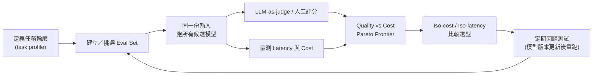

# 如何有系統地比較不同 LLM 模型的差異

> 比較 LLM 不能只看單一 leaderboard 分數：要先定義自己的使用情境，再拆成能力、效率、治理三個層面，用自己的資料跑評估，才能得到對決策有意義的結論。

## Step 1：為什麼「看排行榜分數」容易做錯決策

多數人比較 LLM 的第一直覺是查 leaderboard（例如 MMLU、Chatbot Arena 分數），但這個做法有幾個結構性問題：

- **Benchmark saturation（榜單飽和）**：主流 benchmark 分數已經普遍很高，模型之間的差距被壓縮到接近雜訊範圍，排名前幾名的實際能力差異可能很小。
- **Data contamination（資料汙染）**：公開 benchmark 的題目有機會混入預訓練語料，分數可能反映「記得答案」而非「真的會推理」，這點在 [LLM 評估的獨特挑戰](#/llm/05-evals-safety/why-llm-needs-eval.mdx) 中也提過。
- **綜合分數掩蓋任務差異**：一個模型的「綜合分數」通常是多個子任務的加權平均，你實際要用的任務（例如寫 SQL、做客服對話）可能剛好落在它的弱項。
- **模型持續迭代（model drift）**：同一個模型 ID 背後的權重可能被供應商悄悄更新，去年跑贏的比較結果不保證今天還成立。

結論是：**leaderboard 分數只適合初篩候選名單，真正的比較要落到你自己的任務與資料上。**

## Step 2：比較框架——三個層面

把「LLM 之間的差異」拆成三個彼此獨立的層面，避免用單一分數做決策：

### 1. 能力面（Capability）

| 子項 | 常見衡量方式 |
|---|---|
| 通用推理／知識 | MMLU、GPQA、綜合 benchmark |
| 數學／邏輯推理 | GSM8K、MATH |
| 程式能力 | HumanEval、SWE-bench |
| Agentic／工具使用 | tool-use、multi-step task benchmark |
| 指令遵循與格式穩定度 | IFEval 及自訂 [structured output 評估](#/llm/04-applications/why-structured-output.mdx) |
| Long context 理解 | needle-in-a-haystack、long-doc QA |

### 2. 效率面（Efficiency）

- **Latency**：TTFT（time to first token）與 tokens/sec 的生成速度，尤其是串流體驗與高併發場景下的 tail latency（P99）。
- **Cost**：input／output token 單價差異可能達數十倍，詳見 [Token 與 API 計費模型](#/llm/01-foundations/what-is-a-token-and-api-pricing.mdx)。
- **Context window**：可用的最大上下文長度，以及在長 context 下是否會有品質衰退（見 [Context Window 筆記](#/llm/01-foundations/what-is-context-window.mdx)）。

### 3. 可靠性與治理面（Reliability & Governance）

- **Hallucination 傾向**：同樣的 RAG pipeline 換不同模型，捏造率可能明顯不同。
- **Safety alignment／拒答行為**：對敏感內容的拒答邊界，會直接影響產品可用性。
- **部署與資料政策**：API-only vs 開權重（open-weight）可自架、資料是否用於訓練、rate limit、是否支援 fine-tuning／prompt caching。

## Step 3：怎麼落地做一次嚴謹的比較

1. **先定義任務輪廓（task profile）**，而不是直接套通用 benchmark：這份任務的輸入分佈、預期輸出格式、失敗的代價是什麼。做法上可以參考 [評估集設計的原則](#/llm/05-evals-safety/how-to-design-eval-dataset.mdx)，用自己的真實資料（或貼近真實分佈的合成資料）建一個小型 eval set。
2. **同一份 eval set，跑所有候選模型**，用 [LLM-as-judge 或人工評分](#/llm/05-evals-safety/eval-metrics-overview.mdx) 打分，並固定 judge 與 rubric，確保各模型是在公平條件下比較。
3. **把品質分數與成本、延遲一起畫成散佈圖**（quality vs cost 的 Pareto frontier），而不是只看「誰分數最高」——很多情境下次高分但便宜十倍的模型才是正確選擇。
4. **做 iso-cost 或 iso-latency 比較**：固定預算或固定延遲上限，比較各模型在同一條件下能達到的最佳品質，避免「拿旗艦模型跟入門模型比」這種不公平比較。
5. **建立回歸機制**：模型更新後（新版本、供應商靜默升級）重新跑同一份 eval set，確認結果沒有劣化，這跟一般 [train/val/test 劃分](#/llm/05-evals-safety/train-val-test-in-llm.mdx) 中「用固定測試集持續回歸」的精神一致。

## Step 4：常見陷阱

- **只看單一 benchmark 就下結論**：務必至少涵蓋能力、效率、治理三面向中你在意的部分。
- **忽略 tail latency 與穩定性**：平均延遲低不代表 P99 低，高併發場景下的穩定性往往才是使用者體感的關鍵。
- **拿不同計費單位的模型做表面比較**：務必換算成「完成同一份任務的總成本」而非單純的 token 單價。
- **評估集本身洩漏或過擬合**：長期用同一份公開 eval set 比較，模型供應商也可能間接針對它優化，記得定期輪換或混入私有資料。

## Step 5：整體流程圖

## 相關筆記

- [LLM 評估的獨特挑戰與方法](#/llm/05-evals-safety/why-llm-needs-eval.mdx)
- [高品質評估集設計的原則](#/llm/05-evals-safety/how-to-design-eval-dataset.mdx)
- [常見 LLM 評估指標與適用場景](#/llm/05-evals-safety/eval-metrics-overview.mdx)
- [Token 與 API 計費模型](#/llm/01-foundations/what-is-a-token-and-api-pricing.mdx)
- [Context Window 與模型記憶容量](#/llm/01-foundations/what-is-context-window.mdx)
