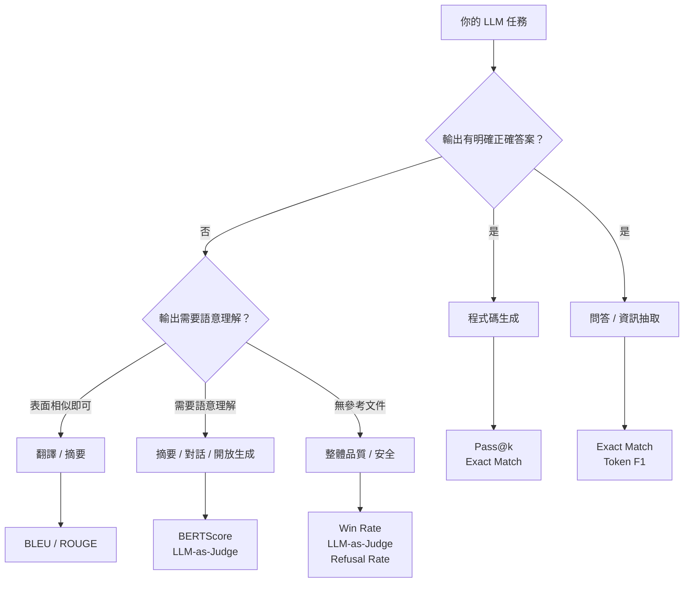

# 常見 LLM 評估指標與適用場景

> 評估指標的選擇完全取決於任務類型 —— 不同任務對「好的輸出」的定義不同。

## 任務 → 指標的對應地圖

---

## Exact Match（EM）

預測和 ground truth 完全一致才算對，否則 0 分。

$$\text{EM} = \frac{\text{完全正確的樣本數}}{\text{總樣本數}}$$

**適合**：閉域 QA（答案是特定人名/地名/數字）、結構化輸出（JSON、SQL）。

**陷阱**：`"Paris"` vs `"Paris, France"` 都是正確答案，EM 會把後者判錯。過於嚴格，常和 Token F1 一起報告。

---

## Token F1

在 token 層級計算 precision 和 recall 的調和平均數。

$$F1 = \frac{2 \cdot \text{Precision} \cdot \text{Recall}}{\text{Precision} + \text{Recall}}$$

其中 Precision = 預測中正確 token 佔比，Recall = 答案中被命中 token 佔比。

**適合**：抽取式 QA（SQuAD benchmark 標準指標）、Named Entity Recognition（NER）。

**優點**：對部分正確的答案更寬容，比 EM 更有區分度。

---

## BLEU（Bilingual Evaluation Understudy）

計算生成文字和參考文字之間的 n-gram precision，加 brevity penalty 防止模型輸出過短。

$$\text{BLEU} = BP \cdot \exp\!\left(\sum_{n=1}^{N} w_n \log p_n\right)$$

其中 `BP` 是 brevity penalty，`p_n` 是 n-gram precision，`w_n` 是各階 n-gram 的權重。

**適合**：機器翻譯（BLEU 最初就是為翻譯設計的）。

**陷阱**：只看表面 n-gram，不懂語意；paraphrase 也會被判錯；不適合摘要、創意生成。

---

## ROUGE（Recall-Oriented Understudy for Gisting Evaluation）

以 recall 為主的 n-gram 覆蓋率：

| 變體 | 計算方式 | 特點 |
|---|---|---|
| ROUGE-N | n-gram recall | 最常用，N=1 或 N=2 |
| ROUGE-L | Longest Common Subsequence | 考慮文字順序 |
| ROUGE-S | Skip-bigram | 允許 n-gram 中有 gap |

**適合**：文字摘要（CNN/DailyMail、XSum 等 benchmark 的標準指標）。

**陷阱**：和 BLEU 相同 —— 表面計算，不懂語意。

---

## BERTScore

用預訓練的 BERT 模型把生成文字和參考文字編碼成向量，計算 token 間的 cosine similarity。

**適合**：任何需要語意理解的生成任務，特別是 paraphrase 很常見的情境（摘要、對話回覆）。

**優點**：能捕捉語意等價性（BLEU/ROUGE 做不到）。

**陷阱**：計算成本高；如果生成文字語意相近但有事實錯誤，BERTScore 不一定能抓到。

---

## Pass@k（程式碼生成專用）

對同一個問題生成 n 個解答，只要其中 k 個通過所有 unit tests 就算成功。

$$\text{Pass@}k = 1 - \frac{\binom{n-c}{k}}{\binom{n}{k}}$$

其中 `n` 是生成總數，`c` 是通過測試的數量。

**適合**：程式碼生成（HumanEval、MBPP benchmark 的標準指標）。

**為什麼不用 EM**：同一個問題有很多種正確寫法，能跑過測試才是真正的正確 —— 逐行比對 code 沒有意義。

---

## Perplexity（困惑度）

模型預測一個序列的能力；越低代表模型越能預測下一個 token。

$$\text{PPL} = \exp\!\left(-\frac{1}{N}\sum_{i=1}^{N}\log P(w_i \mid w_{<i})\right)$$

**適合**：評估語言模型本身的建模品質；比較兩個模型在同樣分佈上的能力。

**陷阱**：不同 tokenizer 的 perplexity 無法直接比較；perplexity 低不等於下游任務表現好。

---

## Win Rate（勝率）

在 A/B 對比中，模型 A 被偏好的比例。常用 Elo rating system 把多輪對比轉換成排名。

**適合**：整體對話品質、chatbot 版本迭代比較（Chatbot Arena 採用此方式）。

**優點**：直接反映人類偏好，適合無法定義唯一正確答案的開放生成。

---

## LLM-as-Judge Score

用強模型（如 Claude 或 GPT-4）根據定義好的 rubric 對輸出打分，或做 A vs B 偏好選擇。

**適合**：幾乎所有任務——特別是人工標注太貴、但任務複雜無法用自動指標的情境。

**主要偏差**：
- **Position bias**：傾向偏好第一個出現的輸出
- **Self-preference**：模型傾向偏好和自己風格相似的輸出
- **Verbosity bias**：傾向偏好較長的回答

---

## 選指標快速參考表

| 任務 | 推薦指標 |
|---|---|
| 機器翻譯 | BLEU、BERTScore |
| 文字摘要 | ROUGE-L、BERTScore |
| 閉域問答（事實型） | Exact Match + Token F1 |
| 程式碼生成 | Pass@k |
| 開放式對話 / 創意生成 | Win Rate、LLM-as-Judge |
| 安全性 / 有害內容 | Refusal Rate、Attack Success Rate |
| 語言模型建模品質 | Perplexity |
| 通用 benchmark（選擇題） | Accuracy |

---

## 相關筆記

- [為什麼 LLM 需要 Evaluation？](#/llm/05-evals-safety/why-llm-needs-eval.mdx)
- [如何設計一個好的 Evaluation Dataset？](#/llm/05-evals-safety/how-to-design-eval-dataset.mdx)
- [Training / Validation / Testing 在 LLM 任務中如何區分？](#/llm/05-evals-safety/train-val-test-in-llm.mdx)
