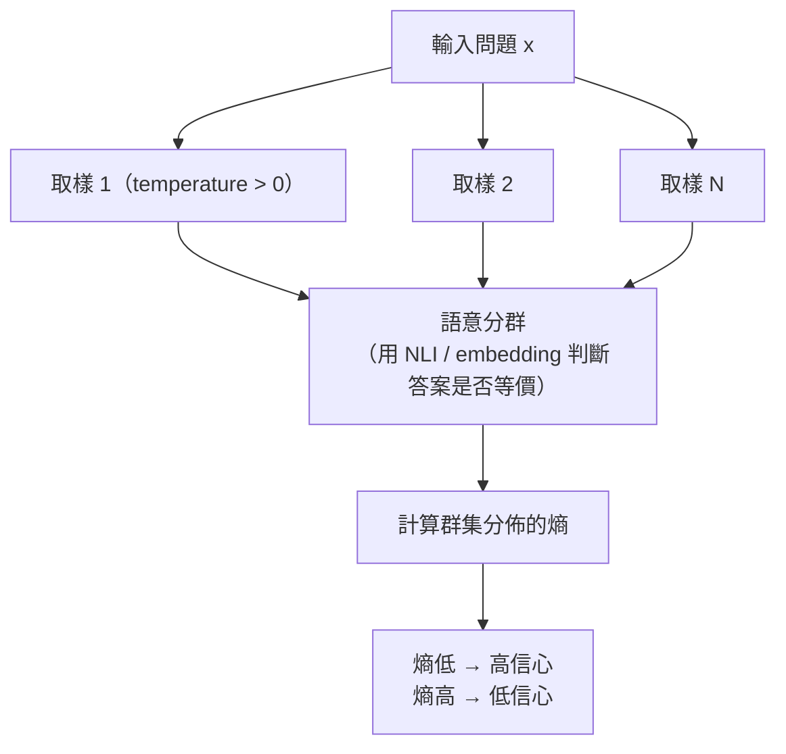

# LLM 產生信心分數（Confidence Score）的方法與校準挑戰

> LLM 沒有像傳統分類器那樣天然可信賴的機率輸出；要拿到可用的 confidence score，需要在 token 機率、自我陳述、多次取樣一致性、事後校準這幾種方法中選擇並組合。

## LLM 的 confidence score 是什麼、為什麼特殊

傳統分類模型（如 logistic regression、CNN 分類器）的 softmax 輸出天生就是一個機率分佈，只要模型訓練得當，這個機率通常可以直接當作 confidence 使用——這叫做模型是 calibrated 的：如果模型對一群樣本都輸出 90% 信心，長期來看這群樣本裡大約真的有 90% 是對的。

LLM 的情況複雜得多，原因有三層：

1. **輸出空間不是固定類別，而是整個 token 序列**。一個答案由很多 token 組成，"信心" 要對整句話（甚至整個語意）定義，而不是對單一分類定義。
2. **RLHF / instruction tuning 會破壞校準**。base model（純 pretraining）在 next-token prediction 上其實相當 calibrated，但經過 RLHF 之後，模型被訓練成「說得肯定、答得流暢」，token 機率會系統性地往高信心偏移，也就是變得 overconfident。這是 OpenAI GPT-4 technical report 裡明確指出的現象。
3. **模型不知道自己"不知道"**。LLM 是基於訓練分佈做 next-token prediction，遇到訓練資料稀疏或矛盾的問題時，它一樣會流暢地生成一個聽起來很肯定的答案，這正是 hallucination 的成因之一。

所以工程上要拿到一個可用的 confidence score，通常要在下面幾種方法裡選擇、甚至組合使用。

## Step 1：Token-level log probability（最原始的訊號）

最直接的方法是拿 API 回傳的 logprobs（token 的 log probability），把整句話的機率組合起來。序列機率是每個 token 條件機率的連乘：

$$
P(y_1, \dots, y_T \mid x) = \prod_{t=1}^{T} P(y_t \mid x, y_{<t})
$$

因為連乘會讓長句機率趨近於 0，實務上會用 perplexity 這個正規化過的指標：

$$
\text{PPL} = \exp\left(-\frac{1}{T}\sum_{t=1}^{T} \log P(y_t \mid x, y_{<t})\right)
$$

perplexity 越低代表模型對這個序列越「順」、越有信心。

**限制**：

- 這只反映「這句話符不符合模型的語言分佈」，不代表「這句話在事實上是不是對的」。一段流暢但錯誤的陳述（fluent hallucination）機率也可以很高。
- 如上所述，RLHF 之後的模型 token 機率本身就偏向 overconfident，直接拿來當校準訊號效果有限。
- 並非所有 API 都會暴露完整 logprobs，多數 chat-tuned 模型的公開 API 只回傳 top-k logprobs。

## Step 2：Verbalized confidence（讓模型自己說信心）

最簡單的工程做法：直接在 prompt 裡要求模型輸出一個信心分數，例如「回答後，請給出你對這個答案的信心（0 到 100）」。

這個方法的優點是不需要存取模型內部機率，任何黑盒 API 都能用；缺點是研究（如 Kadavath et al., *Language Models (Mostly) Know What They Know*, 2022）發現：

- 模型傾向輸出整數、成群聚集在特定數字（很愛回答 90、95、100），分佈很不平滑。
- 普遍系統性 overconfident：模型自稱 90% 信心的那組答案，實際正確率往往顯著低於 90%。
- 一旦答案本身包含 reasoning（chain-of-thought），信心陳述會被 reasoning 的語氣帶著走，而不是真的反映不確定性。

所以 verbalized confidence 是最容易接入但最不可靠的一種，適合當粗略排序訊號，不適合直接當機率使用。

## Step 3：Self-consistency 與語意熵（用多次取樣量測不確定性）

比較穩健的做法是把不確定性定義成「同一個問題，模型答案的變異程度」，這不依賴模型自己陳述信心，而是從行為上量測。

具體做法有兩種常見版本：

1. **Self-consistency / majority voting**（Wang et al., 2022）：對同一題用 temperature > 0 取樣 N 次，統計答案一致的比例當作 confidence。例如 10 次取樣裡有 8 次答案相同，confidence 約為 0.8。這在數學題、選擇題這類答案可以精確比對的任務上效果很好。
2. **Semantic entropy**（Kuhn et al., *Semantic Uncertainty*, ICLR 2023）：開放式生成的答案不能用字面比對（「巴黎」和「法國首都是巴黎」語意相同但字面不同），所以先用 NLI（entailment）模型把 N 個取樣答案分群成語意等價的群集，再對群集分佈算熵：

$$
H = -\sum_{c} p(c) \log p(c)
$$

熵越低，代表答案高度集中在少數語意群集、模型對這題的不確定性越低。這個方法在 hallucination detection 上被證實比單純 token probability 更準。

**代價**：需要多次推理（成本乘以 N），延遲也會變高，適合離線評估或對正確性要求高、可以接受多花幾次 API call 的場景。

## Step 4：P(True)——讓模型評判自己的答案

另一種思路（同樣出自 Kadavath et al., 2022）：先讓模型生成答案，然後把「問題加上這個答案」重新丟給模型，問這個答案是對的嗎，取模型回答 True 這個 token 的機率當作 confidence：

$$
\text{confidence} = P(\text{True} \mid x, \hat{y})
$$

這個方法巧妙地把生成與評判分成兩次獨立推理，讓模型用不同的角色重新檢視自己的輸出，實務上比直接用生成時的 token probability 更貼近實際正確率，尤其在模型規模夠大時效果明顯。這也是 LLM-as-judge 模式的一種特例，可搭配[LLM 評估的獨特挑戰與方法](#/llm/05-evals-safety/why-llm-needs-eval.mdx)一起理解。

## Step 5：事後校準（post-hoc calibration）

如果能取得原始機率（自己 host 開源模型、或 API 有暴露 logprobs），可以用經典的機率校準技術把原始機率映射成符合實際正確率的機率：

- **Temperature scaling**：用一個純量縮放 logits 再做 softmax，縮放係數是在驗證集上用 negative log-likelihood 校準出來的。是目前最常見、最輕量的做法。
- **Platt scaling / isotonic regression**：把原始信心分數當 feature，額外訓練一個小的校準模型（邏輯回歸或保序回歸）映射到實際正確率。
- **Conformal prediction**：不追求單一機率值，而是給出一個有統計保證覆蓋率的預測集合（例如有 90% 把握，正確答案在這 3 個候選之中），適合對錯誤容忍度極低的場景，如醫療、金融。

這些方法都需要一份有 ground truth 標籤的校準集，跟建置[高品質評估集設計的原則](#/llm/05-evals-safety/how-to-design-eval-dataset.mdx)是同一套工程紀律。

## Step 6：實務組合策略

生產系統通常不會只用單一方法，而是依成本與可靠性要求分層：

| 方法 | 額外成本 | 可靠度 | 適用場景 |
|---|---|---|---|
| Token log probability | 幾乎 0（API 內建） | 低（RLHF 後易 overconfident） | 粗略過濾、排序 |
| Verbalized confidence | 幾乎 0（多幾個 token） | 低 | 快速原型、UI 顯示（需加警語） |
| Self-consistency / 語意熵 | N 倍推理成本 | 中高 | 高風險決策、離線 batch 評估 |
| P(True) 自我評判 | 2 倍推理成本 | 中高 | RAG 答案品質把關、agent 動作前的二次確認 |
| 事後校準（temperature scaling 等） | 訓練一次性成本 | 高（但需要標籤） | 有 offline 校準集的正式產品 |

一個常見的組合流程：先用 token probability 或 self-consistency 做便宜的初篩，把低信心的 case 導向更貴的 P(True) 或 human review，形成分層漏斗（cascade），而不是對每個請求都跑最貴的方法。這與[評估 LLM Agent 任務執行是否過度（Over-Execution）的方法](#/llm/04-applications/evaluating-agent-over-execution.mdx)中用便宜訊號先篩、貴訊號把關的思路是一致的工程模式。

## 相關筆記

- [LLM 評估的獨特挑戰與方法](#/llm/05-evals-safety/why-llm-needs-eval.mdx)
- [高品質評估集設計的原則](#/llm/05-evals-safety/how-to-design-eval-dataset.mdx)
- [LLM 的 Hallucination 問題](#/llm/05-evals-safety/what-is-hallucination.mdx)
- [Temperature 與 Top-p 的取樣策略](#/llm/03-inference/temperature-and-top-p.mdx)
