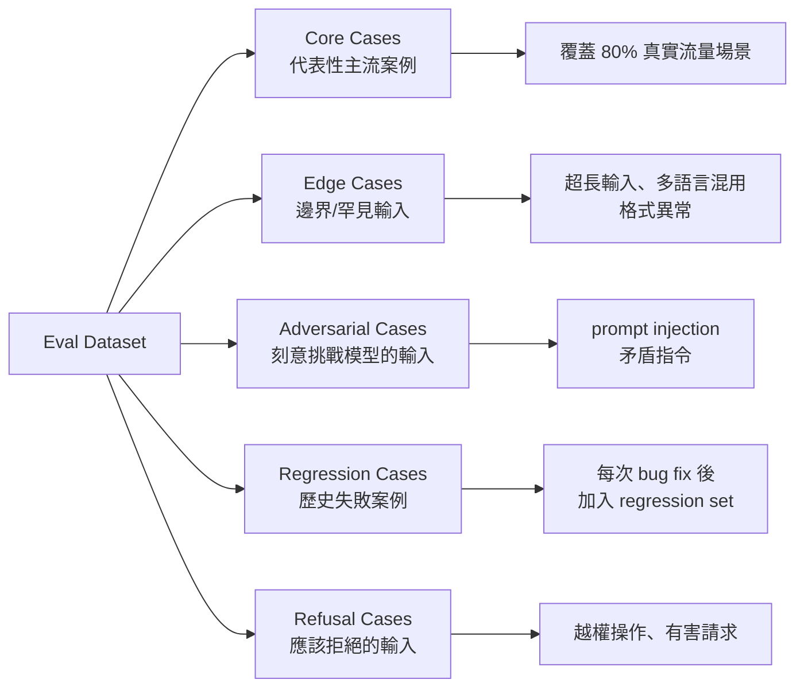
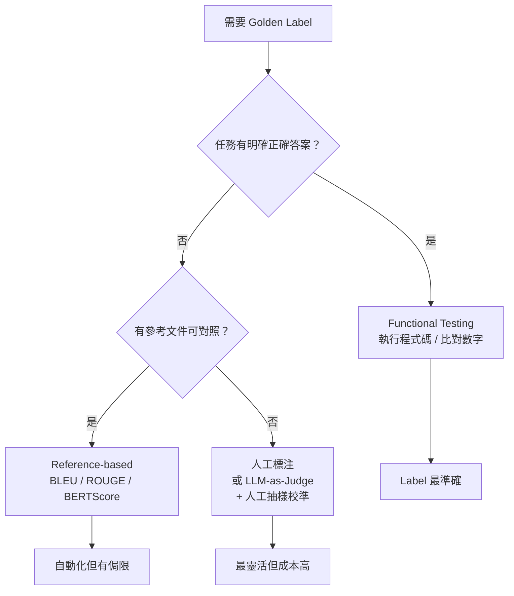
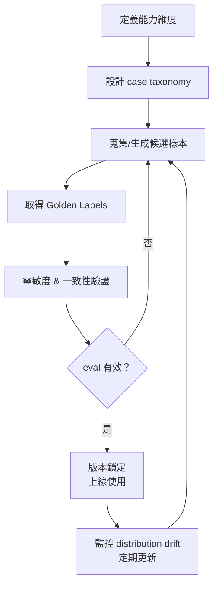

# 高品質評估集設計的原則

> 先定義「你在量什麼」，再設計測試案例 —— 順序不能反過來。

## 核心原則

最常犯的錯誤是先去收資料，再去想要量什麼。正確順序是從「這個模型要解決什麼問題、在哪些維度上應該表現好」出發，再推導出需要什麼樣的測試案例。

---

## Step 1：定義能力維度（Capability Taxonomy）

把要評估的能力分解成維度矩陣。以一個客服 LLM 為例：

| 維度 | 例子 |
|---|---|
| 正確性（Factual Accuracy） | 回答政策問題時引用的條款是否正確 |
| 指令遵循（Instruction Following） | 有沒有按照指定格式回答 |
| 拒絕邊界（Refusal Calibration） | 對不合理要求是否適當拒絕 |
| 語氣一致性（Tone Consistency） | 回答是否維持品牌語氣 |
| 邊界案例處理（Edge Cases） | 模糊問題有沒有追問釐清 |

每個維度對應的 metric 可能不同，必須先定義維度才能選 metric。

---

## Step 2：設計 Case Taxonomy（案例分類）

好的 eval dataset 通常由幾種案例類型組合：

---

## Step 3：蒐集與生成樣本的策略

**三種來源，各有取捨：**

| 來源 | 優點 | 缺點 |
|---|---|---|
| **真實生產流量** | 最貼近真實分佈 | 可能含 PII，需去識別化；早期沒有資料 |
| **人工撰寫** | 精準控制維度覆蓋 | 可能和真實分佈有落差 |
| **LLM 合成** | 快速批量生成 | 需人工審查，可能引入系統性偏差 |

實際做法通常是混合：**以 LLM 合成打底、人工撰寫補邊界案例、上線後持續從真實流量補充**。

---

## Step 4：取得 Golden Label（Ground Truth）

這是設計 eval 最難的一步，因為不同任務的「正確答案」取得方式不同：

**重要原則**：LLM-as-Judge 的判分和人工判分之間的 inter-rater agreement 必須測量。如果兩者一致性低於 80%，代表評分標準本身有問題，需要重新定義 rubric。

---

## Step 5：驗證 Eval 品質本身

Eval dataset 設計完成後，還要驗證它本身是否有效：

**靈敏度測試（Sensitivity Check）**：隨機讓一個較差的模型跑 eval，如果分數和好模型差不多，代表 eval 不夠靈敏——要加入更難的案例。

**一致性測試（Consistency Check）**：同樣的問題問兩次，判分結果應該穩定。如果兩次判分不同，代表評分標準有問題。

**覆蓋率分析（Coverage Analysis）**：用聚類（clustering）分析 eval cases，確保每個能力維度都有足夠密度的覆蓋，沒有明顯空缺。

---

## Step 6：常見陷阱（Pitfalls）

**1. Goodhart's Law（古德哈特定律）**

「當一個指標變成目標，它就不再是好指標了。」模型（或工程師）會開始 optimize for the metric 而非真正能力。定期輪換 eval set、加入未公開的 held-out set 是對策。

**2. Eval Overfitting**

Eval 被多次用來選模型、調 prompt、做決策之後，它就悄悄變成了 validation set。解法：把 eval 分成公開組（頻繁用來 debug）和私有組（只在最終決策前跑一次）。

**3. Distribution Drift**

真實用戶行為會隨時間改變。每季回顧一次 eval 分佈是否還代表真實流量，必要時補充新樣本。

---

## 整體設計流程

---

## 小結：好的 Eval Dataset 的五個特徵

1. **任務對齊**：覆蓋的維度和真實使用場景一致
2. **多樣性**：有主流案例、邊界案例、對抗案例
3. **高品質 Label**：標注標準一致，inter-rater agreement 高
4. **靈敏**：能區分好模型和壞模型
5. **持續維護**：有版本控制，定期審查是否仍代表真實分佈

---

## 相關筆記

- [為什麼 LLM 需要 Evaluation？](#/llm/05-evals-safety/why-llm-needs-eval.mdx)
- [什麼是 Hallucination？](#/llm/05-evals-safety/what-is-hallucination.mdx)
