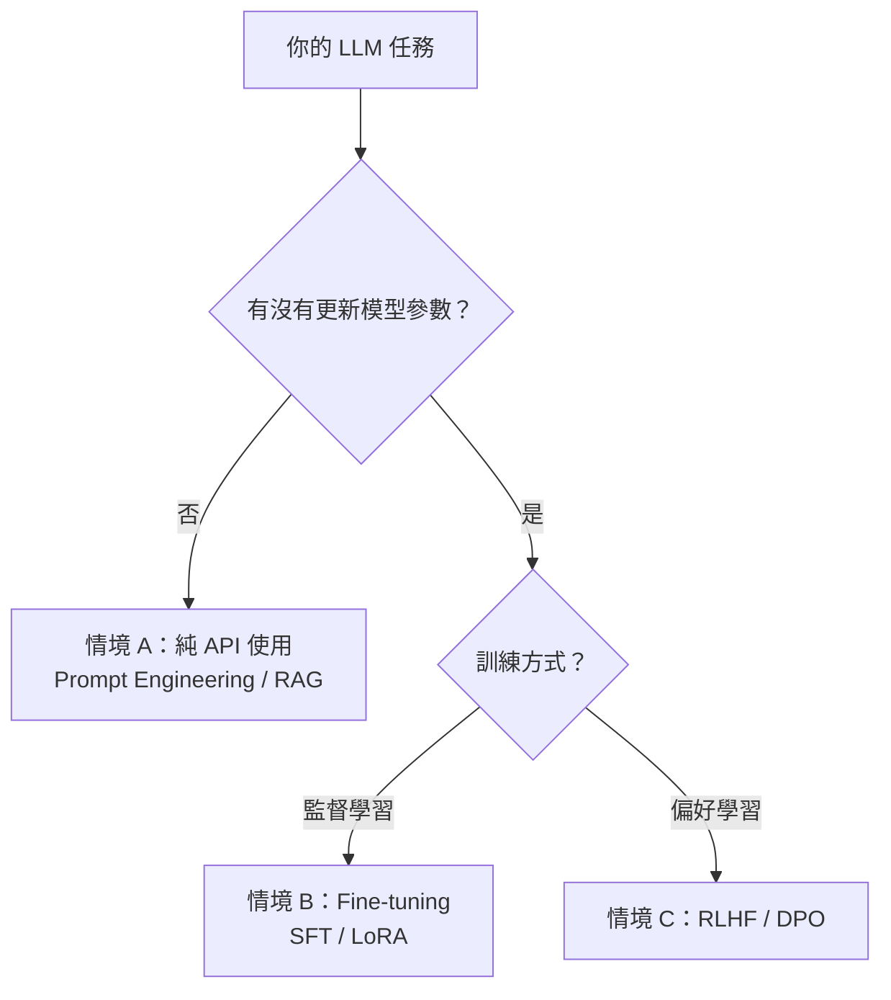
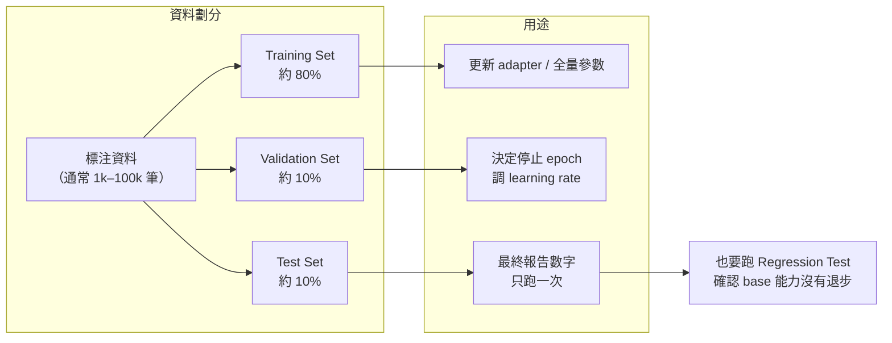
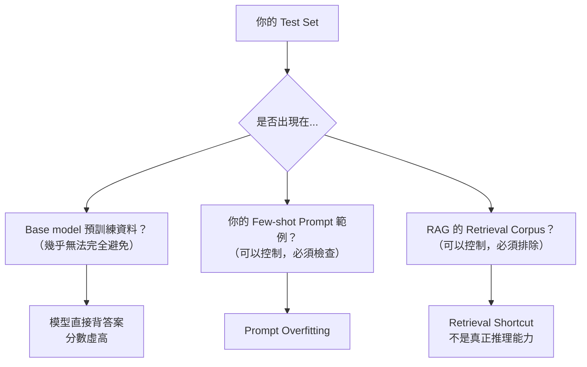

# LLM 中的訓練、驗證、測試劃分

> 傳統 ML 的三分法在 LLM 仍然成立，但「訓練」的定義擴大了——就算只調 prompt，也需要做資料切分。

## 先複習：傳統 ML 的三分法

| 集合 | 用途 | 使用頻率 |
|---|---|---|
| Training set | 更新模型參數 | 每個 epoch |
| Validation set | 調超參數、選 checkpoint、防 overfitting | 訓練過程中頻繁使用 |
| Test set | 最終不偏估 | 只碰一次 |

LLM 打破了這個清晰邊界：LLM 的使用情境不只一種——有時根本沒有在訓練，只是在調 prompt。

---

## 三種 LLM 使用情境，各自的分法不同

---

## 情境 A：純 API 使用（沒有訓練）

這是最常被忽略的情境。很多工程師以為沒有訓練就不需要 train/val/test，**但 prompt 同樣會 overfit**。

| 集合 | LLM 等價物 | 常見錯誤 |
|---|---|---|
| "Training set" | 設計 prompt 時參考的例子（few-shot examples、CoT 範例） | 把測試案例的答案直接寫進 prompt |
| Validation set | 用來比較不同 prompt 版本、決定哪個版本上線 | 反覆在同一批案例上試，直到它過 |
| Test set | 上線前只跑一次的 held-out 案例 | 根本沒有 held-out set，validation = test |

**Prompt Overfitting 的典型症狀**：prompt 在手上的 20 個案例表現很好，但上線後用戶的真實輸入效果差——因為 prompt 是針對那 20 個案例手調的，不是針對真實分佈。

---

## 情境 B：Fine-tuning（SFT / LoRA）

最接近傳統 ML，但有幾個關鍵差異：

**LLM Fine-tuning 和傳統 ML 的三個差異：**

1. **資料量要求低得多**：1k–10k 筆高品質資料通常已足夠（base model 已有強大先驗）
2. **測試集污染風險高**：base model 預訓練資料可能包含你的測試集，導致分數虛高
3. **Catastrophic Forgetting**：fine-tuning 後需要 regression test，確認模型沒有忘記原本的能力

---

## 情境 C：RLHF / DPO（偏好訓練）

RLHF 多了一層「偏好資料」，資料切分更複雜：

| 階段 | 資料 | 注意事項 |
|---|---|---|
| SFT stage | 示範回答資料（同情境 B） | 標準 train/val/test |
| Reward Model training | `(prompt, chosen, rejected)` pairs | 需要獨立的 val/test set 來評估 RM 本身的準確度 |
| RL training | RM 打分驅動 | Test set 必須用人工評估，不能只看 RM 分數 |

**Reward Hacking**：模型可能學會讓 Reward Model 打高分，但實際品質並沒有提升——RM 分數高不等於真的好，最終還是需要人工評估的 test set。

---

## LLM 最獨特的問題：Data Contamination

傳統 ML 只要嚴格切分就能避免 data leakage，但 LLM 面對一個傳統 ML 沒有的問題：**你無法控制 base model 看過什麼**。

**實務對策：**
- 使用較新的、網路上較少出現的資料作為測試集
- 記錄測試集建立日期，只用比模型 knowledge cutoff 更新的資料
- Canary test：在測試集中加入明顯的人造 pattern，看模型是否能「背出來」

---

## 小結

| | 傳統 ML | LLM Fine-tuning | LLM Prompt Engineering |
|---|---|---|---|
| 三分法是否適用 | 完全適用 | 適用，但要加 regression test | 適用，但常被忽略 |
| 主要污染風險 | Train/test 混用 | Base model 預訓練污染 | Prompt 範例污染 |
| 資料量 | 通常需要大量 | 1k–100k 筆 | 幾十到幾百筆即可做 eval |
| "Validation" 的作用 | 調超參數 | 調 epoch / lr / LoRA rank | 選擇 prompt 版本 |

---

## 相關筆記

- [如何設計一個好的 Evaluation Dataset？](#/llm/05-evals-safety/how-to-design-eval-dataset.mdx)
- [為什麼 LLM 需要 Evaluation？](#/llm/05-evals-safety/why-llm-needs-eval.mdx)
- [模型訓練和微調有什麼差異？](#/llm/02-training/pretraining-vs-finetuning.mdx)
