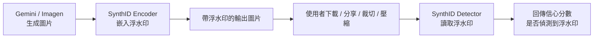

# SynthID：Gemini 生圖的數位浮水印機制

> Google DeepMind 研發的 SynthID，會把一段人眼不可見、但演算法可偵測的訊號直接嵌入生成圖片的像素本身，用來標記「這張圖是 AI 生成的」，且比傳統的 metadata 標記更難被裁切、壓縮、截圖等操作破壞。

## Step 1：為什麼需要浮水印

生成式 AI 讓合成圖片的產製成本趨近於零，這帶來兩個典型風險：

- **Deepfake / 假訊息**：合成圖片被拿去偽造新聞、詐騙、抹黑。
- **內容溯源缺失**：使用者、平台、記者都難以判斷一張圖是不是 AI 生成。

傳統做法是把來源資訊寫進 metadata（如 EXIF、C2PA Content Credentials），但 metadata 是「附加在檔案外層」的資訊，只要重新編碼、截圖、轉貼到社群平台（多數平台會清掉 EXIF），metadata 就會整個消失。Google 因此在 2023 年推出 SynthID，改用「把訊號嵌進像素本身」的方式來對抗這個問題。

## Step 2：核心設計 —— 嵌入像素，而非附加 metadata

SynthID 的浮水印不是在圖片檔案外面貼一個標籤，而是用一個神經網路對生成出來的圖片做一次非常細微的像素擾動（perturbation），這個擾動：

- 對人眼幾乎不可見（不影響圖片觀感與畫質）。
- 分散在整張圖片的像素與頻域（frequency domain）中，而不是集中在某個角落（因此裁切局部區域仍可能偵測到浮水印）。
- 只有搭配對應的偵測模型（decoder）才能被判讀出來，一般使用者或工具肉眼、傳統影像處理都看不出來。

架構上可以理解成一組「encoder–decoder」神經網路，兩者是聯合訓練出來的：

- **Encoder**：在生成圖片的最後一步，加入只有 decoder 認得出來的統計訊號。
- **Decoder（偵測器）**：讀取一張圖片，輸出「這張圖含有 SynthID 浮水印的機率」。

這個過程與 Transformer 的 encoder-decoder 沒有關係，純粹是為了 watermark 訂做的一組小型神經網路，通常在生成模型（如 Imagen、Gemini 原生圖片生成）輸出圖片後，作為 pipeline 的最後一步執行。

## Step 3：魯棒性（Robustness）—— 這是 SynthID 的重點

SynthID 的浮水印被設計成能撐過常見的「二次處理」：

- 裁切（crop）、縮放（resize）
- 有損壓縮（JPEG 壓縮、社群平台重新編碼）
- 調整亮度、對比、濾鏡
- 截圖（screenshot）

也就是說，即使圖片被轉貼到社群平台重新壓縮過，SynthID 仍有機會被偵測出來 —— 這是它相較於 metadata 標記最大的優勢，因為 metadata 只要重新編碼就會消失，但像素層的統計訊號會留下痕跡。

但魯棒性不是無限的，以下操作會削弱甚至清除浮水印：

- 大範圍的 inpainting、重繪
- 疊加高強度雜訊、多次極端壓縮
- 把圖片丟回生成模型重新生成（等於整張圖被覆寫）

## Step 4：偵測結果是「信心分數」，不是是非題

SynthID Detector 回傳的不是「是 / 否是 AI 生成」的二元答案，而是一個信心分數（confidence level，如「極可能含有浮水印」「可能」「未偵測到」）。這反映了浮水印本質上是統計訊號：圖片被編輯得越多，訊號越弱，判斷的確定性也隨之下降。

這點在工程上跟 [LLM 的 hallucination](#/llm/05-evals-safety/what-is-hallucination.mdx) 判斷邏輯有點像 —— 都是機率性訊號，不能當成加密簽章那樣的絕對證明。

一個重要限制：**沒偵測到浮水印，不代表這張圖不是 AI 生成的**。可能是浮水印已經被編輯破壞，也可能圖片根本不是用支援 SynthID 的模型生成的。SynthID 只能給「正向證據」，無法證明「反向」。

## Step 5：SynthID vs. C2PA（Content Credentials）—— 互補而非取代

| | SynthID | C2PA / Content Credentials |
|---|---|---|
| 存放位置 | 嵌入像素、頻域本身 | 檔案的 metadata（加密簽章的 manifest） |
| 抗編輯能力 | 較強（裁切、壓縮、截圖仍可能存活） | 較弱（重新編碼、去除 metadata 即失效） |
| 可讀資訊量 | 低（近似「是否為 AI 生成」的機率） | 高（可記錄生成工具、編輯歷程、時間戳等完整來源鏈） |
| 驗證方式 | 需要專屬 decoder 模型 | 可用公開加密簽章驗證 |

Google 的作法是兩者並用：Gemini、Imagen 生成的圖片，同時寫入 C2PA metadata（提供完整可驗證的來源鏈）與 SynthID 像素浮水印（提供 metadata 被清除後的最後一道防線）。

## Step 6：實際應用範圍

SynthID 不只用在圖片上，Google 把同一套「嵌入生成內容、訓練對應偵測器」的思路套用到多種模態：

- **圖片**：Imagen、Gemini 原生圖片生成。
- **文字**：透過在取樣（sampling）階段對 token 機率做微小、可偵測的偏移來嵌入浮水印，原理上跟 [temperature 取樣](#/llm/03-inference/temperature-and-top-p.mdx) 是在同一個取樣分佈上動手腳，但目的相反 —— 取樣參數是為了控制輸出品質，SynthID 文字浮水印是為了在不影響輸出品質下嵌入可偵測訊號。
- **音訊**：Lyria。
- **影片**：Veo。

Google 也開源了部分 SynthID 技術（Responsible Generative AI Toolkit），並提供 SynthID Detector 網頁工具，讓使用者上傳圖片檢查是否含有浮水印。

## 小結

SynthID 解決的核心問題是「AI 生成內容的可溯源性」，設計重點是把偵測訊號嵌入內容本身（像素、頻域、token 機率分佈），而不是依賴容易被清除的外層 metadata，換取更好的魯棒性；代價是偵測結果只能是機率性的信心分數，且面對大幅度重新生成或編輯時仍可能失效。實務上它通常與 C2PA 這類 metadata 溯源標準搭配使用，形成多層防禦。

## 相關筆記

- [多模態 LLM 與視覺資訊的整合](#/llm/06-frontiers/multimodal-llm.mdx)
- [LLM 的 Hallucination 問題](#/llm/05-evals-safety/what-is-hallucination.mdx)
- [Temperature 與 Top-p 的取樣策略](#/llm/03-inference/temperature-and-top-p.mdx)
