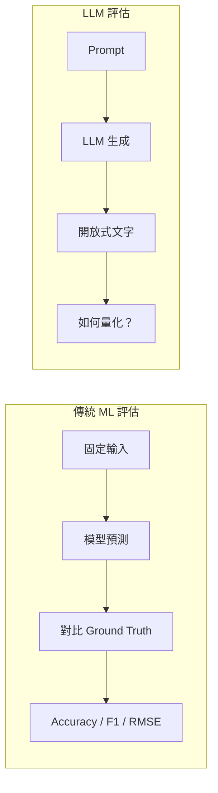
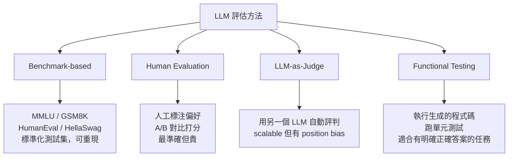

# LLM 評估的獨特挑戰與方法

> LLM 的輸出是開放式文字，沒有唯一正確答案——這讓「評估好不好」從一行公式變成了一門工程學問。

## 核心矛盾：輸出空間從「封閉」變成了「開放」

傳統 ML（分類、迴歸）的評估之所以簡單，是因為正確答案是確定的——「貓或狗」「成交機率 0.73」——只要比對預測值和 ground truth，accuracy / F1 / RMSE 一行算出來。

LLM 打破了這個前提。「幫我寫一封道歉信」沒有唯一正確答案；「這段程式碼有 bug 嗎」可以用一百種方式說對。**評估 LLM 的核心難題，就是如何定義並衡量「好的輸出」。**

---

## Step 1：傳統 ML vs LLM Evaluation 的根本差異

| 維度 | 傳統 ML | LLM |
|---|---|---|
| 輸出空間 | 封閉（有限標籤、連續數值） | 開放（任意自然語言文字） |
| 正確答案 | 唯一（ground truth） | 多個甚至無限個 |
| 評估自動化 | 完全自動，可重現 | 自動化困難，主觀性高 |
| 評估粒度 | 每個樣本獨立 | 需考慮整體連貫性、風格 |
| 覆蓋任務 | 通常一個模型一個任務 | 一個模型覆蓋數十種任務 |
| 主要陷阱 | 過擬合、資料洩漏 | 測試集污染（data contamination）、人類偏好偏差 |

---

## Step 2：為什麼 LLM 評估特別困難

**1. 多個有效答案**

「台灣的首都是哪裡？」——「台北」和「台灣的首府是台北市」都是正確的。傳統 exact-match 只能抓到第一種，第二種會被判錯。

**2. 任務多元，沒有統一指標**

同一個 LLM 要做摘要、翻譯、程式碼生成、數學推理……每種任務的「好」定義不同，需要一組 benchmark 而非單一指標。

**3. 訓練資料污染（Data Contamination）**

LLM 在海量網路資料上預訓練，很可能已經「看過」測試集的答案。傳統 ML 只要嚴格切分 train/test 就能避免，LLM 則難以保證。

**4. 人類偏好的主觀性**

「有幫助」「無害」「誠實」這三個維度本身就有衝突，而且因文化、語境而異，很難用單一數字量化。

**5. Emergent Behavior（湧現行為）**

某些能力（如多步推理）在模型夠大之前根本不存在，傳統的線性縮放假設完全不適用，評估必須持續更新。

---

## Step 3：LLM 的四種主流評估方法

**Benchmark-based**：最常見的方式，用固定測試集衡量特定能力。

- `MMLU`：知識廣度（57 個學科的選擇題）
- `GSM8K`：國小數學推理
- `HumanEval`：程式碼生成（跑測試驗證）
- 優點：可重現、能橫向比較；缺點：模型可能死記測試集答案

**Human Evaluation**：人工標注者對兩個輸出做 A/B 偏好選擇。

- Chatbot Arena 就是讓用戶匿名比較兩個模型輸出並投票
- 最貼近真實使用，但成本高、速度慢

**LLM-as-Judge**：用一個「評審 LLM」（如 GPT-4）對另一個 LLM 的輸出打分。

- 大幅降低評估成本，可規模化
- 主要偏差：`position bias`（傾向偏好第一個輸出）、`self-preference`（模型偏好和自己風格相似的輸出）

**Functional Testing**：有標準答案的任務可直接跑程式驗證。

- 程式碼生成：執行後跑單元測試，pass/fail 是確定的
- 數學題：驗證最終答案數字

---

## Step 4：實際產品的混合 Eval Pipeline

---

## 小結

| | 傳統 ML | LLM |
|---|---|---|
| 評估難度 | 低（有 ground truth） | 高（開放答案） |
| 主要指標 | Accuracy / F1 / RMSE | Win-rate / LLM Judge Score / 通過率 |
| 主要挑戰 | 過擬合 | 資料污染、人類偏好主觀性 |
| 自動化程度 | 完全自動 | 半自動（需 Human Eval 最終確認） |

LLM eval 至今沒有完美解法——這也是為什麼 "eval engineering" 已成為 AI 領域的獨立工程方向。

---

## 相關筆記

- [LLM 和傳統 ML 模型有什麼差異？](#/llm/01-foundations/llm-vs-traditional-ml.mdx)
- [什麼是 Hallucination？](#/llm/05-evals-safety/what-is-hallucination.mdx)
- [Reasoning Model 和一般模型有什麼差異？](#/llm/06-frontiers/reasoning-models.mdx)
