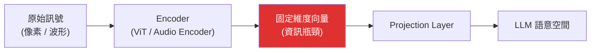

# Modality Translation Loss 與資訊遺失

> 把圖片、語音等連續訊號「翻譯」成 LLM 看得懂的向量或文字時，這個轉換過程本質上是有損壓縮 —— 凡是對訓練目標不重要的細節，都會在轉換階段被丟掉，而且事後無法從 LLM 這一側復原。

---

## Step 1：先釐清「轉換」發生在哪裡

在[多模態 LLM](#/llm/06-frontiers/multimodal-llm.mdx)的 pipeline 裡，圖片要先經過 Vision Encoder、Projection Layer，才會變成跟文字 token 同維度的向量。這個「原始訊號 → 向量表示」的步驟，就是模態轉換（modality translation）發生的地方。

問題不是「LLM 看不懂圖片」，而是圖片在進入 LLM 之前，就已經被壓縮到一個遠比原始訊號低維度的空間裡——**壓縮發生的那一刻，資訊遺失就已經確定了**，LLM 本身再強也無法把丟掉的細節找回來。

---

## Step 2：為什麼一定會遺失，而不只是「壓縮」

任何有損壓縮都會保留「對目標任務重要」的資訊，丟掉「不重要」的資訊。關鍵在於：**Vision Encoder 判斷「重要與否」的標準，來自它的訓練目標，而不是來自下游任務的真實需求。**

以最常見的 CLIP-based encoder 為例：

1. 訓練目標是「圖片 embedding 要跟對應的文字描述 embedding 對齊」（contrastive learning）。
2. 一張圖片的文字描述通常只提到最顯著的語意內容（「一隻狗在草地上」），不會提到狗身上第幾根毛、草地上小石頭的精確位置。
3. Encoder 為了把圖片壓成一個向量（或一組 patch 向量），會優先保留「跟常見文字描述相關」的語意特徵，捨棄與這類描述無關的細粒度細節。

換句話說，資訊遺失的方向是由**訓練資料的分佈**決定的，不是由「這個細節客觀上重不重要」決定的。這也是為什麼同一張圖片，做「圖片描述」任務時看起來表現很好，一旦被問到需要精確細節的問題，就會露出破綻。

---

## Step 3：實務上會怎麼表現出來

| 場景 | 遺失的資訊 | 表現症狀 |
|------|-----------|---------|
| 圖片中的小字 / 圖表數字 | 高頻細節、精確字元 | OCR 讀錯字、讀錯數字（chart 上的 12.3 讀成 123） |
| 數物件數量 | 精確的空間計數結構 | 數錯圖片裡有幾隻羊、幾個人 |
| 空間關係 | 精確座標與相對位置 | 誤判「在左邊還是右邊」「重疊還是分開」 |
| 語音的語氣、停頓、重音 | 韻律（prosody）資訊 | 語音轉文字後，模型讀不出諷刺語氣、強調重點 |
| 圖片的精確顏色數值 | 色彩空間的連續資訊 | 只能給出大致色系（「偏藍」），給不出準確 RGB |

這些都不是模型「推理能力不足」，而是**推理發生之前，輸入端就已經把答案需要的訊號濾掉了**——這一點在除錯多模態任務失敗時特別容易被誤判成推理問題，實際上該去查的是 encoder / tokenization 這一層。

---

## Step 4：這跟其他「損失」概念的關係

- 跟 [Hallucination](#/llm/05-evals-safety/what-is-hallucination.mdx) 的關係：當細節被壓縮丟失後，LLM 面對「被問到已經不存在的細節」時，傾向用語言模型的先驗機率去「腦補」一個合理答案，而不是誠實地說「看不清楚」—— 這是 modality translation loss 誘發 hallucination 的典型路徑。
- 跟 tokenization 的類比：文字的 [tokenization](#/llm/01-foundations/what-is-a-token-and-api-pricing.mdx) 也是一種有損轉換（例如把生僻字切成多個 subword token，模型較難掌握字元級細節，像是數某個單字裡有幾個字母）。模態轉換遺失可以理解成同一類問題在圖片 / 語音上的放大版 —— 因為連續訊號要壓縮的倍率遠高於文字。

---

## Step 5：常見緩解手法

1. **提高輸入解析度 / 切更多 patch**：如 GPT-4V、Claude 的高解析度模式會把圖片切成多個 tile 分別編碼，用更多 token 換取更少的資訊遺失（但會增加成本與延遲）。
2. **原生多模態訓練**：如 Gemini 宣稱的 interleaved pretraining，讓視覺訊號更早、更深地參與訓練，而不是後貼一層 projection，理論上能讓 encoder 學到的「重要性判準」更貼近真實任務分佈。
3. **工具化 grounding**：與其要求 LLM 直接從壓縮後的 embedding 回答精確問題，不如讓 agent 呼叫外部工具（OCR、圖片裁切放大、計算機）直接對原始訊號操作，繞過模態轉換這一層瓶頸。
4. **任務導向的 encoder 微調**：針對特定下游任務（如圖表理解、文件 OCR）用該任務的資料微調 encoder，讓「重要性判準」對齊實際需求，而不是通用圖文對齊的預設分佈。

---

## 相關筆記

- [LLM 如何處理圖片資訊？什麼是多模態 LLM？](#/llm/06-frontiers/multimodal-llm.mdx)
- [什麼是 Hallucination？](#/llm/05-evals-safety/what-is-hallucination.mdx)
- [什麼是 token？API 通常如何計費？](#/llm/01-foundations/what-is-a-token-and-api-pricing.mdx)
