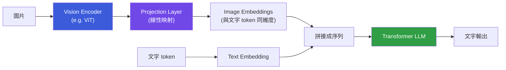

# 多模態 LLM 與視覺資訊的整合

> 多模態 LLM 透過 **Vision Encoder + Projection Layer** 把圖片轉成與文字相同維度的向量，讓 Transformer 以相同機制處理圖文混合輸入。

---

## 核心問題：圖片怎麼變成 token？

文字 LLM 的輸入是 token embedding（向量）。圖片要進入 Transformer，需要先「翻譯」成相同空間的向量。

---

## 三個關鍵元件

### 1. Vision Encoder（視覺編碼器）

常見選擇是 **ViT（Vision Transformer）**：把圖片切成固定大小的 patch（小方塊，例如 16×16 pixels），每個 patch 編碼成一個向量 —— 就像文字的每個 token 一樣。一張 224×224 圖片切成 196 個 patch，產生 196 個向量。

### 2. Projection Layer

Vision Encoder 輸出的維度與 LLM embedding 維度不同，用一個**線性投影層**對齊兩者的向量空間。這一層是讓視覺與語言「說同一種語言」的橋樑。

### 3. LLM 主幹

接收「文字 token embedding + 圖片 patch embedding」拼接成的序列，和純文字模式**完全一樣**地做 attention。LLM 本身不需要修改，只要把圖片變成向量序列即可。

---

## 訓練方式（通常分兩階段）

**階段一 — 視覺語言對齊**

凍結 LLM 主幹，只訓練 Projection Layer。用大量「圖文配對」資料（圖片 + 描述文字）訓練，目標是讓圖片 embedding 落在語言 embedding 空間的正確位置。

**階段二 — Instruction Tuning**

解凍部分或全部參數，用高品質的「視覺問答」指令資料繼續訓練。讓模型學會根據圖片回答具體問題，而不只是描述圖片。

---

## 代表模型比較

| 模型 | 視覺編碼器 | 特色 |
|------|-----------|------|
| GPT-4V / GPT-4o | CLIP-based | 商用強基準，泛化廣 |
| Claude 3/4 系列 | 未公開 | 長文件、表格理解優秀 |
| LLaVA | ViT + CLIP | 開源，架構清晰易研究 |
| Gemini | 原生多模態 | 訓練時圖文音頻交錯，非後貼 |

---

## Gemini 的「原生多模態」有何不同？

大多數多模態 LLM 是「先訓練文字 LLM，再貼上視覺模組」的架構。Gemini 宣稱從訓練一開始就把圖文音頻交錯進行（interleaved pretraining），理論上視覺與語言理解更深度整合，而不是靠 projection layer 強行對齊。

---

## 相關筆記

- [什麼是 Transformer？](#/llm/01-foundations/what-is-transformer.mdx)
- [Reasoning model 和一般模型有什麼差異？](#/llm/06-frontiers/reasoning-models.mdx)
