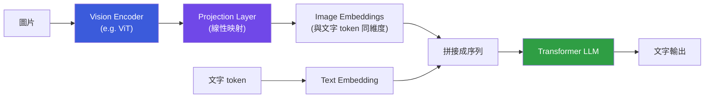

# 多模態 LLM 與視覺資訊的整合

> 多模態 LLM 的本質是「格式轉換」：把圖片、音訊等非文字資料轉成與文字 token 同一空間的向量（或離散 token），讓 Transformer 不需修改架構就能一起處理。主流做法是 **Vision Encoder + Projection Layer**；另一條路線是把各模態都離散化成 token，跟文字共用同一套詞表。

---

## 兩種主流做法：連續向量 vs 離散 Token

在深入 Vision Encoder 細節之前，先看多模態有兩條根本不同的技術路線：

| | 做法 A：Projection（連續向量） | 做法 B：Tokenization（離散化） |
|---|---|---|
| 原理 | Vision Encoder + 線性投影，輸出連續向量直接接文字 embedding | 用 VQ-VAE 等方法把圖片量化成離散 token，跟文字共用詞表 |
| 代表 | LLaVA、GPT-4V | 部分原生多模態生成模型（可輸出圖片 token） |
| 能力 | 模型能「看懂」圖片，輸出仍是文字 | 模型能「看懂」也能「生成」圖片（解碼 token 回圖片） |
| 代價 | 只需訓練一個線性層即可對齊 | 需額外訓練一個離散化的視覺 tokenizer |

下面先展開做法 A（目前商用模型最常見）的細節。

## 核心問題：圖片怎麼變成 token？

文字 LLM 的輸入是 token embedding（向量）。圖片要進入 Transformer，需要先「翻譯」成相同空間的向量。

```mermaid
flowchart LR
    IMG["圖片"] --> VE["Vision Encoder<br/>(e.g. ViT)"]
    VE --> PROJ["Projection Layer<br/>(線性映射)"]
    PROJ --> EMB["Image Embeddings<br/>(與文字 token 同維度)"]
    TXT["文字 token"] --> TE["Text Embedding"]
    EMB --> CONCAT["拼接成序列"]
    TE --> CONCAT
    CONCAT --> LLM["Transformer LLM"]
    LLM --> OUT["文字輸出"]

    style VE fill:#3b5bdb,color:#fff
    style PROJ fill:#7048e8,color:#fff
    style LLM fill:#2f9e44,color:#fff
```

---

## 三個關鍵元件

### 1. Vision Encoder（視覺編碼器）

常見選擇是 **ViT（Vision Transformer）**：把圖片切成固定大小的 patch（小方塊，例如 16×16 pixels），每個 patch 編碼成一個向量 —— 就像文字的每個 token 一樣。一張 224×224 圖片切成 196 個 patch，產生 196 個向量。

### 2. Projection Layer

Vision Encoder 輸出的維度與 LLM embedding 維度不同，用一個**線性投影層**對齊兩者的向量空間。這一層是讓視覺與語言「說同一種語言」的橋樑。

### 3. LLM 主幹

接收「文字 token embedding + 圖片 patch embedding」拼接成的序列，和純文字模式**完全一樣**地做 attention。LLM 本身不需要修改，只要把圖片變成向量序列即可。

---

## 訓練方式（通常分兩階段）

**階段一 — 視覺語言對齊**

凍結 LLM 主幹，只訓練 Projection Layer。用大量「圖文配對」資料（圖片 + 描述文字）訓練，目標是讓圖片 embedding 落在語言 embedding 空間的正確位置。

**階段二 — Instruction Tuning**

解凍部分或全部參數，用高品質的「視覺問答」指令資料繼續訓練。讓模型學會根據圖片回答具體問題，而不只是描述圖片。

---

## 代表模型比較

| 模型 | 視覺編碼器 | 特色 |
|------|-----------|------|
| GPT-4V / GPT-4o | CLIP-based | 商用強基準，泛化廣 |
| Claude 3/4 系列 | 未公開 | 長文件、表格理解優秀 |
| LLaVA | ViT + CLIP | 開源，架構清晰易研究 |
| Gemini | 原生多模態 | 訓練時圖文音頻交錯，非後貼 |

---

## Late Fusion vs Early Fusion：架構層次的差異

- **Late fusion**（LLaVA、多數商用模型）：文字 LLM 先訓練好，之後才「外掛」視覺模組，也就是前面說的 Vision Encoder + Projection Layer 做法。優點是能重用已經訓練好的強大文字模型，成本低、迭代快。
- **Early / Native fusion**（Gemini 宣稱的做法）：從 pretraining 一開始就把圖文音訊交錯（interleaved）一起訓練，理論上模態之間融合更深，而不是訓練完文字模型後再靠 projection layer 強行對齊。

大多數多模態 LLM 走的是 late fusion；Gemini 是少數宣稱走 early fusion 路線的代表模型。

---

## 相關筆記

- [什麼是 Transformer？](#/llm/01-foundations/what-is-transformer.mdx)
- [Reasoning model 和一般模型有什麼差異？](#/llm/06-frontiers/reasoning-models.mdx)
