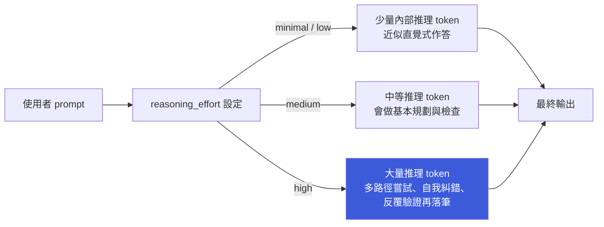

# Codex 中的 Reasoning Effort（Thinking 程度）機制與實際影響

> 一句話版本：Codex 的「Thinking 程度」本質上是傳給 reasoning model 的 `reasoning_effort` 參數，控制模型在給出最終答案前，允許投入多少「隱藏推理 token」做規劃與自我檢查，效果是**延遲 / 成本 vs. 正確率**的權衡，而不是把模型換成一個更聰明的版本。

想先理解 reasoning model 本身「思考過程」的機制，可以先看 [Reasoning Model 與擴展思考能力](#/llm/06-frontiers/reasoning-models.mdx)，這篇筆記是接續講 Codex 這個具體工具怎麼把「思考多久」變成一個可調參數。

---

## Step 1：這個設定調的是什麼

Codex CLI 底層呼叫的是 OpenAI Responses API，對支援 reasoning 的模型（如 o-series、gpt-5-codex 系列），API 上有一個 `reasoning.effort` 欄位。Codex 設定檔（`~/.codex/config.toml`）把它包成使用者可調的選項：

```toml
model_reasoning_effort = "high"   # minimal | low | medium | high（可選項依模型而定）
model_reasoning_summary = "auto"  # auto | concise | detailed | none
```

在互動模式（TUI）裡透過 `/model` 選單挑選的「Thinking 程度」，實際上就是在改這個 `model_reasoning_effort` 值。它不是換模型、也不是換 system prompt，是同一個模型、同一份權重，只是**允許它在正式回答前想多久**。

---

## Step 2：運作機制——effort 如何轉成行為差異

Reasoning model 在訓練階段就學會「思考更久 → 答案更好」這個策略（見前述筆記的 PRM / ORM 討論）。`reasoning_effort` 做的事，是把模型在推理時的內部搜尋 / 驗證步數，往訓練時學到的某個檔位對齊：



這些推理 token 通常不會全部顯示給使用者（除非 `model_reasoning_summary` 設成 `detailed`），但**會被計費、會佔用產生答案前的時間**。effort 越高，模型越傾向：

- 在動手前先列出計畫、拆解子任務
- 執行 tool call（讀檔、跑測試）後停下來檢查結果是否符合預期
- 發現矛盾或錯誤時回頭修正，而不是將錯就錯往下寫

---

## Step 3：各層級的具體差異

| 層級 | 內部推理量 | 延遲 | Token 成本 | 適合場景 | 風險 |
|------|-----------|------|-----------|---------|------|
| `minimal` / `low` | 少 | 低 | 低 | 單檔小改動、格式修正、簡單問答 | 遇到多檔案、隱含依賴的任務容易漏看 edge case |
| `medium`（多數模型預設） | 中 | 中 | 中 | 一般開發任務、常規 bug fix | 對高複雜度重構偶爾會需要重跑一次才收斂 |
| `high` | 多 | 高（可能明顯變慢） | 高（推理 token 另計） | 大型重構、跨檔案 debug、需要先驗證假設再動手的任務 | 簡單任務用 high 是純浪費時間與成本，且不保證更「對」 |

關鍵認知：effort 調高**不會**讓模型知道它原本不知道的東西，也不是「更聰明的模型」；它只是把模型逼著在動手前多花幾輪推理去規劃與檢查。對真正簡單、模型一次就能做對的任務，調高 effort 幾乎只有延遲和成本上升，正確率不會有感提升。

---

## Step 4：常被混淆的另一個開關——reasoning summary

`model_reasoning_summary` 是完全獨立的另一件事：它只控制**要不要把內部推理過程的摘要顯示在 CLI 畫面上**，不影響模型實際計算量或答案品質。

| | `model_reasoning_effort` | `model_reasoning_summary` |
|-|-------------------------|---------------------------|
| 影響 | 模型實際思考多久、算力/token 花費 | 使用者看不看得到思考摘要 |
| 調高的代價 | 延遲、成本上升 | 純顯示，不花額外算力（摘要本身另計但量小） |
| 對答案品質 | 有影響 | 無影響 |

也就是說，把 summary 設成 `detailed` 只是讓你「看得到 Codex 在想什麼」，不會讓它想得更久或更好；反之把 effort 調到 `high` 但 summary 設 `none`，Codex 一樣會認真思考，只是你看不到過程。

---

## Step 5：實務上怎麼選

- 日常小改動、跑腳本、格式修正：留在 `low` / 預設值，換取快速反饋迴圈。
- 涉及多檔案、需要先讀懂既有架構再下手的重構或 debug：切到 `high`，讓它有空間先規劃、跑測試驗證再收斂。
- 不確定時：先用預設 effort 跑一次；如果 Codex 給出的方案明顯漏看邊界情況或跳過驗證步驟，再手動升到 `high` 重跑，而不是預設全程開最高——多數任務不需要，且會拖慢迭代速度。

---

## 相關筆記

- [Reasoning Model 與擴展思考能力](#/llm/06-frontiers/reasoning-models.mdx)
- [Temperature 與 Top-p 的取樣策略](#/llm/03-inference/temperature-and-top-p.mdx)
