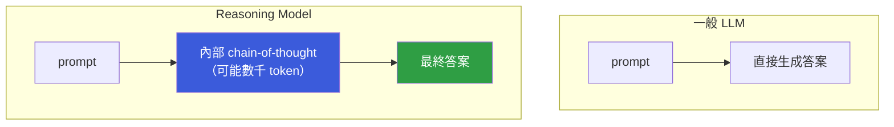

# Reasoning Model 與擴展思考能力

> Reasoning model 在輸出最終答案前，會先生成一段**內部思考過程**（chain-of-thought），這個「草稿空間」讓模型能處理複雜多步推理，而不是直接輸出答案。

---

## 核心差異：Think before you speak

一般 LLM 是 autoregressive 直接生成回答。Reasoning model（如 OpenAI o1/o3、Claude 3.7 Sonnet extended thinking）在輸出最終答案前，會先生成一段內部思考，這段思考通常對使用者不可見或折疊顯示。

---

## 為什麼思考過程有幫助？

關鍵在於：複雜推理需要「草稿空間」。

人類解數學題不會一步到位，需要列式、驗算、回頭修正。LLM 也一樣 —— 如果強迫它在有限 token 內直接給答案，中間步驟被壓縮，容易犯錯。給模型「自由思考的 token」，讓它可以：

- 嘗試多條推理路徑
- 自我糾錯（發現矛盾後回頭）
- 分解子問題再組合

---

## 訓練方式：PRM 與 ORM

Reasoning model 通常用強化學習訓練，有兩種主要的獎勵信號：

| 方式 | 說明 | 優點 |
|------|------|------|
| **ORM（Outcome Reward Model）** | 只看最終答案對不對 | 訓練資料容易取得 |
| **PRM（Process Reward Model）** | 評估每個推理步驟的品質 | 更精準，能引導出正確推理路徑 |

模型學會「思考更久 → 答案更好」的策略，這也是為什麼 reasoning model 回應延遲明顯更高。

---

## 和 Chain-of-Thought Prompting 的差異

普通 LLM 也可以透過 prompt 要求「一步一步思考」（Chain-of-Thought Prompting）。差異在於：

| | CoT Prompting | Reasoning Model |
|-|---------------|-----------------|
| 思考來源 | Prompt 引導 | 訓練中學到的行為 |
| 思考可見性 | 可見 | 通常隱藏或折疊 |
| 效果強度 | 對複雜題有限 | 顯著更強 |
| 成本 | 僅輸入 token 多一點 | thinking token 另計費 |

---

## 什麼時候用 Reasoning Model？

| 適合 | 不適合 |
|------|--------|
| 數學、邏輯、程式競賽題 | 簡單問答、閒聊 |
| 多步驟推理 | 對速度敏感的場景 |
| 容易犯推理錯誤的任務 | token 成本敏感的應用 |

Reasoning model 的 thinking token 費用通常比一般輸出 token 貴，回應延遲也更高，要根據任務複雜度選擇。

---

## 相關筆記

- [LLM 是如何運作的？](#/llm/01-foundations/how-do-llms-work.mdx)
- [Temperature 與 Top-p 是什麼？](#/llm/03-inference/temperature-and-top-p.mdx)
- [In-context learning 與 Prompt engineering 是什麼？](#/llm/04-applications/icl-and-prompt-engineering.mdx)
