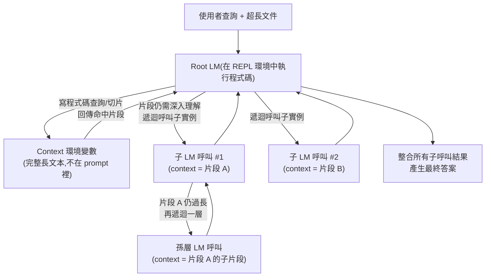

# Recursive Language Models（遞迴語言模型）的核心概念與運作原理

> 一句話版本：Recursive Language Model（RLM）不把長文本直接塞進 context window，而是把它放進一個外部環境變數，讓根模型透過程式碼「遞迴呼叫」自己（或子模型）去理解其中的片段，藉此突破 context window 的長度上限與 context rot 問題。

## Step 1：要解決的問題——Context Rot

即使 context window 已經做到 1M token，把整份長文件直接塞進 prompt 仍有代價：

1. **Context rot**：實驗上 attention 對長序列裡「中段」內容的關注力會明顯下降，token 數越多，模型對其中細節的掌握越不穩定，這是 attention $O(n^2)$ 計算特性衍生出的現實限制。
2. **成本**：每次呼叫都把整份長文本重新丟進 context，即使只需要其中一小段答案，也要為全部內容付 token 費用。
3. **不可組合**：context window 終究有上限，面對「一整個 codebase」「上千篇文件」這種規模，單次塞入是做不到的。

## Step 2：核心想法——Context 是環境變數，不是 Prompt

Recursive Language Model 的關鍵轉變：**不把長文本放進 prompt，而是放進一個外部執行環境（例如 REPL）裡的變數**。根模型（root LM）看到的不是文本本身，而是一個可以用程式碼操作的環境：

- 可以對這個變數做 `grep`、切片、算長度
- 可以把某一段餵給「自己的另一個實例」去理解
- 那個被呼叫的實例，如果拿到的片段還是太長，可以**再對它做一次同樣的事**——這就是「遞迴」的來源：LM 呼叫 LM 呼叫 LM。

每一層呼叫看到的都是**小塊**的 context，不會有任何一次呼叫需要「一次性讀完全部」。遞迴深度可以視需要展開，直到片段小到單次呼叫能可靠處理為止。

## Step 3：和既有做法的差異

| 做法 | 機制 | 限制 |
|---|---|---|
| **長 context 模型** | 直接把全部塞進 1M token window | Context rot、成本高、終究有上限 |
| **RAG** | 用 embedding 相似度一次性檢索出相關片段，塞進 prompt | 單次檢索，若相關性判斷錯就漏資訊；不能對檢索結果再展開推理 |
| **摘要 / compaction** | 把舊內容壓縮成摘要塞進 context | 有損，細節容易在壓縮時丟失 |
| **Recursive LM** | Context 留在環境變數裡，模型用程式碼遞迴地、按需展開查詢，只在真正需要細讀時才把片段送進某次 LM 呼叫 | 需要多次 LM 呼叫，延遲/成本轉嫁到呼叫次數，而非單次 context 長度 |

RLM 的本質更接近**分治演算法（divide and conquer）**或 MapReduce：根模型負責「分」與「合」，子呼叫負責「治」，而不是像 RAG 那樣一次性檢索、一次性塞入。

## Step 4：與 Subagent 模式的關係

這個架構和 subagent 分工模式（見「相關筆記」）同構——根模型像 orchestrator，遞迴呼叫的子實例像被派發任務的 subagent，差別在於 RLM 特別強調：

- 呼叫的目的是**繞開 context window 限制**，不是分工不同專長
- 遞迴深度是動態的，由模型自己決定要不要再往下展開一層
- Context 本身被當作程式可操作的資料結構（變數、檔案、可查詢的環境），而不是自然語言直接餵入

## Step 5：優點與限制

**優點**

- 理論上可以處理遠超單次 context window 的輸入總量（總量分散到多次呼叫，而非塞進一次）
- 每次子呼叫的片段小，減少 context rot，回答品質更穩定
- 天然可組合：子呼叫本身也可以再遞迴，適合處理巢狀結構的資料（如整個程式碼庫、多層目錄文件）

**限制**

- 呼叫次數增加，總延遲與總 token 成本可能不降反升（用「多次小呼叫」換「一次大呼叫」）
- 根模型的切片/查詢程式碼寫得好不好，直接決定能不能真正找到該讀的片段，這部分仍依賴模型的程式能力與規劃能力
- 遞迴需要終止條件（片段小到可直接處理），設計不當會遞迴過深或漏看邊界資訊

## 相關筆記

- [Context Window 與模型記憶容量](#/llm/01-foundations/what-is-context-window.mdx)
- [Agent 檔案式記憶與 RAG 的異同](#/llm/04-applications/agent-memory-vs-rag.mdx)
- [AI Agent 三種分工模式](#/llm/04-applications/ai-agent-collaboration-modes.mdx)
- [Embedding Model 的選型考量與評估方法](#/llm/04-applications/how-to-choose-embedding-model.mdx)
