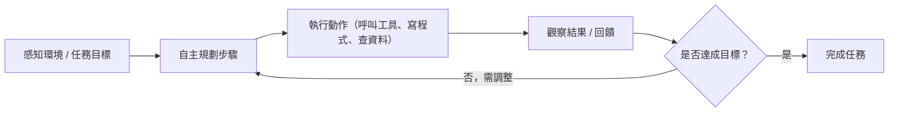
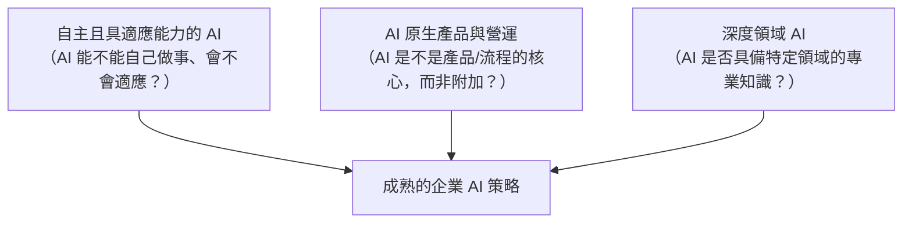

# 企業 AI 策略的三個層次：自主適應、AI 原生、深度領域

> 企業導入 AI 常見的三個評估維度——「自主且具適應能力的 AI」「AI 原生產品與營運」「深度領域 AI」——分別對應 AI 的**行為能力**、**產品/組織設計方式**、**知識深度**，成熟的策略通常三者兼備。

這三個詞常見於企業 AI 策略、顧問報告（如麥肯錫、BCG 一類的分類法）中，用來描述企業導入 AI 時可以切入的三個不同角度。它們不是互斥的選項，而是同一套策略下的三個互補維度。

## Step 1：自主且具適應能力的 AI（Autonomous & Adaptive AI）

這個維度講的是 AI 系統的**行為能力**：AI 能不能自己規劃、執行、修正，而不只是被動回答單一問題。

### 傳統 AI vs. 自主適應 AI

傳統的 AI 應用是「輸入 → 固定模型 → 輸出」的單次呼叫模式；自主適應的 AI 則是一個持續的迴圈：

- **自主性（Autonomy）**：能把一個模糊的高層目標拆解成多個步驟，不需要人在每一步下指令。
- **適應性（Adaptivity）**：根據執行過程中的回饋（錯誤訊息、環境變化、使用者糾正）動態調整策略，而不是照著固定腳本硬跑到底。

這正是 [agent](#/llm/04-applications/ai-agent-collaboration-modes.mdx) 架構要解決的問題：讓 LLM 具備規劃（planning）、工具使用（tool use）、自我修正（self-correction）的能力，形成一個閉環系統。

### 實務例子

- **Coding agent**（例如 Claude Code）：接到「修這個 bug」的指令後，自己讀程式碼、寫測試、跑測試、看錯誤訊息、再修正，直到測試通過，而不是一次性吐出一段程式碼就結束。
- **客服 agent**：遇到使用者的模糊問題時，自己決定要不要查知識庫、要不要呼叫訂單系統 API、要不要轉真人客服，而不是走死板的決策樹。

### 企業導入時的關鍵挑戰

自主性越高，**風險（blast radius）**也越大——AI 可能會執行超出預期範圍的動作。這也是為什麼會需要 [評估 agent 是否過度執行](#/llm/04-applications/evaluating-agent-over-execution.mdx) 這類機制：用 human-in-the-loop、動作範圍限制（scope）、審計日誌等手段，在放權給 AI 自主行動與可控風險之間取得平衡。

## Step 2：AI 原生產品與營運（AI-Native Products & Operations）

這個維度講的不是 AI 的能力，而是**產品或組織流程的設計方式**：AI 是不是從一開始就被當作核心來設計。

### AI-native vs. AI-as-feature

| 面向 | AI-as-feature（傳統疊加） | AI-native（原生設計） |
|---|---|---|
| 設計起點 | 先有既有產品/流程，再「加裝」AI 功能 | 從需求出發，直接以 AI 能力為核心重新設計 |
| 拿掉 AI 後 | 產品/流程仍可運作（AI 只是加分項） | 產品/流程不成立（AI 是必要條件） |
| 典型例子 | Excel 加一顆「AI 建議」按鈕 | GitHub Copilot、ChatGPT——AI 就是產品本身 |
| 組織流程 | 舊有的客服/行銷/供應鏈流程不變，AI 只是輔助工具 | 直接用 AI 重新設計流程（例如客服流程從「人工處理、AI 輔助」變成「AI 優先處理、人工處理例外」） |

### 為什麼要區分這兩者

單純把 AI 當功能疊加，往往只能拿到「效率小幅提升」的邊際效益，因為底層的流程假設（人工是主要處理者）並沒有改變。AI-native 的做法是重新設計整個工作流的責任分配——例如：

- **AI-native 客服**：不是「客服人員 + AI 輔助工具」，而是「AI 優先處理，人工只處理 AI 判斷為高風險或低信心的案例」。
- **AI-native 產品開發**：不是「工程師寫程式 + AI 自動完成」，而是「AI agent 負責大部分實作，工程師專注在需求釐清、架構決策與 review」。

這也呼應了維度 1 的自主性——AI-native 的組織設計，通常需要搭配自主且具適應能力的 AI，才能真正把 AI 放在流程的核心位置，而不只是輔助角色。

## Step 3：深度領域 AI（Deep Domain AI）

這個維度講的是 AI 的**知識深度**：AI 是不是針對特定專業領域（醫療、法律、金融、半導體製造等）做了深度客製化，具備該領域的專業知識、術語、法規與工作流程理解，而不是套用通用型模型。

### 通用 AI 在專業領域的侷限

通用型 LLM（如未經客製化的 GPT、Claude）在專業領域常見的問題：

- **術語與慣例落差**：法律文件的用語、醫療病歷的縮寫、半導體製程的專有名詞，通用模型的訓練資料涵蓋度有限。
- **[Hallucination](#/llm/05-evals-safety/what-is-hallucination.mdx) 風險更高**：在高度專業、高風險的領域（例如藥物交互作用判斷），模型自信地講錯比不知道更危險。
- **缺乏領域特定的評測標準**：通用 benchmark（如 MMLU）無法反映模型在某個垂直領域的實際可用性，需要 [領域特定的 eval dataset](#/llm/05-evals-safety/how-to-design-eval-dataset.mdx)。

### 如何做到「深度」

要讓 AI 真正具備領域深度，通常需要多管齊下：

- **領域資料微調（fine-tuning）**：用領域內的專業語料做 SFT，讓模型熟悉專業術語與寫作風格。
- **領域知識庫 + RAG**：把法規條文、內部 SOP、病歷範本等結構化知識放進 [RAG](#/llm/04-applications/how-to-choose-embedding-model.mdx) 系統，讓模型回答時有依據可查，而不是單憑參數記憶。
- **領域專屬評測**：針對該領域的關鍵任務（例如病理報告摘要的準確率）設計專屬 eval，而不是只看通用 benchmark 分數。
- **領域專家參與 RLHF/DPO**：讓該領域的專業人士參與偏好標註，而不是只用一般標註員。

### 實務例子

- 專門判讀病理切片影像並給出診斷建議的 AI，而不是把 ChatGPT 直接套用在醫療影像上。
- 專門分析半導體良率數據、具備製程知識的 AI，能理解「哪個製程參數異常通常對應哪類良率問題」。

## Step 4：三者的關係——為什麼企業策略要三個一起看

這三個維度分別回答三個不同的問題：

一個常見的誤區是只做其中一個維度就以為完成了 AI 轉型：

- 只有**深度領域知識**，但產品設計仍是「AI-as-feature」、AI 也不具備自主性 → 得到的是一個很懂領域知識、但只能被動回答單一問題的專家問答機器人，無法真正改變工作流程的效率。
- 只有**自主性**，但沒有領域深度 → 得到的是一個什麼都敢自己做、但在專業領域容易講錯話、做錯事的通用 agent，風險反而更高。
- 只有 **AI-native 的流程設計**，但 AI 本身既不自主也沒有領域深度 → 流程重新設計了，但 AI 的實際產出品質跟不上，最終還是要人工大量介入補救。

因此企業在規劃 AI 策略時，通常會希望：用具自主性與適應能力的 agent（維度 1），以 AI-native 的方式重新設計產品或流程（維度 2），並注入深度領域知識讓 AI 的判斷真正可信（維度 3）——三者疊加才能真正把 AI 從「輔助工具」提升為「核心生產力」。

## 相關筆記

- [AI Agent 三種分工模式](#/llm/04-applications/ai-agent-collaboration-modes.mdx)
- [評估 LLM Agent 任務執行是否過度（Over-Execution）的方法](#/llm/04-applications/evaluating-agent-over-execution.mdx)
- [LLM 的 Hallucination 問題](#/llm/05-evals-safety/what-is-hallucination.mdx)
- [高品質評估集設計的原則](#/llm/05-evals-safety/how-to-design-eval-dataset.mdx)
- [Embedding Model 的選型考量與評估方法](#/llm/04-applications/how-to-choose-embedding-model.mdx)
