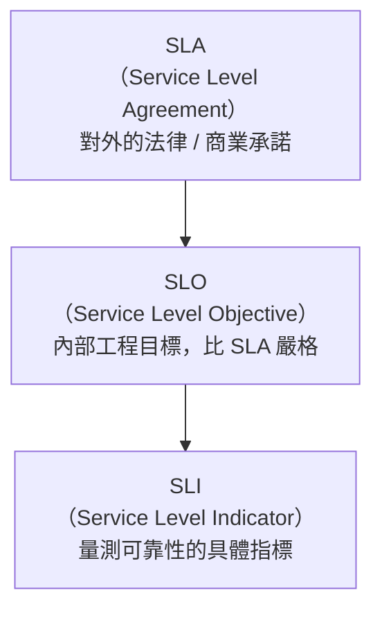
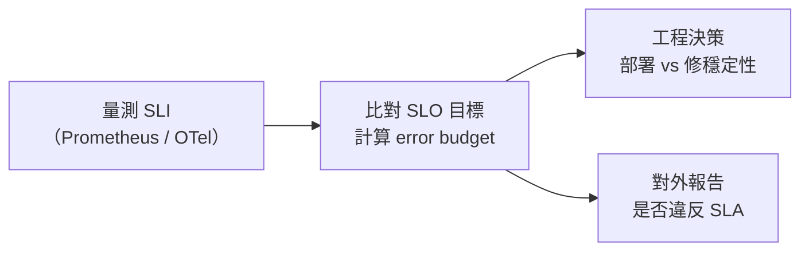

# SLA、SLO 與 SLI 的核心概念與設計實踐

> 三個縮寫描述同一件事的三個不同視角：量什麼（SLI）、目標是多少（SLO）、對外承諾多少（SLA）。

## 三層結構



---

## Step 1：SLI — 量什麼

SLI 是「量測可靠性的具體指標」，通常表達為一個比率：

$$\text{SLI} = \frac{\text{符合條件的事件數}}{\text{全部事件數}}$$

常見的 SLI 類型：

| 類型 | 量測什麼 | 範例 |
|------|----------|------|
| Availability | 服務是否可用 | 成功回應數 / 總請求數 |
| Latency | 速度夠不夠快 | P99 `<` 500ms 的請求比例 |
| Error Rate | 錯誤率 | 5xx 錯誤數 / 總請求數 |
| Throughput | 吞吐量是否達標 | 每秒完成的 job 數量 |
| Freshness | 資料有多新 | 24h 內更新的資料比例 |

**量測陷阱**：SLI 要從使用者視角量，而不是純 server-side。只量 server latency 而漏掉 DNS / TLS 握手時間，客戶感受到的慢就不在你的數字裡。

---

## Step 2：SLO — 目標是多少

SLO 是「SLI 要達到的目標值」，通常定義在一段時間窗口（rolling window 或 calendar month）內：

```
SLO = SLI ≥ 目標值（在指定時間窗口內）
```

範例：
- Availability SLO：過去 30 天，99.9% 的請求要成功
- Latency SLO：過去 7 天，95% 的請求要在 200ms 內回應

### Error Budget

SLO 的精髓在於**刻意不設 100%**，留下的空間就是 **Error Budget（錯誤預算）**：

$$\text{Error Budget} = 1 - \text{SLO Target}$$

若 SLO = 99.9%，每 30 天的 error budget 約為：

$$30 \times 24 \times 60 \times (1 - 0.999) \approx 43.2 \text{ 分鐘}$$

這 43.2 分鐘是合法的「可用停機時間」，用來做部署、實驗、消化技術債。Error budget 燒完之前，工程師可以放膽部署；燒完之後就要停止高風險變更、優先修穩定性。

---

## Step 3：SLA — 對外的承諾

SLA 是公司對客戶的合約承諾，通常：
- 寫在服務條款或 enterprise contract 裡
- 違反會有具體賠償（退款、service credit）
- **比 SLO 刻意寬鬆**，在 SLO 與 SLA 之間留 buffer，避免 SLO 剛破就要賠錢

典型的 SLO vs SLA 對比：

| 指標 | SLO（內部目標） | SLA（對外承諾） |
|------|----------------|----------------|
| Availability | 99.95% | 99.9% |
| Latency P99 | 300ms | 500ms |

---

## Step 4：三者的設計關係



SRE 的核心工作流程：持續量測 SLI → 對比 SLO → 根據 error budget 餘量決定工程優先級 → 必要時才觸及 SLA 的賠償機制。

---

## 常見設計陷阱

1. **SLO 設太嚴**：SLO 99.999%（5 個九）= error budget 僅 5 分鐘 / 年，任何部署都可能燒完預算，反而阻礙工程速度。除非業務真的需要，否則從 99.9% 起步。
2. **量錯 SLI**：只量 server-side availability，沒量 latency degradation——服務回應了但花了 10 秒，使用者早已離開，你卻「達標」。
3. **SLA = SLO**：沒留 buffer，一旦 SLO 破就要賠錢，壓力過大導致工程師過度保守。
4. **太多 SLO**：指標太多、每個都要追，等同於沒有優先順序。Google 建議每個服務只追 3–5 個最關鍵的 SLO。

---

## 小結

| 概念 | 一句話 | 主要受眾 |
|------|--------|----------|
| SLI | 量出來的可靠性數字 | 工程師 |
| SLO | 我們對系統設的工程目標 | 工程師、產品 |
| SLA | 對客戶的法律 / 商業承諾 | 客戶、法務、業務 |

---

## 相關筆記

- [GCP Uptime Checks 與 Alerting 功能](#/sre/05-gcp/gcp-uptime-checks-and-alerting.mdx) — 以 GCP 工具實作 availability SLI 量測
- [Log 與 Metric 的職責劃分](#/sre/02-observability/log-vs-metric-signal-design.mdx) — SLI 訊號的來源設計
