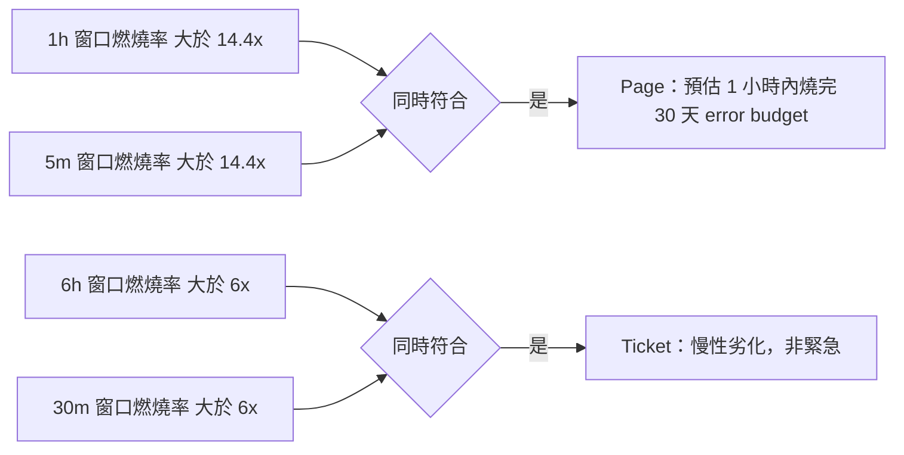
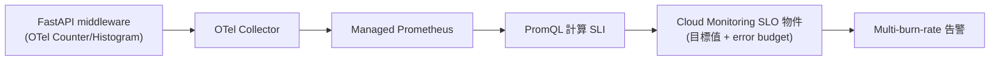

# 在 GKE FastAPI 服務上以 OpenTelemetry 落地 SLI/SLO 量測

> 用 RED method 決定要量什麼、用 OTel Metrics API 把數字打出來、再用 PromQL/MQL 算出 SLI 並疊上 SLO 目標；SLA 是另一層的商業承諾，不是直接算出來的數字。

## Step 1：先分清楚要「算」的是哪一層

延續 [SLA、SLO 與 SLI 的核心概念與設計實踐](#/sre/01-reliability/sla-slo-sli.mdx)：能直接從監控系統「算」出來的只有 **SLI**（實際量到的數字）；SLO 是設定的目標值，拿 SLI 去對比；SLA 是商業合約，只在違反 SLO 到一定嚴重程度時才觸發賠償邏輯，不是監控系統直接算出來的東西。所以這裡要解決的實際問題是：**怎麼用已經啟用的 OTel，把 FastAPI 服務的 SLI 算出來，並疊出 error budget。**

## Step 2：用 RED method 決定 SLI 從哪裡量

對一般同步請求型的 API 服務（FastAPI 這種），Google 的 **RED method**（Rate / Errors / Duration）幾乎可以直接對應到 SLI：

| RED 面向 | 對應 SLI | OTel instrument |
|---|---|---|
| Rate | 吞吐量 baseline，作分母用 | Counter |
| Errors | Availability SLI（成功請求 / 總請求） | Counter |
| Duration | Latency SLI（P95/P99 `<` 門檻值的比例） | Histogram |

## Step 3：OTel Metrics API 埋點（FastAPI 中介層）

在 middleware 對每個 request 記錄三件事：依 status code 分類的請求數、request duration 分佈。instrument 選型可參考 [OTel Metrics Instrument 選型指南](#/sre/99-staging/otel-metrics-instrument-selection.mdx)——這裡用到的是 `Counter`（單調遞增，量請求數）與 `Histogram`（量延遲分佈）：

```python
from opentelemetry import metrics
import time

meter = metrics.get_meter("fastapi.slo")

request_counter = meter.create_counter(
    "http_server_requests_total",
    description="Total HTTP requests",
)
duration_histogram = meter.create_histogram(
    "http_server_duration_seconds",
    description="HTTP request duration",
)

@app.middleware("http")
async def slo_metrics_middleware(request, call_next):
    start = time.monotonic()
    response = await call_next(request)
    duration = time.monotonic() - start

    route = request.scope.get("route")
    attrs = {
        "http.route": route.path if route else request.url.path,
        "http.status_class": f"{response.status_code // 100}xx",
    }
    request_counter.add(1, attrs)
    duration_histogram.record(duration, attrs)
    return response
```

關鍵是把 `http.status_class` 這種低 cardinality 的屬性放進去，而不是把完整 URL path（含 path params）當標籤，避免 cardinality 爆炸——這點跟 [OpenTelemetry 的 Metrics API 與其他 API 總覽](#/sre/06-opentelemetry/otel-metrics-api-fastapi.mdx) 提到的原則一致。

## Step 4：透過 Managed Prometheus 把數字變成 SLI 查詢

GKE 上最常見的路徑是 OTel Collector 把 metrics 轉送到 **Google Cloud Managed Service for Prometheus（GMP）**，之後用 PromQL 計算 SLI。

**Availability SLI**（過去 5 分鐘成功率）：

```promql
sum(rate(http_server_requests_total{http_status_class=~"2xx|3xx"}[5m]))
/
sum(rate(http_server_requests_total[5m]))
```

**Latency SLI**（P95 是否 `<` 300ms，換算成「達標比例」，這種寫法比直接算分位數更貼近 GCP SLO 的 request-based 定義）：

```promql
sum(rate(http_server_duration_seconds_bucket{le="0.3"}[5m]))
/
sum(rate(http_server_duration_seconds_count[5m]))
```

## Step 5：疊上 SLO 目標，算出 error budget 燃燒率

有了 SLI 時間序列之後，SLO 只是設一條目標線，例如 30 天 availability ≥ 99.9%。Error budget 的剩餘量：

$$\text{剩餘 Budget} = (\text{SLO 目標} - \text{實際 SLI}) \times \text{窗口總請求數}$$

GCP Cloud Monitoring 有原生的 **Service Monitoring / SLO** 物件，可以直接把上面的 PromQL（或 MQL）filter 設成 `good_service_filter` 與 `total_service_filter`，由 Cloud Monitoring 幫忙算 SLI 曲線與 error budget，不用自己維護計算邏輯。

## Step 6：告警要看燃燒率，不要只看瞬時值

單純「SLI 掉到門檻以下就告警」有兩個問題：短暫抖動誤報、真正的慢性劣化因為窗口平滑而發現太晚。Google SRE workbook 建議用 **multi-window multi-burn-rate** 告警：



短窗口 + 長窗口同時符合才觸發，能同時避免誤報與延遲發現。

## 小結：完整計算鏈路



## 相關筆記

- [SLA、SLO 與 SLI 的核心概念與設計實踐](#/sre/01-reliability/sla-slo-sli.mdx)
- [OpenTelemetry 的 Metrics API 與其他 API 總覽（以 FastAPI 為例）](#/sre/06-opentelemetry/otel-metrics-api-fastapi.mdx)
- [OTel Metrics Instrument 選型指南](#/sre/99-staging/otel-metrics-instrument-selection.mdx)
- [OpenTelemetry 在 GKE + GCP 上的實踐案例](#/sre/05-gcp/otel-gcp-gke-case-study.mdx)
