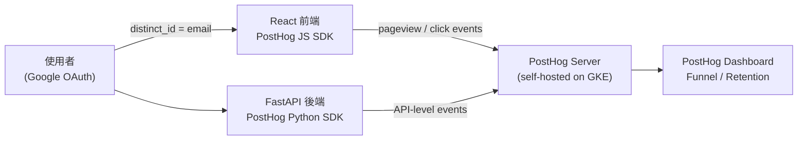

# 內部系統功能使用率追蹤的業界做法

> 以 FastAPI + React + GKE + Google OAuth 架構為背景，說明 2026 年業界評估內部工具功能使用率的主流方案、選型考量與埋點設計。

## Step 1：確立使用者識別基礎

所有追蹤的前提是「知道誰在用哪個功能」。Google OAuth 登入後，後端可從 JWT 拿到 `sub`（唯一 ID）與 `email`。建議用 FastAPI middleware 在 request 進來時就把 user identity 注入 `request.state`，讓所有 route handler 不需重複解析：

```python
@app.middleware("http")
async def attach_user(request: Request, call_next):
    token = request.headers.get("Authorization", "").removeprefix("Bearer ")
    user_id = decode_user_id(token)   # 驗 Google OAuth token，拿 sub 或 email
    request.state.user_id = user_id
    return await call_next(request)
```

這個 `user_id` 會成為後續所有事件的 `distinct_id`，跨前後端保持一致。

## Step 2：選擇追蹤層

三種常見方案不互斥，依需求疊加。

### 方案 A：PostHog（2026 年最推薦）

[PostHog](https://posthog.com) 是開源 product analytics 平台，可 self-host 在 GKE 上，data 不離開公司。它提供：

- React SDK：自動抓 pageview 與 click，也可手動 `posthog.capture`
- Python SDK：後端直接呼叫 `posthog.capture(user_id, event_name, properties)`
- 內建 funnel analysis、retention 分析、session replay、feature flags

整體架構如下：



前端埋點範例：

```tsx
// 在 React 元件內
posthog.capture('filter_applied', { filter_type: 'date_range' })
posthog.capture('report_exported', { format: 'csv' })
```

後端埋點範例：

```python
import posthog

posthog.capture(
    distinct_id=request.state.user_id,
    event="report_exported",
    properties={"report_type": "monthly", "format": "csv"}
)
```

### 方案 B：OpenTelemetry Traces + BigQuery

如果已有 OpenTelemetry 架構，可以在 span attribute 上記錄 `user.id` 和 `feature.name`，再 export 到 BigQuery 用 SQL 做分析。

優點是不需引入新 SDK；缺點是 tracing 的設計出發點是除錯而非分析，funnel analysis 需自己寫 SQL。

```python
from opentelemetry import trace

tracer = trace.get_tracer(__name__)

@app.get("/reports/export")
async def export_report(request: Request):
    with tracer.start_as_current_span("feature.report_export") as span:
        span.set_attribute("user.id", request.state.user_id)
        span.set_attribute("feature.name", "report_export")
        # 業務邏輯...
```

BigQuery 查詢範例：

```sql
SELECT
  feature_name,
  COUNT(DISTINCT user_id) AS unique_users,
  COUNT(*) AS total_calls
FROM `project.otel_traces.spans`
WHERE
  start_time > TIMESTAMP_SUB(CURRENT_TIMESTAMP(), INTERVAL 7 DAY)
  AND span_name LIKE 'feature.%'
GROUP BY feature_name
ORDER BY unique_users DESC
```

### 方案 C：Structured Logging + BigQuery（最輕量）

在功能入口用 structured logging 記錄事件，GCP Cloud Logging 自動收集，再 export 到 BigQuery 做分析。幾乎零額外 infrastructure cost。

```python
import structlog
log = structlog.get_logger()

@app.get("/reports/export")
async def export_report(request: Request):
    log.info("feature_used",
        user_id=request.state.user_id,
        feature="report_export",
        properties={"format": "csv"})
    # 業務邏輯...
```

BigQuery 查詢：

```sql
SELECT
  json_value(jsonPayload, '$.feature') AS feature,
  COUNT(DISTINCT json_value(jsonPayload, '$.user_id')) AS unique_users
FROM `project.logs.app_logs`
WHERE timestamp > TIMESTAMP_SUB(CURRENT_TIMESTAMP(), INTERVAL 7 DAY)
  AND json_value(jsonPayload, '$.message') = 'feature_used'
GROUP BY feature
ORDER BY unique_users DESC
```

## Step 3：設計要追蹤的事件

參考 Segment Spec 的 event taxonomy，從最重要的兩層開始：

| 類型 | 範例事件名稱 | 適合評估什麼 |
|------|--------------|-------------|
| Page 瀏覽 | `page_viewed` | 功能觸達率（有多少人看到這個頁面）|
| Feature 啟動 | `feature_opened` | 功能使用率（有多少人真的打開它）|
| 核心動作完成 | `report_exported` | 轉換率（有多少人完成目標操作）|
| 錯誤遭遇 | `feature_error` | 阻礙點（哪裡讓使用者卡關）|

**不要追蹤所有點擊**。先從「有沒有人打開這個頁面」（page view）與「有沒有人完成核心操作」（conversion event）開始，這兩個數字就足以評估一個功能的使用率與價值。

## 選型對照

| 方案 | 適合情境 | 主要成本 |
|------|----------|----------|
| PostHog self-hosted | 想要完整 product analytics，data 不出公司 | 維護 PostHog GKE workload |
| OTel + BigQuery | 已有 OTel 架構，SRE 主導分析 | 自建 BigQuery 報表 |
| Structured Log + BigQuery | 最小 footprint，只需基本計數 | 幾乎為零 |
| GA4 / Mixpanel / Amplitude | SaaS，零維護 | 月費 + data governance 合規審查 |

對大多數公司內部工具而言，**PostHog self-hosted 是 2026 年最均衡的選擇**：功能夠用、data in-house、React 與 Python SDK 都有一流支援，與 GKE 的整合已經相當成熟。

## 相關筆記

- [Log 與 Metric 的職責劃分：以 GCP 結構化日誌為例](#/sre/02-observability/log-vs-metric-signal-design.mdx)
- [OpenTelemetry 的 Metrics API 與其他 API 總覽（以 FastAPI 為例）](#/sre/06-opentelemetry/otel-metrics-api-fastapi.mdx)
- [OpenTelemetry 在 GKE + GCP 上的實踐案例](#/sre/05-gcp/otel-gcp-gke-case-study.mdx)
