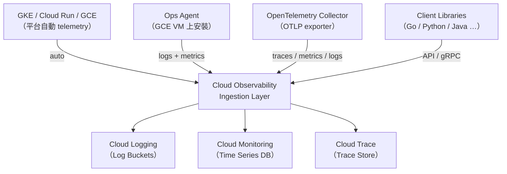
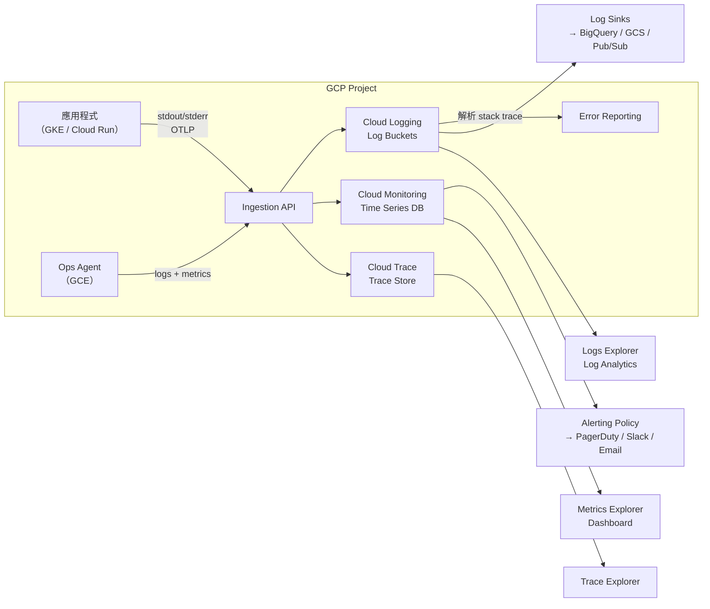

# GCP Cloud Observability 套件總覽

> Google Cloud Observability（舊稱 Google Cloud Operations Suite，更早叫 Stackdriver）是 GCP 內建的可觀測性平台，把 Logging、Monitoring、Tracing、Profiling、Error Reporting 整合在同一個品牌與 Console UI 下。

## Step 1 — 品牌沿革與定位

2020 年以前，這些工具叫 **Stackdriver**，是 Google 2014 年收購的獨立產品。2020 年改名為 **Google Cloud Operations Suite**，之後行銷上統稱 **Cloud Observability**，讓各子產品的定位更清楚。

核心動機：**一個 GCP 專案內的所有資源，自動把 telemetry 送進同一個平台**，工程師不需要自己搭 Prometheus stack，也不需要管理 Elasticsearch 叢集。

## Step 2 — 套件組成

```
Cloud Observability
├── Cloud Logging          # 日誌收集、儲存、查詢
├── Cloud Monitoring       # 指標、Dashboard、Alerting、Uptime Checks
├── Cloud Trace            # 分散式追蹤
├── Cloud Profiler         # 持續 CPU / Heap profiling
└── Error Reporting        # 例外彙整、通知
```

| 子產品 | 核心功能 | 主要資料類型 |
|--------|----------|------------|
| Cloud Logging | 收集、儲存、查詢日誌；Log-based Metrics；Log Sinks | Logs |
| Cloud Monitoring | 指標 TSDB；Dashboard；Alerting Policy；Uptime Checks | Metrics |
| Cloud Trace | 分散式 trace 儲存與查詢；Latency breakdown | Traces |
| Cloud Profiler | 持續採樣 CPU、記憶體 flame graph | Profiles |
| Error Reporting | 自動歸類例外；First/Last seen；通知 | （從 logs 派生）|

## Step 3 — 資料怎麼進來（Ingestion 路徑）



三種來源：

1. **平台自動 telemetry**：GKE、Cloud Run、App Engine 本身就會把 stdout/stderr 和系統指標送進去，不需要任何設定。
2. **Ops Agent**：GCE VM 上的統一代理程式（取代舊的 Logging Agent + Monitoring Agent），負責收 VM 的系統日誌、應用程式日誌、CPU / Memory / Disk metrics。
3. **OpenTelemetry / Client Library**：應用程式自行埋點，透過 OTLP 或 Cloud Trace / Cloud Monitoring API 送資料。

## Step 4 — 各子產品的儲存與查詢模型

### Cloud Logging

- 日誌存在 **Log Buckets**（GCS-based，但有獨立的 retention 設定）
- 兩個查詢 UI：**Logs Explorer**（即時查詢，用 Logging Query Language）和 **Log Analytics**（BigQuery 語法，適合跨時段分析）
- **Log Sinks**：可把日誌導出到 BigQuery、GCS、Pub/Sub，實現長期保存或下游消費

### Cloud Monitoring

- 時序資料存在 Google 私有的 **Time Series DB**（非 Prometheus，但可用 Managed Service for Prometheus 橋接）
- **Metrics Explorer** 用來 ad-hoc 查詢；Dashboard 用來持久化視圖；Alerting Policy 用來觸發通知
- 指標有三個來源：平台指標（`compute.googleapis.com/…`）、Prometheus 指標、自定義指標（Custom Metrics API）

### Cloud Trace

- 存 distributed trace，每個 span 記錄 service name、latency、attributes、events
- Trace Explorer 可以看 Gantt chart，找 root cause；自動計算 latency percentile
- 與 OpenTelemetry 完全相容：OTLP exporter 指向 `cloudtrace.googleapis.com` 即可

### Cloud Profiler

- **持續採樣**（Continuous Profiling），不需要手動觸發，對生產環境 CPU 消耗極低（約 0.5%）
- 支援 Go、Python、Java、Node.js；安裝 Profiler Agent 後自動上報
- 產出 flame graph，橫軸是時間佔比，縱軸是 call stack

### Error Reporting

- 從 Cloud Logging 自動解析 stack trace，歸類成「錯誤群組」
- 顯示 First seen / Last seen / Affected versions / 發生頻率趨勢
- 可設 alerting，第一次出現新錯誤就通知

## Step 5 — 統一抽象：Monitored Resource

所有子產品共用一個核心概念 **Monitored Resource**，描述「這筆 telemetry 來自哪個 GCP 資源」：

```
Monitored Resource
├── type       # e.g. "gce_instance", "k8s_container", "cloud_run_revision"
├── project_id
├── location   # region / zone
└── labels     # 各 type 有不同的 key set（如 cluster_name、pod_name）
```

這讓 Logging、Monitoring、Trace 可以互相關聯：同一個 `k8s_container` 的 log、metric、trace 在 Console 裡可以互相跳轉。

## Step 6 — IAM 與計費重點

**IAM roles**（常用）：

| Role | 說明 |
|------|------|
| `roles/logging.viewer` | 查看 logs |
| `roles/monitoring.viewer` | 查看 metrics / dashboard |
| `roles/cloudtrace.user` | 查看 traces |
| `roles/logging.admin` | 管理 log sinks / buckets |

**計費概要**：

| 子產品 | 免費額度 | 超出後 |
|--------|---------|--------|
| Cloud Logging | 50 GB / project / 月 | 按量計費 |
| Cloud Monitoring 自定義指標 | 150 MB / month | 按量計費 |
| Cloud Trace | 250 萬 span / 月 | 按量計費 |
| Cloud Profiler | 免費 | — |

## 架構全景



## 相關筆記

- [OpenTelemetry 的功能與應用](#/sre/02-observability/what-is-opentelemetry.mdx)
- [OpenTelemetry 在 GKE + GCP 上的實踐案例](#/sre/02-observability/otel-gcp-gke-case-study.mdx)
- [GCP Logs Explorer、Trace Explorer、Metrics Explorer 與 Error Reporting 的關係](#/sre/02-observability/gcp-logs-trace-metrics-error-reporting.mdx)
- [Cloud Monitoring Dashboard 與 Metrics Explorer 的關係](#/sre/02-observability/gcp-monitoring-dashboard.mdx)
- [GCP Cloud Monitoring 的 Uptime Checks 與 Alerting 功能](#/sre/02-observability/gcp-uptime-checks-and-alerting.mdx)
