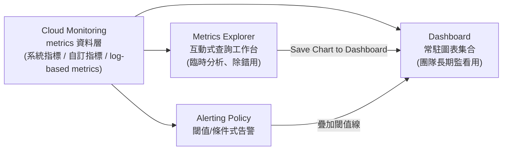

# Cloud Monitoring Dashboard 與 Metrics Explorer 的關係

> 一句話版本：Metrics Explorer 是「即興作圖的工作台」，Dashboard 是「把做好的圖固定下來、常駐展示給團隊看」的呈現層，兩者共用同一份底層 metrics 資料，只是使用情境不同。

## Step 1：Dashboard 是什麼

Cloud Monitoring Dashboard 是一組事先排版好、常駐存在的圖表（widget）集合，用來讓團隊長期盯著同一批關鍵指標，而不用每次都重新設定查詢條件。典型使用情境：on-call 值班時打開的總覽頁、每週對外報告的服務健康度頁面。

一個 Dashboard 裡常見的 widget 類型：

| Widget 類型 | 用途 |
|---|---|
| Line chart | 時間序列趨勢（QPS、延遲、CPU） |
| Scorecard | 單一當前數值 + 依閾值變色（如目前 error rate） |
| Heatmap | 依 bucket 分佈的延遲分佈隨時間變化 |
| Table | 依維度（如各 region）並列多組數值 |
| Alert chart | 疊加顯示某個 alerting policy 的閾值線與觸發歷史 |

## Step 2：Metrics Explorer 是什麼（先回顧）

Metrics Explorer 是互動式的**查詢介面**：選 metric、設 filter、選 aggregation（sum/mean/p99…）、設 group by，畫面即時重畫。適合「我現在懷疑某個服務有問題，想馬上探索一下」的臨時分析，查詢條件不會自動保留給別人看。

## Step 3：兩者怎麼串起來

實務流程通常是：在 Metrics Explorer 反覆調整查詢，找到一張「有意義、值得長期盯著」的圖之後，按下 **Save Chart to Dashboard**，這張圖的查詢定義就會被固化成 Dashboard 上的一個 widget——所以 Dashboard 上大部分的圖，源頭都是某一次在 Metrics Explorer 裡調好的查詢。

## Step 4：Dashboard 的三種建立方式

1. **手動建立**：在 Console 裡新增 Dashboard、逐個加 widget（最常見的入門方式）。
2. **GCP 自動產生**：只要你在用某個受支援的資源類型（如 GKE、Cloud SQL、Cloud Run），Cloud Monitoring 會自動生成一份「開箱即用」的 Dashboard，涵蓋該資源類型常見的關鍵指標，不需要自己設定。
3. **Dashboard as Code**：用 Dashboard 的 JSON/YAML 定義（`google_monitoring_dashboard` Terraform resource 或 Monitoring API），把 Dashboard 佈局寫成設定檔納入版本控管，適合多環境（dev/staging/prod）需要一致 Dashboard 佈局的情境。

## Step 5：Dashboard 與告警的分工

告警本身**不是**設定在 Dashboard 上——告警是獨立的 Alerting Policy（定義 metric + 條件 + 通知管道）。Dashboard 只是視覺化呈現層，可以選擇性疊加顯示某個 alerting policy 的閾值線，方便你在看趨勢圖時同時知道「多接近會觸發告警」，但兩者是分開設定、分開運作的兩個資源。

## 相關筆記

- [GCP Logs Explorer、Trace Explorer、Metrics Explorer 與 Error Reporting 的關係](#/sre/02-observability/gcp-logs-trace-metrics-error-reporting.mdx)
- [Prometheus 與 Grafana 的功能與協作方式](#/sre/02-observability/prometheus-and-grafana-overview.mdx)
