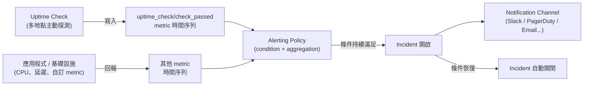
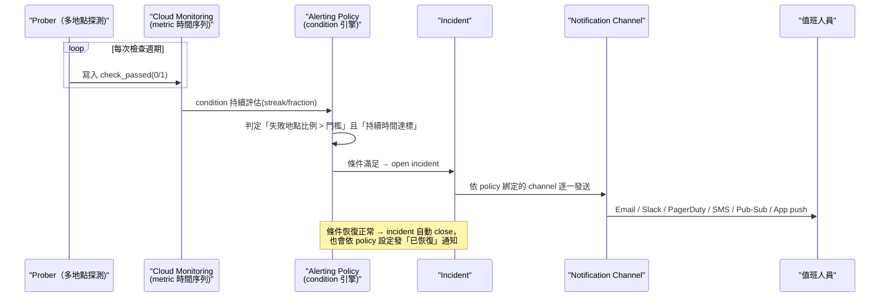

# GCP Cloud Monitoring 的 Uptime Checks 與 Alerting 功能

> Uptime checks 是「從外部主動探測服務是否還活著」的黑箱監控；Alerting 是「當任何指標（包含 uptime check 的結果）出現異常時通知人」的規則引擎——兩者常搭配使用，但分別解決不同層次的問題。

## Step 1：Uptime Checks 解決什麼問題

Cloud Monitoring 內建的 metrics（CPU、延遲、錯誤率⋯）多數是**服務自己回報**的內部視角：如果整台機器掛掉、DNS 解析失敗、或網路層被防火牆擋住，服務可能完全來不及回報任何 metric。

Uptime check 是**黑箱探測（black-box probing）**：GCP 從全球多個地點主動對你指定的 endpoint 發送請求，只關心「探測結果」，不需要目標服務有任何內建的監控程式碼。

- **協定**：HTTP（S）、TCP
- **探測地點**：可選單一地點或多個全球地點（美、歐、亞太⋯），每個地點各自獨立判定成功/失敗
- **檢查頻率**：1、5、10、15 分鐘
- **內容驗證**：不只看 status code，還能設定 response body 必須（或不能）包含某段文字，抓「回了 200 但頁面其實是錯誤訊息」這種偽陽性
- **Private uptime check**：透過 VPC 與 PSC（Private Service Connect）可探測沒有對外 IP 的內部服務，不需要為了健康檢查而把服務暴露到公網

探測結果會寫成標準的 metric 時間序列，最關鍵的是：

```text
monitoring.googleapis.com/uptime_check/check_passed   # 0/1，本次探測是否成功
monitoring.googleapis.com/uptime_check/request_latency # 探測的往返延遲
```

這代表 uptime check 產生的資料**跟其他 metric 完全同構**——可以畫進 dashboard（見 [Cloud Monitoring Dashboard 與 Metrics Explorer 的關係](#/sre/02-observability/gcp-monitoring-dashboard.mdx)），也可以直接接上 alerting policy。

## Step 2：Alerting 解決什麼問題

Alerting policy 是一個獨立於 uptime check 的通用規則引擎，輸入可以是**任何** Cloud Monitoring 的 metric（uptime check、CPU 使用率、自訂的 application metric、log-based metric⋯），核心組成：

| 組成 | 說明 |
|---|---|
| **Condition** | 觸發規則，例如「metric 超過門檻值」「metric 變化率異常」「metric 完全沒有回報數據（absence）」 |
| **Aggregation** | 如何彙總多個時間序列，例如「99th percentile」「跨全部 uptime check 地點取平均通過率」 |
| **Notification channel** | 通知去哪：Email、Slack、PagerDuty、SMS、Pub/Sub、Webhook、Mobile app push |
| **Documentation** | 附在通知裡的說明文字，通常放 runbook 連結，讓值班的人不用先自己 google |
| **Incident 生命週期** | 條件持續滿足 → open incident；條件恢復正常 → 自動 close（也可設定 auto-close 逾時） |

Alerting policy 的條件判定不是「單點觸發」，而是要求**持續滿足一段時間（duration）**才 fire，避免單次抖動誤報。這對 uptime check 特別重要——單一地點的一次探測失敗可能只是那個 probing location 本身網路波動，所以典型作法是設定「多個地點中有超過 N 個回報失敗」或「所有地點的通過率低於 X%」才觸發。

## Step 3：兩者如何搭配



常見的落地模式：

1. **服務可用性告警**：對 uptime check 的 `check_passed` 建立 alerting policy，條件是「跨全部探測地點的失敗比例 > 50% 且持續 5 分鐘」，通知 on-call。這是偵測「服務完全打不通」最外部、最貼近真實用戶視角的一層，不依賴服務本身還能不能回報 metric。
2. **延遲告警**：對 `uptime_check/request_latency` 設門檻值，抓「服務有回應但變慢」。
3. **SLO burn rate 告警**：如果已經定義了 SLO（見可靠性基礎章節），可以用 uptime check 或其他 metric 的歷史資料算 error budget 消耗速度，對「燒錢太快」本身建立告警，而不是對單次錯誤告警——這樣可以區分「偶發雜訊」和「真的在快速惡化」。
4. **Absence 告警**：條件設成「這個 metric 超過 N 分鐘沒有任何資料點」，用來抓 uptime check 探測本身掛掉、或服務完全停止回報（比一般的門檻值告警更早抓到「服務整個消失」的情況）。

## Step 4：Uptime Check 本身怎麼「送」通知——關鍵是它不會自己送

一個常見誤解是「幫 uptime check 打開通知選項」。實際上 **uptime check 資源本身沒有通知能力**，它只負責持續寫入 `check_passed` / `request_latency` 這兩條 metric 時間序列；會不會通知人、通知誰，完全是掛在它上面的 **Alerting Policy** 決定的。



實際落地時分兩段設定，缺一不可：

1. **建立 Alerting Policy 的 condition**：在 GCP Console 的 Uptime Checks 頁面點「Create Alerting Policy」時，會自動帶出一個預填的 condition 樣板（metric 固定為該 uptime check 的 `check_passed`），但你仍要選：
   - **判定範圍**：`any region reports failures`（任一探測地點失敗就算）還是 `more than X% of regions report failures`（多數地點都失敗才算）——前者靈敏、容易因單地點網路波動誤報，後者較穩但反應慢。
   - **持續時間（duration）**：條件要連續滿足多久才觸發，例如「持續 5 分鐘」。
2. **綁定 Notification Channel**：Notification channel 是獨立資源（在 Monitoring → Alerting → Notification channels 底下建立與管理），同一個 channel 可以被多個不同的 alerting policy 重複使用。常見型別與送達方式：

| Channel 型別 | 實際送達機制 |
|---|---|
| Email | SMTP 寄送到指定信箱 |
| SMS | 簡訊閘道寄送到指定號碼（需先驗證） |
| Slack | 透過 Slack App 整合，以 webhook 形式貼文到指定頻道 |
| PagerDuty | 呼叫 PagerDuty 的 Events API，直接開一張 PagerDuty incident |
| Webhook | 對你指定的 URL 發 HTTP POST，body 帶 incident JSON，可接任何自架系統 |
| Pub/Sub | 發一則訊息到指定 topic，適合接自動化處理（例如自動觸發 runbook 腳本） |
| Mobile App | 透過 Google Cloud Console App 推播 |

沒有第 2 步，即使 alerting policy 的 condition 正確觸發、incident 也確實開了，也不會有任何人收到通知——這是排查「uptime check 明明掉了但沒人被吵醒」時第一個要檢查的地方：**policy 有沒有掛 notification channel、channel 本身有沒有驗證通過（例如 email/SMS 需要先完成一次驗證流程才會生效）**。

## 兩者的本質差異

| | Uptime Check | Alerting |
|---|---|---|
| **角色** | 資料來源（黑箱探測器） | 規則引擎（對任意資料源做判斷與通知） |
| **視角** | 外部、跨地理位置的真實用戶視角 | 中立，可以接內部或外部任何 metric |
| **能否獨立存在** | 可以只建 uptime check 不建告警（純觀測） | 可以不靠 uptime check，對任何既有 metric 告警 |
| **典型用途** | 偵測「服務對外是否可達」 | 把「異常」轉成「通知人」的最後一哩路 |

## 相關筆記

- [Cloud Monitoring Dashboard 與 Metrics Explorer 的關係](#/sre/02-observability/gcp-monitoring-dashboard.mdx)
- [GCP Logs Explorer、Trace Explorer、Metrics Explorer 與 Error Reporting 的關係](#/sre/02-observability/gcp-logs-trace-metrics-error-reporting.mdx)
