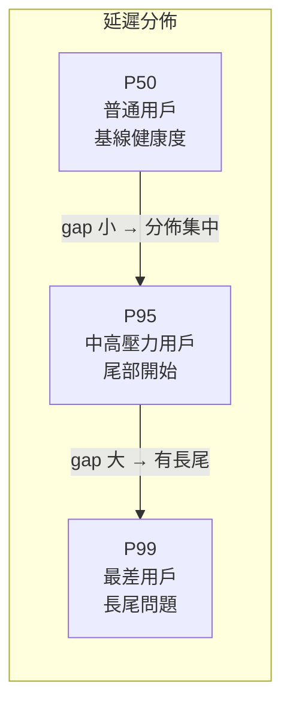

# P50 / P95 / P99 百分位延遲的意義與監控應用

> 百分位數（Percentile）讓你分層看見不同使用者的延遲體驗，是 SRE 定義延遲 SLO 與排查長尾問題的核心工具。

## 百分位數是什麼？

百分位數回答的問題是：**「把所有請求的延遲排序後，第 X% 的那筆是多少？」**

以 1000 筆請求為例：

| 指標 | 意義 | 直覺解讀 |
|------|------|---------|
| **P50**（Median）| 第 500 筆 | 「最普通的那個使用者」感受到的延遲 |
| **P95** | 第 950 筆 | 「每 20 人中倒數第 1 人」感受到的延遲 |
| **P99** | 第 990 筆 | 「每 100 人中倒數第 1 人」感受到的延遲 |

## 為什麼不用平均值（Average）？

平均值會被**極端值（outlier）嚴重拉偏**。

```
假設 10 筆請求延遲（ms）：
[10, 11, 12, 10, 11, 12, 10, 11, 12, 5000]

平均值：510 ms  ← 看起來很糟
P50：11 ms      ← 大多數人根本感受不到問題
P99：5000 ms    ← 但確實有 1% 的人在受苦
```

平均值混淆了「大多數人的體驗」與「少數人的痛苦」。百分位數讓你**分層看見**不同使用者的實際感受。

## P50 / P95 / P99 各自揭示什麼？



- **P50 高**：整體服務就是慢，根本問題（DB 慢查詢、運算瓶頸）
- **P95 / P99 高，P50 正常**：長尾問題（GC pause、鎖競爭、cache miss、單一慢節點）
- **三者一起飆升**：通常是流量突增、依賴服務故障、資源耗盡

## 在 SLO 定義上的應用

Google SRE 推薦把**延遲 SLO 定義在 P99**，而非 P50：

> 例：「P99 延遲 < 500ms 的請求佔所有請求的 95%」

原因：

1. 最差體驗（長尾）代表真實的服務品質下限
2. P50 很容易達到，不具區分度
3. P99 迫使工程團隊真正解決長尾問題，而非只優化中位數

SLI 的量測建議：

$$\text{Latency SLI} = \frac{\text{P99 延遲} < \text{閾值的請求數}}{\text{總請求數}}$$

## Prometheus 實作：histogram 與 summary

**Histogram**（推薦）——在查詢時計算百分位：

```promql
# P99 延遲（以 5 分鐘為窗口）
histogram_quantile(0.99,
  sum(rate(http_request_duration_seconds_bucket[5m])) by (le)
)
```

**Summary**——在 SDK 端預先計算，無法跨實例聚合，不推薦用於分散式系統。

| | Histogram | Summary |
|--|-----------|---------|
| 計算時機 | 查詢端（Prometheus） | SDK 端 |
| 跨實例聚合 | 可以 | 不可以 |
| 精確度 | 受 bucket 邊界影響 | 精確 |
| 推薦情境 | 分散式服務 | 單機、精確需求 |

## 告警設計建議

對 P99 設 warn，對 P99 嚴重超標設 critical；通常不對 P50 直接告警：

```yaml
# Prometheus Alerting Rule 範例
- alert: HighLatencyP99
  expr: |
    histogram_quantile(0.99,
      sum(rate(http_request_duration_seconds_bucket[5m])) by (le, service)
    ) > 1.0
  for: 5m
  labels:
    severity: warning
  annotations:
    summary: "{{ $labels.service }} P99 延遲超過 1s"
```

## 常見陷阱

1. **只看 P99 忽略 P50**：P50 突然惡化往往是 P99 惡化的前兆
2. **窗口太短**：P99 在低流量時雜訊大，窗口建議 5m 以上
3. **聚合層級太高**：全服務 P99 掩蓋了單一端點的問題，應加 `by (endpoint)` 細分
4. **Bucket 邊界設計不當**：Histogram 的 bucket 要覆蓋預期延遲範圍，否則 P99 計算會失真

## 相關筆記

- [Prometheus 與 Grafana 的功能與協作方式](#/sre/02-observability/prometheus-and-grafana-overview.mdx)
- [SLA、SLO 與 SLI 的核心概念與設計實踐](#/sre/01-reliability/sla-slo-sli.mdx)
- [OTel Metrics Instrument 選型指南](#/sre/99-staging/otel-metrics-instrument-selection.mdx)
